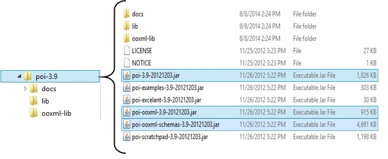
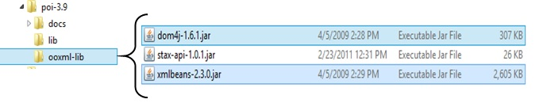

# 一 概述

# Apache POI PPT - 概述

由 xicity 创建，youj 最后一次修改 2016-12-27

很多时候，需要一个软件应用程序来生成Microsoft Office文件格式的报告。 有时，应用程序甚至希望接收MS- Office文件作为输入数据。

任何希望生成MS Office文件作为输出的Java程序员都必须使用预定义和只读API来执行此操作。

## **什么是Apache POI？**

Apache POI是一个流行的API，允许程序员使用Java程序创建，修改和显示MS-Office文件。 它是由Apache Software Foundation开发和发布的一个开源库。 它包含用于解码用户输入数据或将文件转换为MS Office文档的类和方法。

## Apache POI的组件

Apache POI包含用于MS-Office的所有OLE2复合文档的类和方法。 此API的组件列表如下:

- **POIFS(可疑混淆执行文件系统)**:此组件是所有其他POI元素的基本因素。 它用于显式读取不同的文件。
- **HSSF(可怕的SpreadSheet格式)**:用于读取和写入.xls格式的MS-Excel文件。
- **XSSF(XML SpreadSheet格式)**:用于MS-Excel的.xlsx文件格式。
- **HPSF(可怕属性集格式)**:用于提取MS-Office文件的属性集。
- **HWPF(可怕字处理器格式)**:用于读取和写入MS-Word的扩展文件 **.doc** 。
- **XWPF(XML字处理器格式)**:用于读取和写入MS-Word的.docx扩展文件。
- **HSLF(可怕的幻灯片布局格式)**:用于阅读，创建和编辑PowerPoint演示文稿。
- **HDGF(Horrible DiaGram格式)**:它包含MS-Visio二进制文件的类和方法。
- **HPBF(Horrible PuBlisher格式)**:用于读取和写入MS-Publisher文件。

本教程将指导您完成使用Java进行Microsoft PowerPoint演示文稿的过程。 因此，讨论限于 **XSLF组件。**

**注意**:旧版本的POI支持二进制文件格式，如doc，xls，ppt等。版本3.5起，POI支持MS- Office的OOXML文件格式，如docx，xlsx，pptx等。

# 二 Java PPT API 接口

本章将介绍Java PowerPoint API及其功能的一些风格。 有许多供应商提供Java PPT相关的API; 本章提供了部分API介绍。

## Aspose Slides for Java

用于Java的Aspose幻灯片是一个纯许可的Java PPT API，由供应商 **Aspose** 开发和发布。 这个API的最新版本是8.1.2，于2014年7月发布。它是一个丰富而重的API(纯Java类和AWT类的组合)，用于设计可以读取，写入和管理幻灯片的PPT组件。

此API的常见用途如下:

- Build dynamic presentations
- Render and print high-fidelity presentations
- Generate, edit, convert, and print presentations

## Apache POI

Apache POI是Apache Software Foundation提供的一个100％开源库。 大多数中小型应用程序开发人员严重依赖Apache POI(HSLF + XSLF)。 它支持PPT库的所有基本功能; 然而，渲染和文本提取是其主要特征。 下面给出了用于PPT的Apache POI的架构。

# 三 Apache POI PPT - 安装

本章将介绍在基于Windows和Linux的系统上设置Apache POI的过程。 Apache POI可以轻松地安装并与您当前的Java环境集成，遵循几个简单的步骤，没有任何复杂的设置过程。 安装需要用户管理。

## 系统要求

 

| JDK          | Java SE 2 JDK 1.5或更高版本 |
| ------------ | --------------------------- |
| 内存         | 1 GB RAM(推荐)              |
| 磁盘空间     | 无最低要求                  |
| 操作系统版本 | Windows XP或以上版本，Linux |

现在让我们继续安装Apache POI的步骤。

## 步骤1:验证Java安装

首先，您需要在系统上安装Java软件开发工具包(SDK)。 请根据您正在处理的平台执行以下两个命令，验证是否安装成功。

如果Java安装已正确完成，那么它将显示Java安装的当前版本和规范。 下表给出了样本输出。

| 平台    | 命令                                             | 示例输出                                                     |
| ------- | ------------------------------------------------ | ------------------------------------------------------------ |
| Windows | 打开命令控制台并键入:  **//>java -version** | Java版本“1.7.0_60"   Java TM SE运行时间   环境(build 1.7.0_60-b19)   Java Hotspot(TM)64位服务器   VM(构建24.60-b09，混合模式) |
| Linux   | 打开命令终端并键入:   **$java -version**    | java版本“1.7.0_25"   打开JDK运行时环境(rhel-2.3.10.4.el6_4-x86_64)   打开JDK 64位服务器虚拟机(构建23.7-b01，混合模式) |

- 我们假设本教程的读者在他们的系统上安装了Java SDK 1.7.0_60版本。
- 如果您没有Java SDK，请从<http://www.oracle.com/technetwork/java/javase/downloads/index.html>并安装它。

## 步骤2:设置Java环境

将环境变量JAVA_HOME设置为指向计算机上安装Java的基本目录位置。 例如，

| 平台    | 描述                                               |
| ------- | -------------------------------------------------- |
| Windows | 将JAVA_HOME设置为 C:\ProgramFiles\java\jdk1.7.0_60 |
| linux   | 导出JAVA_HOME = /usr/local/java-current            |

将Java编译器位置的完整路径附加到系统路径。 

| 描述    | 描述                                                         |
| ------- | ------------------------------------------------------------ |
| Windows | 将字符串“C:\Program Files\Java\jdk1.7.0_60\bin"附加到系统变量PATH的结尾。 |
| Linux   | 导出PATH = $ PATH:$ JAVA_HOME / bin /                        |

如上所述，从命令提示符处执行命令 **java -version** 。 

## 步骤3:安装Apache POI库

从 [http://poi.apache.org/download](http://poi.apache.org/download.html) 下载最新版本的Apache POI。 html ，并将其内容解压缩到一个文件夹，从中可以将所需的库链接到Java程序。 让我们假设文件收集在C驱动器上的文件夹中。

以下图像显示已下载文件夹中的目录和文件结构:

将上述图片中突出显示的五个 **jars** 的完整路径添加到CLASSPATH。  

| 描述    | 描述                                                         |
| ------- | ------------------------------------------------------------ |
| Windows | 将以下字符串附加到用户变量CLASSPATH的结尾:   “C:\poi-3.9\poi-3.9-20121203.jar;"   “C:\poi-3.9\poi-ooxml-3.9-20121203.jar;"   “C:\poi-3.9\poi-ooxml-schemas-3.9-20121203.jar;"   “C:\poi-3.9\ooxml-lib\dom4j-1.6.1.jar;"   “C:\poi-3.9\ooxml-lib\xmlbeans-2.3.0.jar;.;" |
| Linux   | 导出CLASSPATH = $ CLASSPATH:   /usr/share/poi-3.9/poi-3.9-20121203.tar:  /usr/share/poi-3.9/poi-ooxml-schemas-3.9-20121203.tar: /usr/share/poi-3.9/poi-ooxml-3.9-20121203.tar: /usr/share/poi-3.9/ooxml-lib/dom4j-1.6.1.tar: /usr/share/poi-3.9/ooxml-lib/xmlbeans-2.3.0.tar |

# 四 Apache POI PPT - 类和方法

在本章中，我们将了解Apache POI API下的几个类和方法，这些对于使用Java程序处理PPT文件至关重要。

## 介绍

要创建和管理演示文稿，您在包 *org.apache.poi.xslf.usermodel* 中有一个名为XMLSlideShow的类。 下面给出了一些重要的方法和这个类的构造函数。

**类**:XMLSlideShow

**包**:org.apache.poi.xslf.usermodel

| S.No | 构造函数和说明                                               |
| ---- | ------------------------------------------------------------ |
| 1    | **XMLSlideShow(java.io.InputStream inputStream)**  你可以通过传递一个inputstream类对象来实例化这个类。 |

| S.No | 方法和描述                                                   |
| :--- | ------------------------------------------------------------ |
| 1    | **int addPicture(byte [] pictureData，int format)**   使用此方法，您可以向演示文稿添加图片。 |
| 2    | **XSLFSlide createSlide()**   在演示文稿中创建空白幻灯片。 |
| 3    | **XSLFSlide createSlide(XSLFSlideLayout布局)**   创建具有给定幻灯片布局的幻灯片。 |
| 4    | **java.util.List< XSLFPictureData>** getAllPictures()   返回一个演示文稿中所有图片的数组。 |
| 5    | **java.awt.Dimension getPageSize()**   使用此方法，您可以了解当前页面大小。 |
| 6    | **XSLFSlideMaster [] getSlideMasters()**   返回演示文稿中所有幻灯片的数组。 |
| 7    | **XSLFSlide [] getSlides()**   返回演示文稿中的所有幻灯片。 |
| 8    | **XslFSlide removeSlide(int index)**   使用此方法，您可以从演示文稿中删除幻灯片。 |
| 9    | **void setPageSize(java.awt.Dimension pgSize)**   使用此方法，您可以重置页面大小。 |
| 10   | **void setSlideOrder(XSLFSlide slide，int newIndex)**   使用此方法，您可以重新排序幻灯片。 |

## 滑动

要在演示文稿中创建和管理幻灯片，请使用 **XSLFSlide** 类的方法。 这一类的一些重要方法如下所述。

**类**:XSLFSlide

**套件**:org.apache.poi.xslf.usermodel

 

| S.No | 描述                                                         |
| ---- | ------------------------------------------------------------ |
| 1    | **XSLFBackground getBackground()**   返回幻灯片母版的常用背景。 |
| 2    | **XSLFSlideLayout getLayout(SlideLayout type)**   返回XSLFSlideLayout对象。 |
| 3    | **XSLFSlideLayout [] getSlideLayouts()**   返回此幻灯片母版中的所有幻灯片布局。 |

## 幻灯片布局

POI库有一个名为 **XSLFSlideLayout** 的类，您可以使用它来管理幻灯片的布局。

**类**:XSLFSlideLayout

**套件**:org.apache.poi.xslf.usermodel

| 描述 | 方法和说明                                                   |
| ---- | ------------------------------------------------------------ |
| 1    | **void copyLayout(XSLFSlide幻灯片)**   此方法会将占位符从此布局复制到给定幻灯片。 |

## 文本段落

您可以使用 **XSLFTextParagraph** 类别将内容写入幻灯片。 下面提到这个类的一些重要方法。

**类**:XSLFTextParagraph

**套件**:org.apache.poi.xslf.usermodel

| S.No | 方法和描述                                                   |
| ---- | ------------------------------------------------------------ |
| 1    | **XSLFTextRun addLineBreak()**   在段落中插入换行符。   |
| 2    | **XSLFTextRun addNewTextRun()**   在段落中添加新的文本行。 |
| 3    | **void setBulletAutoNumber(ListAutoNumber scheme，int startAt)**    将自动编号的项目符号点应用于段落。 |
| 4    | **void setIndent(double value)**   将缩进设置为段落中的文本。 |
| 5    | **void setLeftMargin(double value)**   此方法用于添加段落的左边距。 |
| 6    | **void setLineSpacing(double line spacing)**   此方法用于在段落中设置行间距。 |
| 7    | **void setTextAlign(TextAlign align)**   此方法用于设置要设置为段落的对齐方式。 |

## 文本运行

这是文本正文中文本分隔的最低级别。 您可以使用 **XSLFTextRun** 类来管理段落的文本运行。 下面提到这个类的一些重要方法。

**类**:XSLFTextParagraph

**套件**:org.apache.poi.xslf.usermodel

| S.No | 方法和描述                                                   |
| ---- | ------------------------------------------------------------ |
| 1    | **XSLFHyperlink createHyperlink()**   在演示文稿中创建超链接。 |
| 2    | **XSLFHyperlink getHyperlink()**   此方法用于获取超链接。 |
| 3    | **java.lang.String getText()**   以Java字符串形式返回此Text节点的值。 |
| 4    | **void setBold(boolean bold)**   此方法用于以粗体设置文本。 |
| 5    | **void setCharacterSpacing(double spc)**   设置文本运行中的字符之间的间距。 |
| 6    | **void setFontColor(java.awt.Color color)**   设置文本的字体颜色。 |
| 7    | **void setFontSize(double fontSize)**   设置文本的字体大小。 |
| 8    | **void setItalic(boolean italic)**   这个方法用于使段落斜体。 |
| 9    | **void setStrikethrough(boolean strike)**   此方法用于将一段文本格式化为删除线文本。 |
| 10   | **void setSubscript(boolean flag)**   此方法用于将文本格式化为下标。 |
| 11   | **void setSuperscript(boolean flag)**   此方法用于将此运行中的文本格式化为上标。 |
| 12   | **void setText(java.lang.String text)**   此方法用于在运行中设置文本。 |
| 13   | **void setUnderline(Boolean underline)**   此方法用于在文本运行中对文本加下划线。 |

## 文本形状

在PPT中，我们有可以在其中保存文本的形状。 我们可以使用 **XSLFTextShape** 类来管理这些。 下面提到这个类的一些重要方法。

**类**:XSLFTextShape

**套件**:org.apache.poi.xslf.usermodel

| S.No | 方法和描述                                                   |
| ---- | ------------------------------------------------------------ |
| 1    | **void setPlaceholder(Placeholder placeholder)**   使用此方法，您可以选择占位符。 |
| 2    | **Placeholder getTextType()**   返回当前占位符的类型。  |
| 3    | **void clearText()**   清除当前文本形状的文本区域。     |
| 4    | **XSLFTextParagraph addNewTextParagraph()**   向形状添加新的段落运行。 |
| 5    | **void drawContent(java.awt.Graphics2D graphics)**   此方法允许您在幻灯片上绘制任何内容。 |

## 超链接

POI库具有一个名为 **XSLFHyperlink** 的类，您可以使用它在演示文稿中创建一个超链接。 下面提到这个类的一些重要方法。

**类**:XSLFHyperlink

**套件**:org.apache.poi.xslf.usermodel

 

| S.No | 方法和描述                                                   |
| ---- | ------------------------------------------------------------ |
| 1    | **java.net.URI getTargetURL()**   返回演示文稿幻灯片中存在的网址。 |
| 2    | **void setAddress(java.lang.String address)**   此方法用于将地址设置为URL。 |
| 3    | **void setAddress(XSLFSlide幻灯片)**   将地址设置为演示文稿幻灯片中显示的网址。 |

# 五 Apache POI PPT - 演示