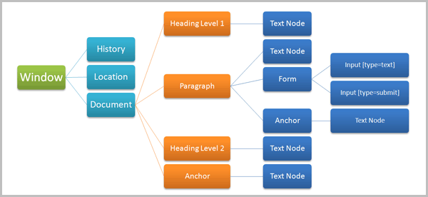
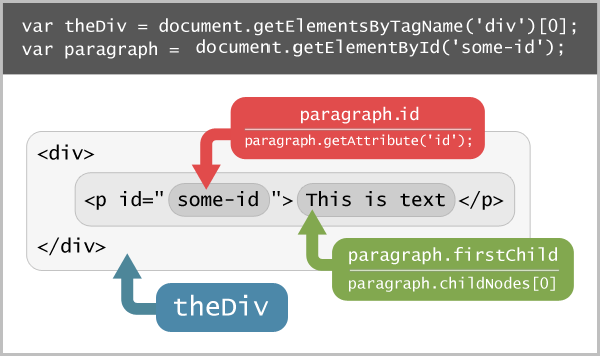
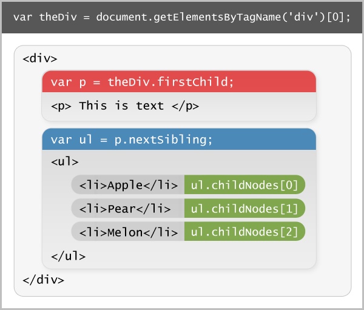

# 文档对象模型Document Object Model

DOM（Document Object Model，文档对象模型）是一个通过和JavaScript进行内容交互的API。Javascript和DOM一般经常作为一个整体，因为Javascript通常都是用来进行DOM操作和交互的。



主要内容来自：http://net.tutsplus.com/tutorials/javascript-ajax/javascript-and-the-dom-series-lesson-1/

关于DOM，有些知识需要注意：

1.window对象作为全局对象，也就是说你可以通过window来访问全局对象。

	1.  属性在对象下面以变量的形式存放，在页面上创建的所有全局对象都会变成window对象的属性。
	2.  方法在对象下面以函数的形式存放，因为左右的函数都存放在window对象下面，所以他们也可以称为方法。

2.DOM为web文档创建带有层级的结果，这些层级是通过node节点组成，这里有几种DOM node类型，最重要的是Element, Text, Document。

	1.  Element节点在页面里展示的是一个元素，所以如果你有段落元素(<p>)，你可以通过这个DOM节点来访问。
	2.  Text节点在页面里展示的所有文本相关的元素，所以如果你的段落有文本在里面的话，你可以直接通过DOM的Text节点来访问这个文本
	3.  Document节点代表是整个文档，它是DOM的根节点。

3.每个引擎对DOM标准的实现有一些轻微的不同。例如，Firefox浏览器使用的Gecko引擎有着很好的实现（尽管没有完全遵守W3C规范），但IE浏览器使用的Trident引擎的实现却不完整而且还有bug，给开发人言带来了很多问题。

# Web上的JavaScript

## **Script元素**

当你在网站页面上使用JavaScript的时候，需要使用SCRIPT元素：

```html
    <!DOCTYPE html PUBLIC "-//W3C//DTD XHTML 1.0 Strict//EN" "http://www.w3.org/TR/xhtml1/DTD/xhtml1-strict.dtd">  
    <html xmlns="http://www.w3.org/1999/xhtml" lang="en">  
        <head>  
                <meta http-equiv="Content-Type" content="text/html; charset=UTF-8" />  
                <title>JavaScript!</title>  
        </head>  
        <body>        
            <script type="text/javascript">  
            // <![CDATA[  
      
            // ]]>  
            </script>        
        </body>  
    </html>  
```

上述代码，严格来说SCRIPT的TYPE属性应该设置为application/javascript，但是由于IE不支持这个，所以平时我们不得不写成text/javascript或者直接去掉type。另外你也可以看到在SCRIPT元素里的注释行// <![CDATA[ 是用来告诉支持XHTML的浏览器，这里面的代码是字符数据而不是XHTML标签，比如如果你在里面的数据使用了<或>，浏览器就不会再解析成XHTML标签了。

## **Defer属性**

任何在 script 元素里声明的代码在页面加载的时候都会运行，唯一一个例外是给SCRIPT元素加上一个defer属性。defer属性告诉浏览器加载完HTML文档以后再执行JS代码，但这个属性只能在IE下使用。

## **连接外部脚本**

如果你想了解外部脚本，只需要简单地在 script 上使用 src 属性就行了，使用单独的JS文件的好处是可以缓存，而且也不需要担心CDATA方面的问题：

```
<script type="text/javascript" src="my-script.js"></script>
```

## **JavaScript必备**

在我们继续DOM之前，我们来复习一下JavaScript的核心必备知识，如果你还不了解，也没关系，我们在这一章节将稍微花点时间来回顾一下。

JavaScript有几种数据类型：Number, String, Boolean, Object, Undefined and Null。

单行注释使用双斜杠//，双斜杠后面的所有文字都会被注释掉，多行注意使用/*和*/括住。

### **Number**

在JavaScript里所有的Number都是浮点型的，当声明一个数字变量的时候，记得不要使用任何引号。

```javascript
// 注：使用var类声明变量
var leftSide = 100;  
var topSide = 50;  
var areaOfRectangle = leftSide * topSide; // = 5000  
```

### **String**

JavaScript里声明字符串特别简单，和其它语言一样，在JS里使用单引号或双引号都可以。

```javascript
var firstPart = 'Hello';  
var secondPart = 'World!';  
var allOfIt = firstPart + ' ' + secondPart; // Hello World!  
// +符合是字符连接符。也用于数字相加
```

### **Boolean**

布尔类型用于条件判断，布尔类型是只有2个值：true和false。任何使用逻辑操作符的比较都会返回布尔值。

```javascript
5 === (3 + 2); // = true  
// 你也可以将布尔值赋给一个变量
var veryTired = true;
// 这样使用
if (veryTired) {
    // 执行代码 
}   
```

===也是比较操作符，不仅比较数值，还比较类型。

### **Function**

函数是特殊的对象。

```javascript
// 使用function操作符来声明新函数  
function myFunctionName(arg1, arg2) {
    // 函数代码
}

// 你也可以声明匿名函数 
function (arg1, arg2) {
    // Function code goes here.  
}

// 运行函数很简单，直接在函数名称后面加上小括号就可以了
// 或者也可以带上参数
myFunctionName(); // 无参
myFunctionName('foo', 'bar'); // 有参数

// 也可以使用自调用  

(function () {
    // 这里自调用函数
})();
```

### **Array**

数组也是特殊的对象，它包含了一批值（或对象），访问这些数据的话需要使用数字索引：

```javascript
// 2种方式声明数组

// 字面量:  
var fruit = ['apple', 'lemon', 'banana'];

// Array构造函数:  
var fruit = new Array('apple', 'lemon', 'banana');

fruit[0]; // 访问第1个项(apple)  
fruit[1]; // 访问第2个项(lemon)  
fruit[2]; // 访问第3个项(banana) 
```

### **Object**

一个对象是一个key-value的集合，和数组相似，唯一的不同是你可以为每个数据定义一个名称。

```javascript
// 2种类型定义Object对象

// 字面量（大括号）
var profile = {
    name: 'Bob',
    age: 99,
    job: 'Freelance Hitman'
};

// 使用Object构造函数
var profile = new Object();
profile.name = 'Bob';
profile.age = 99;
profile.job = 'Freelance Hitman';  
```

### **IF/Else语句**

JS里使用最多的语句莫过于条件语句了：

```javascript
var legalDrinkingAge = 21;  
var yourAge = 29;  
  
if ( yourAge >= legalDrinkingAge ) {   
    alert('You can drink.');  
} else {  
    alert('Sorry, you cannot drink.');  
```

### **JavaScript操作符**

建议你访问[这个页面](https://developer.mozilla.org/En/Core_JavaScript_1.5_Guide/Operators)来查看所有的JS操作符，这里我仅仅给出一些例子：   

```javascript
// 加减乘除
var someMaths = 2 + 3 + 4 - 10 * 100 / 2;  
      
// 等于  
if ( 2 == (5 - 3 ) { /* 代码 */ } // == 比较是否相等
      
// 不等于 
if ( 2 != (5 - 3 ) { /* 代码 */ }   
      
// 严格等于（推荐） 
2 === 2 // 代替 2 == 2  
2 !== 3 // 代替 2 != 3  
      
// 赋值:  
var numberOfFruit = 9;  
numberOfFruit -= 2; // 等价于 "numberOfFruit = numberOfFruit - 2"  
numberOfFruit += 2; // 等价于 "numberOfFruit = numberOfFruit + 2"   
```

### **Loop循环**

Loop循环在是遍历数组或者对象的所有成员的时候非常方便，JavaScript里使用最多的是FOR和WHILE语句。

```javascript
var envatoTutSites = ['NETTUTS', 'PSDTUTS', 'AUDIOTUTS', 'AETUTS', 'VECTORTUTS'];

// WHILE循环
var counter = 0;
var lengthOfArray = envatoTutSites.length;
while (counter < lengthOfArray) {
    alert(envatoTutSites[counter]);
    counter++; // 等价于counter += 1;  
}

// FOR循环
// i只是用于迭代，可以任意取名 
for (var i = 0, length = envatoTutSites.length; i < length; i++) {
    alert(envatoTutSites[i]);
}  
```

# DOM正文

## **访问DOM节点**

我们来个例子，一个HTML里包含一段文本和一个无序的列表。

```javascript
<!DOCTYPE html PUBLIC "-//W3C//DTD XHTML 1.0 Strict//EN" "http://www.w3.org/TR/xhtml1/DTD/xhtml1-strict.dtd">  
<html xmlns="http://www.w3.org/1999/xhtml" lang="en">  
    <head>  
            <meta http-equiv="Content-Type" content="text/html; charset=UTF-8" />  
            <title>JavaScript!</title>  
    </head>  
    <body>  
  
        <p id="intro">My first paragraph...</p>  
  
        <ul>  
            <li>List item 1</li>  
            <li>List item 1</li>  
            <li>List item 1</li>  
            <li>List item 1</li>  
            <li>List item 1</li>  
        </ul>  
  
        <script type="text/javascript">  
        // <![CDATA[  
  
        // ]]>  
</script>  
  
    </body>  
</html> 
```

上面例子里，我们使用getElementById DOM方法来访问p段落，在script里添加如下代码：

```javascript
var introParagraph = document.getElementById('intro');  
// 现在有了该DOM节点，这个DOM节点展示的是该信息段落
```

变量introParagraph现在已经引用到该DOM节点上了，我们可以对该节点做很多事情，比如查询内容和属性，或者其它任何操作，甚至可以删除它，克隆它，或者将它移到到DOM树的其它节点上。

文档上的任何内容，我们都可以使用JavaScript和DOM API来访问，所以类似地，我们也可以访问上面的无序列表，唯一的问题是该元素没有ID属性，如果ID的话就可以使用相同的方式，或者使用如下getElementsByTagName方式：

```javascript
var allUnorderedLists = document.getElementsByTagName('ul');  
// 'getElementsByTagName'返回的是一个节点集合
// - 和数组有点相似
```

## **getElementsByTagName**

getElementsByTagName方法返回的是一个节点集合，和数组类似也有length属性，重要的一个特性是他是live的——如果你在该元素里添加一个新的li元素，这个集合就会自动更新，介于他和数组类型，所以可以和访问数组一样的方法来访问，所以从0开始：

```javascript
// 访问无序列表: [0]索引
var unorderedList = document.getElementsByTagName('ul')[0];

// 获取所有的li集合:  
var allListItems = unorderedList.getElementsByTagName('li');

// 循环遍历
for (var i = 0, length = allListItems.length; i < length; i++) {
    // 弹出该节点的text内容
    alert(allListItems[i].firstChild.data);
} 
```

以下图例更清晰地展示了DOM获取的知识：



## **DOM穿梭**

“穿梭”这个词主要是用来描述通过DOM查找节点，DOM API提供了大量的节点属性让我们来往上或者往下查询节点。

所有的节点都有这些属性，都是可以用于访问相关的node节点：

1. **Node.childNodes**: 访问一个单元素下所有的直接子节点元素，可以是一个可循环的类数组对象。该节点集合可以保护不同的类型的子节点（比如text节点或其他元素节点）。
2. **Node.firstChild**: 与‘childNodes’数组的第一个项(‘Element.childNodes[0]‘)是同样的效果，仅仅是快捷方式。
3. **Node.lastChild**: 与‘childNodes’数组的最后一个项(‘Element.childNodes[Element.childNodes.length-1]‘)是同样的效果，仅仅是快捷方式。shortcut.
4. **Node.parentNode**: 访问当前节点的父节点，父节点只能有一个，祖节点可以用‘Node.parentNode.parentNode’的形式来访问。
5. **Node.nextSibling**: 访问DOM树上与当前节点同级别的下一个节点。
6. **Node.previousSibling**: 访问DOM树上与当前节点同级别的上一个节点。



通过这张图，理解起来就简单多了，但有个非常重要的知识点：那就是元素之间不能有空格，如果ul和li之间有空格的话，就会被认为是内容为空的text node节点，这样ul.childNodes[0]就不是第一个li元素了。相应地，<p>的下一个节点也不是<ul>，因为<p>和<ul>之间有一个空行的节点，一般遇到这种情况需要遍历所有的子节点然后判断nodeType类型，1是元素，2是属性，3是text节点，详细的type类型可以通过[此地址](https://developer.mozilla.org/En/DOM/Node.nodeType)：

```javascript
    Node.ELEMENT_NODE == 1
    Node.ATTRIBUTE_NODE == 2
    Node.TEXT_NODE == 3
    Node.CDATA_SECTION_NODE == 4
    Node.ENTITY_REFERENCE_NODE == 5
    Node.ENTITY_NODE == 6
    Node.PROCESSING_INSTRUCTION_NODE == 7
    Node.COMMENT_NODE == 8
    Node.DOCUMENT_NODE == 9
    Node.DOCUMENT_TYPE_NODE == 10
    Node.DOCUMENT_FRAGMENT_NODE == 11
    Node.NOTATION_NODE == 12
```

# 总结

原生的DOM方法和属性足够我们日常的应用了，本章节我们只列举了一些例子，下一章节我们列举更多的例子，还会包括浏览器事件模型。