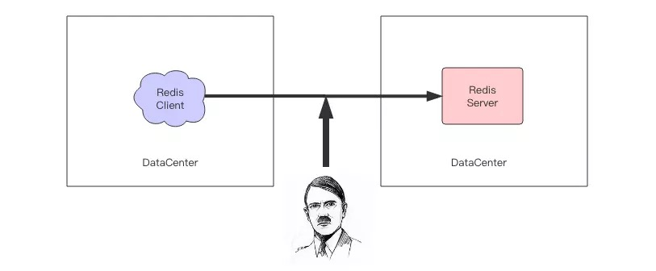
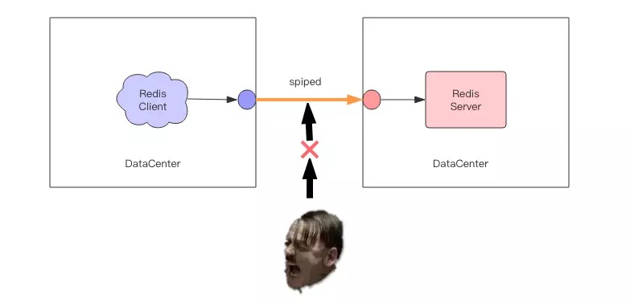
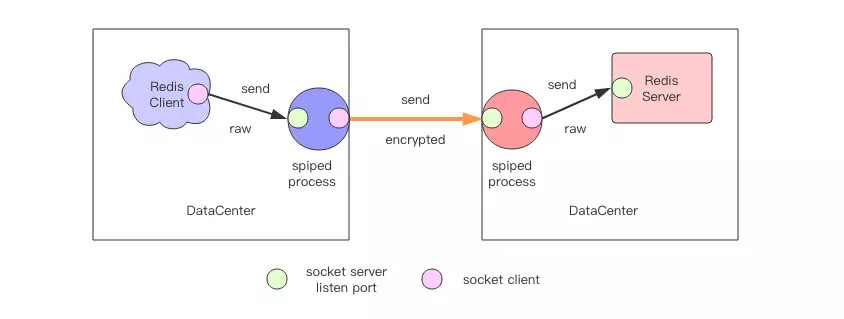

# 隔墙有耳 —— Redis 安全通信

想象这样一个应用场景，公司有两个机房。因为一个紧急需求，需要跨机房读取 Redis 数据。应用部署在 A 机房，存储部署在 B 机房。如果使用普通 tcp 直接访问，因为跨机房所以传输数据会暴露在公网，这非常不安全，客户端服务器交互的数据存在被窃听的风险。



Redis 本身并不支持 SSL 安全链接，不过有了 SSL 代理软件，我们可以让通信数据透明地得到加密，就好像 Redis 穿上了一层隐身外套一样。spiped 就是这样的一款 SSL 代理软件，它是 Redis 官方推荐的代理软件。



## spiped 原理

让我们放大细节，仔细观察 spiped 实现原理。spiped 会在客户端和服务器各启动一个 spiped 进程。



左边的 spiped 进程 A 负责接受来自 Redis Client 发送过来的请求数据，加密后传送到右边的 spiped 进程 B。spiped B 将接收到的数据解密后传递到 Redis Server。然后 Redis Server 再走一个反向的流程将响应回复给 Redis Client。

每一个 spiped 进程都会有一个监听端口 (server socket) 用来接收数据，同时还会作为一个客户端 (socket client) 将数据转发到目标地址。

spiped 进程需要成对出现，相互之间需要使用相同的共享密钥来加密消息。

## spiped 使用入门

```assembly
> brew install spiped
```

如果是 Linux，可以使用 apt-get 或者 yum 安装：

```assembly
> apt-get install spiped
> yum install spiped
```

1. 使用 Docker 启动 redis-server，注意要绑定本机的回环`127.0.0.1`；

   ```assembly
   > docker run -d -p127.0.0.1:6379:6379 --name redis-server-6379 redis
   12781661ec47faa8a8a967234365192f4da58070b791262afb8d9f64fce61835
   > docker ps
   CONTAINER ID        IMAGE               COMMAND                  CREATED                  STATUS              PORTS                      NAMES
   12781661ec47        redis               "docker-entrypoint.s…"   Less than a second ago   Up 1 second         127.0.0.1:6379->6379/tcp   redis-server-6379
   ```

2. 生成随机的密钥文件；

   ```assembly
   # 随机的 32 个字节
   > dd if=/dev/urandom bs=32 count=1 of=spiped.key
   1+0 records in
   1+0 records out
   32 bytes transferred in 0.000079 secs (405492 bytes/sec)
   > ls -l
   rw-r--r--  1 qianwp  staff  32  7 24 18:13 spiped.key
   ```

3. 使用密钥文件启动服务器 spiped 进程，`172.16.128.81`是我本机的公网 IP 地址；

   ```assembly
   # -d 表示 decrypt(对输入数据进行解密)，-s 为源监听地址，-t 为转发目标地址
   > spiped -d -s '[172.16.128.81]:6479' -t '[127.0.0.1]:6379' -k spiped.key
   > ps -ef|grep spiped
   501 30673     1   0  7:29 下午 ??         0:00.04 spiped -d -s [172.16.128.81]:6479 -t [127.0.0.1]:6379 -k spiped.key
   ```

   这个 spiped 进程监听公网 IP 的 6479 端口接收公网上的数据，将数据解密后转发到本机回环地址的 6379 端口，也就是 redis-server 监听的端口。

4. 使用密钥文件启动客户端 spiped 进程，`172.16.128.81`是我本机的公网 IP 地址；

   ```assembly
   # -e 表示 encrypt，对输入数据进行加密
   > spiped -e -s '[127.0.0.1]:6579' -t '[172.16.128.81]:6479' -k spiped.key
   > ps -ef|grep spiped
   501 30673     1   0  7:29 下午 ??         0:00.04 spiped -d -s [172.16.128.81]:6479 -t [127.0.0.1]:6379 -k spiped.key
   501 30696     1   0  7:30 下午 ??         0:00.03 spiped -e -s [127.0.0.1]:6579 -t [172.16.128.81]:6479 -k spiped.key
   ```

   客户端 spiped 进程监听了本地回环地址的 6579 端口，将该端口上收到的数据加密转发到服务器 spiped 进程。

5. 启动客户端链接，因为 Docker 里面的客户端不好访问宿主机的回环地址，所以 Redis 的客户端我们使用 Python 代码来启动；

   ```python
   >> import redis
   >> c=redis.StrictRedis(host="localhost", port=6579)
   >> c.ping()
   >> c.info('cpu')
   {'used_cpu_sys': 4.83,
    'used_cpu_sys_children': 0.0,
    'used_cpu_user': 0.93,
    'used_cpu_user_children': 0.0}
   ```

   可以看出客户端和服务器已经通了，如果我们尝试直接链接服务器 spiped 进程 (加密的端口 6379)，看看会发生什么。

   ```assembly
   >>> import redis
   >>> c=redis.StrictRedis(host="172.16.128.81", port=6479)
   >>> c.ping()
   Traceback (most recent call last):
     File "<stdin>", line 1, in <module>
     File "/Users/qianwp/source/animate/juejin-redis/.py/lib/python2.7/site-packages/redis/client.py", line 777, in ping
       return self.execute_command('PING')
     File "/Users/qianwp/source/animate/juejin-redis/.py/lib/python2.7/site-packages/redis/client.py", line 674, in execute_command
       return self.parse_response(connection, command_name, **options)
     File "/Users/qianwp/source/animate/juejin-redis/.py/lib/python2.7/site-packages/redis/client.py", line 680, in parse_response
       response = connection.read_response()
     File "/Users/qianwp/source/animate/juejin-redis/.py/lib/python2.7/site-packages/redis/connection.py", line 624, in read_response
       response = self._parser.read_response()
     File "/Users/qianwp/source/animate/juejin-redis/.py/lib/python2.7/site-packages/redis/connection.py", line 284, in read_response
       response = self._buffer.readl
   ```

   从输出中可以看出来请求是发送过去了，但是却出现了读超时，要么是服务器在默认的超时时间内没有返回数据，要么是服务器没有返回客户端想要的数据。

   spiped 可以同时支持多个客户端链接的数据转发工作，它还可以通过参数来限定允许的最大客户端连接数。但是对于服务器 spiped，它不能同时支持多个服务器之间的转发。意味着在集群环境下，需要为每一个 server 节点启动一个 spiped 进程来代收消息，在运维实践上这可能会比较繁琐。