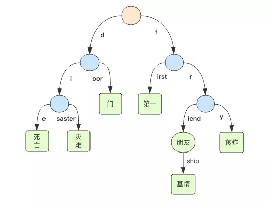
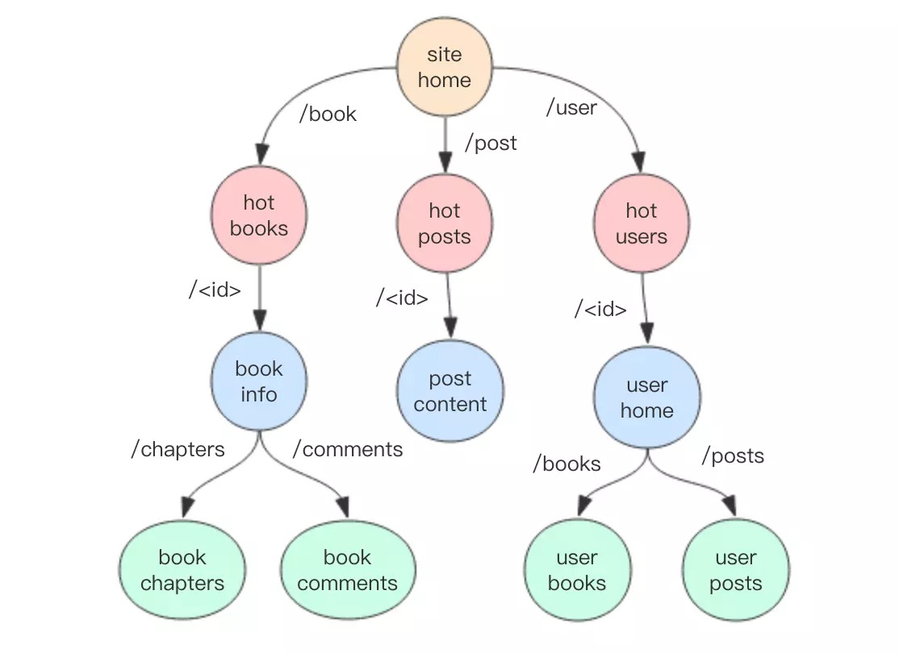
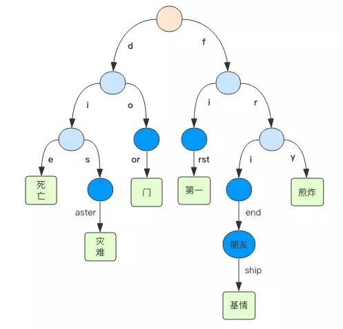
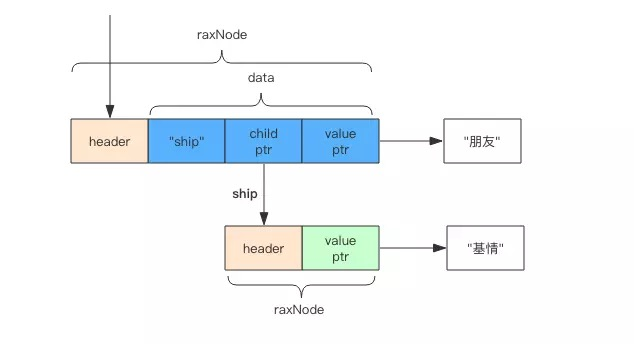

Rax 是 Redis 内部比较特殊的一个数据结构，它是一个有序字典树 (基数树 Radix Tree)，按照 key 的字典序排列，支持快速地定位、插入和删除操作。Redis 五大基础数据结构里面，能作为字典使用的有 hash 和 zset。hash 不具备排序功能，zset 则是按照 score 进行排序的。rax 跟 zset 的不同在于它是按照 key 进行排序的。Redis 作者认为 rax 的结构非常易于理解，但是实现却有相当的复杂度，需要考虑很多的边界条件，需要处理节点的分裂、合并，一不小心就会出错。


## 应用

你可以将一本英语字典看成一棵 radix tree，它所有的单词都是按照字典序进行排列，每个词汇都会附带一个解释，这个解释就是 key 对应的 value。有了这棵树，你就可以快速地检索单词，还可以查询以某个前缀开头的单词有哪些。



你也可以将公安局的人员档案信息看成一棵 radix tree，它的 key 是每个人的身份证号，value 是这个人的履历。因为身份证号的编码的前缀是按照地区进行一级一级划分的，这点和单词非常类似。有了这棵树，你就可以快速地定位出人员档案，还可以快速查询出某个小片区都有哪些人。

Radix tree 还可以应用于时间序列应用，key 为时间戳，value 为发生在具体时间的事件内容。因为时间戳的编码也是按照【年月日时分秒毫秒微秒纳秒】进行一级一级划分的，所以它也可以使用字典序来排序。有了这棵数，我们就可以快速定位出某个具体时间发生了什么事，也可以查询出一段时间内都有哪些事发生。

我们经常使用的 Web 服务器的 Router 它也是一棵 radix tree。这棵树上挂满了 URL 规则，每个 URL 规则上都会附上一个请求处理器。当一个请求到来时，我们拿这个请求的 URL 沿着树进行遍历，找到相应的请求处理器来处理。因为 URL 中可能存在正则 pattern，而且同一层的节点对顺序没有要求，所以它不算是一棵严格的 radix tree。

```
# golang 的 HttpRouter 库
The router relies on a tree structure which makes heavy use of *common prefixes*
it is basically a *compact* [*prefix tree*](https://en.wikipedia.org/wiki/Trie) 
(or just [*Radix tree*](https://en.wikipedia.org/wiki/Radix_tree)). 
Nodes with a common prefix also share a common parent. 
Here is a short example what the routing tree for the `GET` request method could look like:

Priority   Path             Handle
9          \                *<1>
3          ├s               nil
2          |├earch\         *<2>
1          |└upport\        *<3>
2          ├blog\           *<4>
1          |    └:post      nil
1          |         └\     *<5>
2          ├about-us\       *<6>
1          |        └team\  *<7>
1          └contact\        *<8>
```



Rax 被用在 Redis Stream 结构里面用于存储消息队列，在 Stream 里面消息 ID 的前缀是时间戳 + 序号，这样的消息可以理解为时间序列消息。使用 Rax 结构进行存储就可以快速地根据消息 ID 定位到具体的消息，然后继续遍历指定消息之后的所有消息。

Rax 被用在 Redis Cluster 中用来记录槽位和key的对应关系，这个对应关系的变量名成叫着slots_to_keys。这个raxNode的key是由槽位编号hashslot和key组合而成的。我们知道cluster的槽位数量是16384，它需要2个字节来表示，所以rax节点里存的key就是2个字节的hashslot和对象key拼接起来的字符串。


因为rax的key是按照key前缀顺序挂接的，意味着同样的hashslot的对象key将会挂在同一个raxNode下面。这样我们就可以快速遍历具体某个槽位下面的所有对象key。

## 结构

rax 中有非常多的节点，根节点、叶节点和中间节点，有些中间节点带有 value，有些中间节点纯粹是结构性需要没有对应的 value。

```c
struct raxNode {
    int<1> isKey; // 是否没有 key，没有 key 的是根节点
    int<1> isNull; // 是否没有对应的 value，无意义的中间节点
    int<1> isCompressed; // 是否压缩存储，这个压缩的概念比较特别
    int<29> size; // 子节点的数量或者是压缩字符串的长度 (isCompressed)
    byte[] data; // 路由键、子节点指针、value 都在这里
}
```

rax 是一棵比较特殊的 radix tree，它在结构上不是标准的 radix tree。如果一个中间节点有多个子节点，那么路由键就只是一个字符。如果只有一个子节点，那么路由键就是一个字符串。后者就是所谓的「压缩」形式，多个字符压在一起的字符串。比如前面的那棵字典树在 Rax 算法中将呈现出如下结构：



图中的深蓝色节点就是「压缩」节点。

接下来我们再细看`raxNode.data`里面存储的到底是什么东西，它是一个比较复杂的结构，按照压缩与否分为两种结构

**压缩结构** 子节点如果只有一个，那就是压缩结构，data 字段如下伪代码所示：

```c
struct data {
    optional struct { // 取决于 header 的 size 字段是否为零
        byte[] childKey; // 路由键
        raxNode* childNode; // 子节点指针
    } child;
    optional string value; // 取决于 header 的 isNull 字段
}
```



如果是叶子节点，child 字段就不存在。如果是无意义的中间节点 (isNull)，那么 value 字段就不存在。

**非压缩节点** 如果子节点有多个，那就不是压缩结构，存在多个路由键，一个键是一个字符。

```c
struct data {
    byte[] childKeys; // 路由键字符列表
    raxNode*[] childNodes; // 多个子节点指针
    optional string value; // 取决于 header 的 isNull 字段
}
```


也许你会想到如果子节点只有一个，并且路由键字符串的长度为 1 呢，那到底算压缩还是非压缩？仔细思考一下，在这种情况下，压缩和非压缩在数据结构表现形式上是一样的，不管 isCompressed 是 0 还好是 1，结构都是一样的。

## 增删节点

Rax 的增删节点逻辑非常复杂，代码里充斥了太多`ifelse`逻辑，老师我看的是晕头转向，所以这里也就不分析它的源码了，以后要是彻底看懂了，再来继续跟同学们分享吧。如果哪位同学想挑战一下，可以试试看！

## 思考

还有哪些场合可以使用 radix tree？