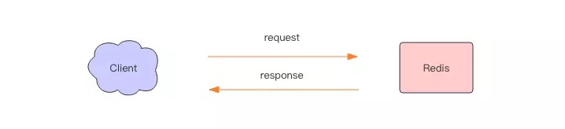
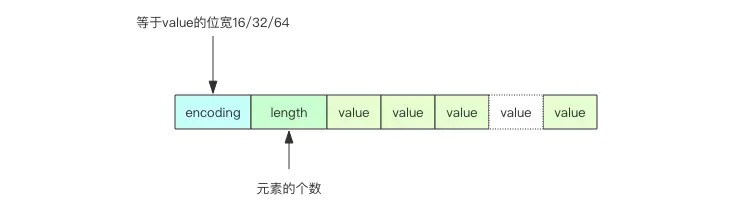
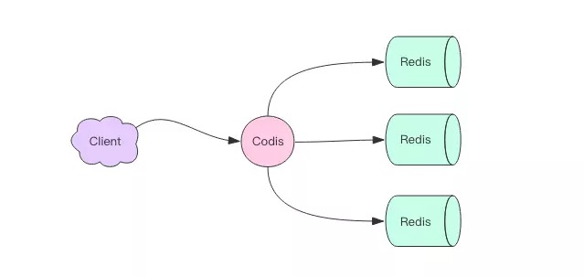
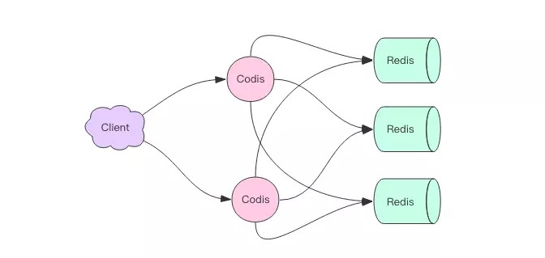
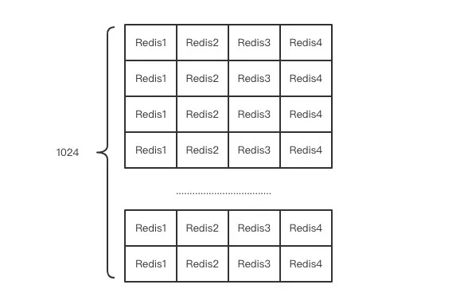
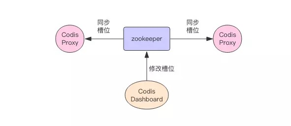
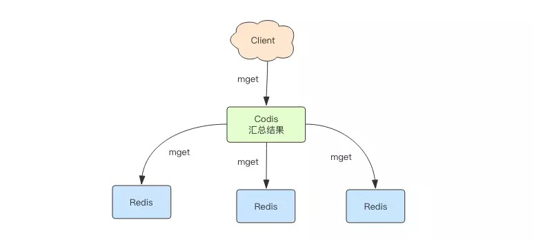
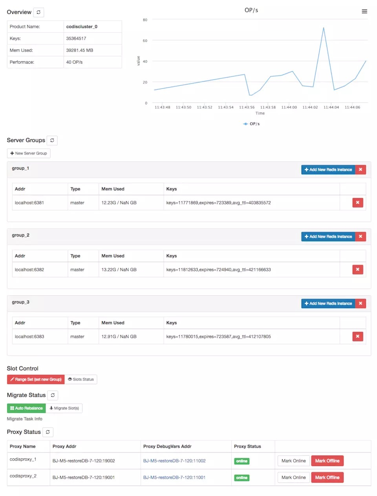
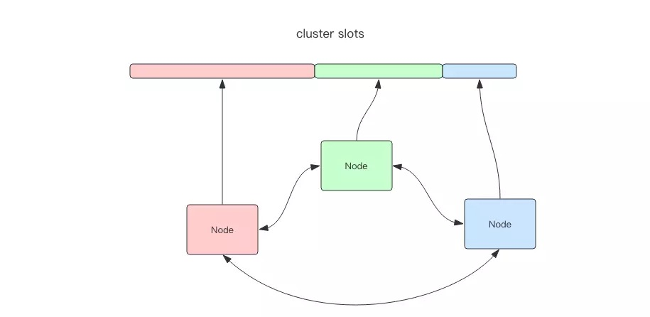
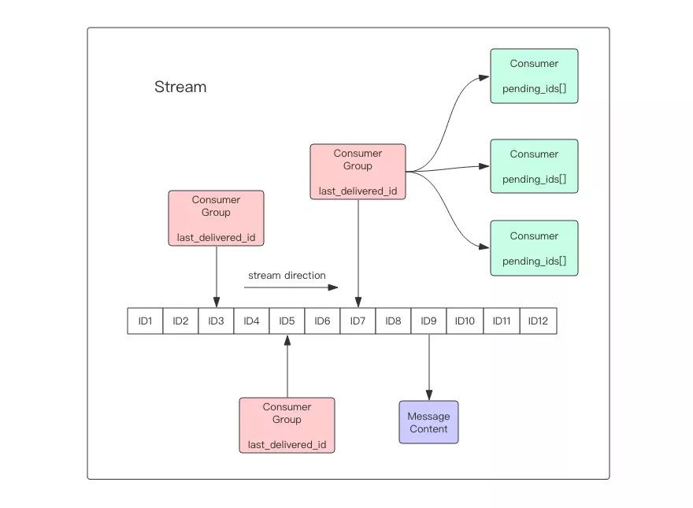

# 十二、原理1 线程 IO 模型

Redis 是个单线程程序！这点必须铭记。

也许你会怀疑高并发的 Redis 中间件怎么可能是单线程。很抱歉，它就是单线程，你的怀疑暴露了你基础知识的不足。莫要瞧不起单线程，除了 Redis 之外，Node.js 也是单线程，Nginx 也是单线程，但是它们都是服务器高性能的典范。

Redis 单线程为什么还能这么快？

因为它所有的数据都在内存中，所有的运算都是内存级别的运算。正因为 Redis 是单线程，所以要小心使用 Redis 指令，对于那些时间复杂度为 O(n) 级别的指令，一定要谨慎使用，一不小心就可能会导致 Redis 卡顿。

Redis 单线程如何处理那么多的并发客户端连接？

这个问题，有很多中高级程序员都无法回答，因为他们没听过多路复用这个词汇，不知道 select 系列的事件轮询 API，没用过非阻塞 IO。

## 非阻塞 IO

当我们调用套接字的读写方法，默认它们是阻塞的，比如read方法要传递进去一个参数n，表示最多读取这么多字节后再返回，如果一个字节都没有，那么线程就会卡在那里，直到新的数据到来或者连接关闭了，read方法才可以返回，线程才能继续处理。而write方法一般来说不会阻塞，除非内核为套接字分配的写缓冲区已经满了，write方法就会阻塞，直到缓存区中有空闲空间挪出来了。


非阻塞 IO 在套接字对象上提供了一个选项Non_Blocking，当这个选项打开时，读写方法不会阻塞，而是能读多少读多少，能写多少写多少。能读多少取决于内核为套接字分配的读缓冲区内部的数据字节数，能写多少取决于内核为套接字分配的写缓冲区的空闲空间字节数。读方法和写方法都会通过返回值来告知程序实际读写了多少字节。

有了非阻塞 IO 意味着线程在读写 IO 时可以不必再阻塞了，读写可以瞬间完成然后线程可以继续干别的事了。

## 事件轮询 (多路复用)

非阻塞 IO 有个问题，那就是线程要读数据，结果读了一部分就返回了，线程如何知道何时才应该继续读。也就是当数据到来时，线程如何得到通知。写也是一样，如果缓冲区满了，写不完，剩下的数据何时才应该继续写，线程也应该得到通知。


事件轮询 API 就是用来解决这个问题的，最简单的事件轮询 API 是select函数，它是操作系统提供给用户程序的 API。输入是读写描述符列表read_fds & write_fds，输出是与之对应的可读可写事件。同时还提供了一个timeout参数，如果没有任何事件到来，那么就最多等待timeout时间，线程处于阻塞状态。一旦期间有任何事件到来，就可以立即返回。时间过了之后还是没有任何事件到来，也会立即返回。拿到事件后，线程就可以继续挨个处理相应的事件。处理完了继续过来轮询。于是线程就进入了一个死循环，我们把这个死循环称为事件循环，一个循环为一个周期。

每个客户端套接字socket都有对应的读写文件描述符。

```python
read_events, write_events = select(read_fds, write_fds, timeout)
for event in read_events:
    handle_read(event.fd)
for event in write_events:
    handle_write(event.fd)
handle_others()  # 处理其它事情，如定时任务等
```

因为我们通过select系统调用同时处理多个通道描述符的读写事件，因此我们将这类系统调用称为多路复用 API。现代操作系统的多路复用 API 已经不再使用select系统调用，而改用epoll(linux)和kqueue(freebsd & macosx)，因为 select 系统调用的性能在描述符特别多时性能会非常差。它们使用起来可能在形式上略有差异，但是本质上都是差不多的，都可以使用上面的伪代码逻辑进行理解。

服务器套接字serversocket对象的读操作是指调用accept接受客户端新连接。何时有新连接到来，也是通过select系统调用的读事件来得到通知的。

事件轮询 API 就是 Java 语言里面的 NIO 技术

Java 的 NIO 并不是 Java 特有的技术，其它计算机语言都有这个技术，只不过换了一个词汇，不叫 NIO 而已。

## 指令队列

Redis 会将每个客户端套接字都关联一个指令队列。客户端的指令通过队列来排队进行顺序处理，先到先服务。

## 响应队列

Redis 同样也会为每个客户端套接字关联一个响应队列。Redis 服务器通过响应队列来将指令的返回结果回复给客户端。 如果队列为空，那么意味着连接暂时处于空闲状态，不需要去获取写事件，也就是可以将当前的客户端描述符从write_fds里面移出来。等到队列有数据了，再将描述符放进去。避免select系统调用立即返回写事件，结果发现没什么数据可以写。出这种情况的线程会飙高 CPU。

## 定时任务

服务器处理要响应 IO 事件外，还要处理其它事情。比如定时任务就是非常重要的一件事。如果线程阻塞在 select 系统调用上，定时任务将无法得到准时调度。那 Redis 是如何解决这个问题的呢？

Redis 的定时任务会记录在一个称为最小堆的数据结构中。这个堆中，最快要执行的任务排在堆的最上方。在每个循环周期，Redis 都会将最小堆里面已经到点的任务立即进行处理。处理完毕后，将最快要执行的任务还需要的时间记录下来，这个时间就是select系统调用的timeout参数。因为 Redis 知道未来timeout时间内，没有其它定时任务需要处理，所以可以安心睡眠timeout的时间。

Nginx 和 Node 的事件处理原理和 Redis 也是类似的

# 十三、 原理2 通信协议

Redis 的作者认为数据库系统的瓶颈一般不在于网络流量，而是数据库自身内部逻辑处理上。所以即使 Redis 使用了浪费流量的文本协议，依然可以取得极高的访问性能。Redis 将所有数据都放在内存，用一个单线程对外提供服务，单个节点在跑满一个 CPU 核心的情况下可以达到了 10w/s 的超高 QPS。

## RESP(Redis Serialization Protocol)

RESP 是 Redis 序列化协议的简写。它是一种直观的文本协议，优势在于实现异常简单，解析性能极好。

Redis 协议将传输的结构数据分为 5 种最小单元类型，单元结束时统一加上回车换行符号\r\n。

1. 单行字符串 以 + 符号开头。
2. 多行字符串 以 $ 符号开头，后跟字符串长度。
3. 整数值 以 : 符号开头，后跟整数的字符串形式。
4. 错误消息 以 - 符号开头。
5. 数组 以 * 号开头，后跟数组的长度。

**单行字符串** hello world

```assembly
+hello world\r\n
```

**多行字符串** hello world

```assembly
$11\r\nhello world\r\n
```

多行字符串当然也可以表示单行字符串。

**整数** 1024

```assembly
:1024\r\n
```

**错误** 参数类型错误

```
-WRONGTYPE Operation against a key holding the wrong kind of value\r\n
```

**数组** [1,2,3]

```
*3\r\n:1\r\n:2\r\n:3\r\n
```

**NULL** 用多行字符串表示，不过长度要写成-1。

```
$-1\r\n
```

**空串** 用多行字符串表示，长度填 0。

```
$0\r\n\r\n
```

注意这里有两个`\r\n`。为什么是两个?因为两个`\r\n`之间,隔的是空串。

## 客户端 -> 服务器

客户端向服务器发送的指令只有一种格式，多行字符串数组。比如一个简单的 set 指令set author codehole会被序列化成下面的字符串。

```assembly
*3\r\n$3\r\nset\r\n$6\r\nauthor\r\n$8\r\ncodehole\r\n
```

在控制台输出这个字符串如下，可以看出这是很好阅读的一种格式。

```assembly
*3
$3
set
$6
author
$8
codehole
```

## 服务器 -> 客户端

服务器向客户端回复的响应要支持多种数据结构，所以消息响应在结构上要复杂不少。不过再复杂的响应消息也是以上 5 中基本类型的组合。

**单行字符串响应**

```assembly
127.0.0.1:6379> set author codehole
OK
```

这里的 OK 就是单行响应，没有使用引号括起来。

```assembly
+OK
```

**错误响应**

```assembly
127.0.0.1:6379> incr author
(error) ERR value is not an integer or out of range
```

试图对一个字符串进行自增，服务器抛出一个通用的错误。

```assembly
-ERR value is not an integer or out of range
```

**整数响应**

```assembly
127.0.0.1:6379> incr books
(integer) 1
```

这里的`1`就是整数响应

```assembly
:1
```

**多行字符串响应**

```assembly
127.0.0.1:6379> get author
"codehole"
```

这里使用双引号括起来的字符串就是多行字符串响应

```assembly
$8
codehole
```

**数组响应**

```assembly
127.0.0.1:6379> hset info name laoqian
(integer) 1
127.0.0.1:6379> hset info age 30
(integer) 1
127.0.0.1:6379> hset info sex male
(integer) 1
127.0.0.1:6379> hgetall info
1) "name"
2) "laoqian"
3) "age"
4) "30"
5) "sex"
6) "male"
```

这里的 hgetall 命令返回的就是一个数组，第 0|2|4 位置的字符串是 hash 表的 key，第 1|3|5 位置的字符串是 value，客户端负责将数组组装成字典再返回。

```
*6
$4
name
$6
laoqian
$3
age
$2
30
$3
sex
$4
male
```

**嵌套**

```assembly
127.0.0.1:6379> scan 0
1) "0"
2) 1) "info"
   2) "books"
   3) "author"
```

scan 命令用来扫描服务器包含的所有 key 列表，它是以游标的形式获取，一次只获取一部分。

scan 命令返回的是一个嵌套数组。数组的第一个值表示游标的值，如果这个值为零，说明已经遍历完毕。如果不为零，使用这个值作为 scan 命令的参数进行下一次遍历。数组的第二个值又是一个数组，这个数组就是 key 列表。

```assembly
*2
$1
0
*3
$4
info
$5
books
$6
author
```

# 十四、原理3 持久化

Redis 的数据全部在内存里，如果突然宕机，数据就会全部丢失，因此必须有一种机制来保证 Redis 的数据不会因为故障而丢失，这种机制就是 Redis 的持久化机制。

Redis 的持久化机制有两种，第一种是快照，第二种是 AOF 日志。快照是一次全量备份，AOF 日志是连续的增量备份。快照是内存数据的二进制序列化形式，在存储上非常紧凑，而 AOF 日志记录的是内存数据修改的指令记录文本。AOF 日志在长期的运行过程中会变的无比庞大，数据库重启时需要加载 AOF 日志进行指令重放，这个时间就会无比漫长。所以需要定期进行 AOF 重写，给 AOF 日志进行瘦身。


## 快照原理

我们知道 Redis 是单线程程序，这个线程要同时负责多个客户端套接字的并发读写操作和内存数据结构的逻辑读写。

在服务线上请求的同时，Redis 还需要进行内存快照，内存快照要求 Redis 必须进行文件 IO 操作，可文件 IO 操作是不能使用多路复用 API。

这意味着单线程同时在服务线上的请求还要进行文件 IO 操作，文件 IO 操作会严重拖垮服务器请求的性能。还有个重要的问题是为了不阻塞线上的业务，就需要边持久化边响应客户端请求。持久化的同时，内存数据结构还在改变，比如一个大型的 hash 字典正在持久化，结果一个请求过来把它给删掉了，还没持久化完呢，这尼玛要怎么搞？

**那该怎么办呢？**

Redis 使用操作系统的多进程 COW(Copy On Write) 机制来实现快照持久化，这个机制很有意思，也很少人知道。多进程 COW 也是鉴定程序员知识广度的一个重要指标。

## fork(多进程)

Redis 在持久化时会调用 glibc 的函数fork产生一个子进程，快照持久化完全交给子进程来处理，父进程继续处理客户端请求。子进程刚刚产生时，它和父进程共享内存里面的代码段和数据段。这时你可以将父子进程想像成一个连体婴儿，共享身体。这是 Linux 操作系统的机制，为了节约内存资源，所以尽可能让它们共享起来。在进程分离的一瞬间，内存的增长几乎没有明显变化。


用 Python 语言描述进程分离的逻辑如下。`fork`函数会在父子进程同时返回，在父进程里返回子进程的 pid，在子进程里返回零。如果操作系统内存资源不足，pid 就会是负数，表示`fork`失败。

```python
pid = os.fork()
if pid > 0:
    handle_client_requests()  # 父进程继续处理客户端请求
if pid == 0:
    handle_snapshot_write()  # 子进程处理快照写磁盘
if pid < 0:
    # fork error
```

子进程做数据持久化，它不会修改现有的内存数据结构，它只是对数据结构进行遍历读取，然后序列化写到磁盘中。但是父进程不一样，它必须持续服务客户端请求，然后对内存数据结构进行不间断的修改。

这个时候就会使用操作系统的 COW 机制来进行数据段页面的分离。数据段是由很多操作系统的页面组合而成，当父进程对其中一个页面的数据进行修改时，会将被共享的页面复制一份分离出来，然后对这个复制的页面进行修改。这时子进程相应的页面是没有变化的，还是进程产生时那一瞬间的数据。


随着父进程修改操作的持续进行，越来越多的共享页面被分离出来，内存就会持续增长。但是也不会超过原有数据内存的 2 倍大小。另外一个 Redis 实例里冷数据占的比例往往是比较高的，所以很少会出现所有的页面都会被分离，被分离的往往只有其中一部分页面。每个页面的大小只有 4K，一个 Redis 实例里面一般都会有成千上万的页面。

子进程因为数据没有变化，它能看到的内存里的数据在进程产生的一瞬间就凝固了，再也不会改变，这也是为什么 Redis 的持久化叫「快照」的原因。接下来子进程就可以非常安心的遍历数据了进行序列化写磁盘了。

## AOF 原理

AOF 日志存储的是 Redis 服务器的顺序指令序列，AOF 日志只记录对内存进行修改的指令记录。

假设 AOF 日志记录了自 Redis 实例创建以来所有的修改性指令序列，那么就可以通过对一个空的 Redis 实例顺序执行所有的指令，也就是「重放」，来恢复 Redis 当前实例的内存数据结构的状态。

Redis 会在收到客户端修改指令后，进行参数校验进行逻辑处理后，如果没问题，就立即将该指令文本存储到 AOF 日志中，也就是先执行指令才将日志存盘。这点不同于leveldb、hbase等存储引擎，它们都是先存储日志再做逻辑处理。

Redis 在长期运行的过程中，AOF 的日志会越变越长。如果实例宕机重启，重放整个 AOF 日志会非常耗时，导致长时间 Redis 无法对外提供服务。所以需要对 AOF 日志瘦身。

## AOF 重写

Redis 提供了 bgrewriteaof 指令用于对 AOF 日志进行瘦身。其原理就是开辟一个子进程对内存进行遍历转换成一系列 Redis 的操作指令，序列化到一个新的 AOF 日志文件中。序列化完毕后再将操作期间发生的增量 AOF 日志追加到这个新的 AOF 日志文件中，追加完毕后就立即替代旧的 AOF 日志文件了，瘦身工作就完成了。

## fsync

AOF 日志是以文件的形式存在的，当程序对 AOF 日志文件进行写操作时，实际上是将内容写到了内核为文件描述符分配的一个内存缓存中，然后内核会异步将脏数据刷回到磁盘的。

这就意味着如果机器突然宕机，AOF 日志内容可能还没有来得及完全刷到磁盘中，这个时候就会出现日志丢失。那该怎么办？

Linux 的glibc提供了fsync(int fd)函数可以将指定文件的内容强制从内核缓存刷到磁盘。只要 Redis 进程实时调用 fsync 函数就可以保证 aof 日志不丢失。但是 fsync 是一个磁盘 IO 操作，它很慢！如果 Redis 执行一条指令就要 fsync 一次，那么 Redis 高性能的地位就不保了。

所以在生产环境的服务器中，Redis 通常是每隔 1s 左右执行一次 fsync 操作，周期 1s 是可以配置的。这是在数据安全性和性能之间做了一个折中，在保持高性能的同时，尽可能使得数据少丢失。

Redis 同样也提供了另外两种策略，一个是永不 fsync——让操作系统来决定何时同步磁盘，很不安全，另一个是来一个指令就 fsync 一次——非常慢。但是在生产环境基本不会使用，了解一下即可。

## 运维

快照是通过开启子进程的方式进行的，它是一个比较耗资源的操作。

1. 遍历整个内存，大块写磁盘会加重系统负载
2. AOF 的 fsync 是一个耗时的 IO 操作，它会降低 Redis 性能，同时也会增加系统 IO 负担

所以通常 Redis 的主节点是不会进行持久化操作，持久化操作主要在从节点进行。从节点是备份节点，没有来自客户端请求的压力，它的操作系统资源往往比较充沛。

但是如果出现网络分区，从节点长期连不上主节点，就会出现数据不一致的问题，特别是在网络分区出现的情况下又不小心主节点宕机了，那么数据就会丢失，所以在生产环境要做好实时监控工作，保证网络畅通或者能快速修复。另外还应该再增加一个从节点以降低网络分区的概率，只要有一个从节点数据同步正常，数据也就不会轻易丢失。

## Redis 4.0 混合持久化

重启 Redis 时，我们很少使用 rdb 来恢复内存状态，因为会丢失大量数据。我们通常使用 AOF 日志重放，但是重放 AOF 日志性能相对 rdb 来说要慢很多，这样在 Redis 实例很大的情况下，启动需要花费很长的时间。

Redis 4.0 为了解决这个问题，带来了一个新的持久化选项——混合持久化。将 rdb 文件的内容和增量的 AOF 日志文件存在一起。这里的 AOF 日志不再是全量的日志，而是自持久化开始到持久化结束的这段时间发生的增量 AOF 日志，通常这部分 AOF 日志很小。


于是在 Redis 重启的时候，可以先加载 rdb 的内容，然后再重放增量 AOF 日志就可以完全替代之前的 AOF 全量文件重放，重启效率因此大幅得到提升。

# 十五、 原理4 管道

大多数同学一直以来对 Redis 管道有一个误解，他们以为这是 Redis 服务器提供的一种特别的技术，有了这种技术就可以加速 Redis 的存取效率。但是实际上 Redis 管道 (Pipeline) 本身并不是 Redis 服务器直接提供的技术，这个技术本质上是由客户端提供的，跟服务器没有什么直接的关系。下面我们对这块做一个深入探究。

## Redis 的消息交互

当我们使用客户端对 Redis 进行一次操作时，如下图所示，客户端将请求传送给服务器，服务器处理完毕后，再将响应回复给客户端。这要花费一个网络数据包来回的时间。



如果连续执行多条指令，那就会花费多个网络数据包来回的时间。如下图所示。


回到客户端代码层面，客户端是经历了写-读-写-读四个操作才完整地执行了两条指令。


现在如果我们调整读写顺序，改成写—写-读-读，这两个指令同样可以正常完成。


两个连续的写操作和两个连续的读操作总共只会花费一次网络来回，就好比连续的 write 操作合并了，连续的 read 操作也合并了一样。


这便是管道操作的本质，服务器根本没有任何区别对待，还是收到一条消息，执行一条消息，回复一条消息的正常的流程。客户端通过对管道中的指令列表改变读写顺序就可以大幅节省 IO 时间。管道中指令越多，效果越好。

## 管道压力测试

接下来我们实践一下管道的力量。

Redis 自带了一个压力测试工具`redis-benchmark`，使用这个工具就可以进行管道测试。

首先我们对一个普通的 set 指令进行压测，QPS 大约 5w/s。

```assembly
> redis-benchmark -t set -q
SET: 51975.05 requests per second
```

我们加入管道选项`-P`参数，它表示单个管道内并行的请求数量，看下面`P=2`，QPS 达到了 9w/s。

```assembly
> redis-benchmark -t set -P 2 -q
SET: 91240.88 requests per second
```

再看看`P=3`，QPS 达到了 10w/s。

```assembly
SET: 102354.15 requests per second
```

但如果再继续提升 P 参数，发现 QPS 已经上不去了。这是为什么呢？

因为这里 CPU 处理能力已经达到了瓶颈，Redis 的单线程 CPU 已经飙到了 100%，所以无法再继续提升了。

## 深入理解管道本质

接下来我们深入分析一个请求交互的流程，真实的情况是它很复杂，因为要经过网络协议栈，这个就得深入内核了。


上图就是一个完整的请求交互流程图。我用文字来仔细描述一遍：

1. 客户端进程调用write将消息写到操作系统内核为套接字分配的发送缓冲send buffer。
2. 客户端操作系统内核将发送缓冲的内容发送到网卡，网卡硬件将数据通过「网际路由」送到服务器的网卡。
3. 服务器操作系统内核将网卡的数据放到内核为套接字分配的接收缓冲recv buffer。
4. 服务器进程调用read从接收缓冲中取出消息进行处理。
5. 服务器进程调用write将响应消息写到内核为套接字分配的发送缓冲send buffer。
6. 服务器操作系统内核将发送缓冲的内容发送到网卡，网卡硬件将数据通过「网际路由」送到客户端的网卡。
7. 客户端操作系统内核将网卡的数据放到内核为套接字分配的接收缓冲recv buffer。
8. 客户端进程调用read从接收缓冲中取出消息返回给上层业务逻辑进行处理。
9. 结束。

其中步骤 5~8 和 1~4 是一样的，只不过方向是反过来的，一个是请求，一个是响应。

我们开始以为 write 操作是要等到对方收到消息才会返回，但实际上不是这样的。write 操作只负责将数据写到本地操作系统内核的发送缓冲然后就返回了。剩下的事交给操作系统内核异步将数据送到目标机器。但是如果发送缓冲满了，那么就需要等待缓冲空出空闲空间来，这个就是写操作 IO 操作的真正耗时。

我们开始以为 `read` 操作是从目标机器拉取数据，但实际上不是这样的。`read` 操作只负责将数据从本地操作系统内核的接收缓冲中取出来就了事了。但是如果缓冲是空的，那么就需要等待数据到来，这个就是读操作 IO 操作的真正耗时。

所以对于value = redis.get(key)这样一个简单的请求来说，write操作几乎没有耗时，直接写到发送缓冲就返回，而read就会比较耗时了，因为它要等待消息经过网络路由到目标机器处理后的响应消息,再回送到当前的内核读缓冲才可以返回。这才是一个网络来回的真正开销。

而对于管道来说，连续的`write`操作根本就没有耗时，之后第一个`read`操作会等待一个网络的来回开销，然后所有的响应消息就都已经回送到内核的读缓冲了，后续的 `read` 操作直接就可以从缓冲拿到结果，瞬间就返回了。

# 十六、 原理5 事务

为了确保连续多个操作的原子性，一个成熟的数据库通常都会有事务支持，Redis 也不例外。Redis 的事务使用非常简单，不同于关系数据库，我们无须理解那么多复杂的事务模型，就可以直接使用。不过也正是因为这种简单性，它的事务模型很不严格，这要求我们不能像使用关系数据库的事务一样来使用 Redis。

## Redis 事务的基本使用

每个事务的操作都有 begin、commit 和 rollback，begin 指示事务的开始，commit 指示事务的提交，rollback 指示事务的回滚。它大致的形式如下。

```java
begin();
try {
    command1();
    command2();
    ....
    commit();
} catch(Exception e) {
    rollback();
}
```

Redis 在形式上看起来也差不多，分别是 multi/exec/discard。multi 指示事务的开始，exec 指示事务的执行，discard 指示事务的丢弃。

```assembly
> multi
OK
> incr books
QUEUED
> incr books
QUEUED
> exec
(integer) 1
(integer) 2
```

上面的指令演示了一个完整的事务过程，所有的指令在 exec 之前不执行，而是缓存在服务器的一个事务队列中，服务器一旦收到 exec 指令，才开执行整个事务队列，执行完毕后一次性返回所有指令的运行结果。因为 Redis 的单线程特性，它不用担心自己在执行队列的时候被其它指令打搅，可以保证他们能得到的「原子性」执行。


上图显示了以上事务过程完整的交互效果。QUEUED 是一个简单字符串，同 OK 是一个形式，它表示指令已经被服务器缓存到队列里了。

## 原子性

事务的原子性是指要么事务全部成功，要么全部失败，那么 Redis 事务执行是原子性的么？

下面我们来看一个特别的例子。

```assembly
> multi
OK
> set books iamastring
QUEUED
> incr books
QUEUED
> set poorman iamdesperate
QUEUED
> exec
1) OK
2) (error) ERR value is not an integer or out of range
3) OK
> get books
"iamastring"
>  get poorman
"iamdesperate
```

上面的例子是事务执行到中间遇到失败了，因为我们不能对一个字符串进行数学运算，事务在遇到指令执行失败后，后面的指令还继续执行，所以 poorman 的值能继续得到设置。

到这里，你应该明白 Redis 的事务根本不能算「原子性」，而仅仅是满足了事务的「隔离性」，隔离性中的串行化——当前执行的事务有着不被其它事务打断的权利。

## discard(丢弃)

Redis 为事务提供了一个 discard 指令，用于丢弃事务缓存队列中的所有指令，在 exec 执行之前。

```assembly
> get books
(nil)
> multi
OK
> incr books
QUEUED
> incr books
QUEUED
> discard
OK
> get books
(nil)
```

我们可以看到 discard 之后，队列中的所有指令都没执行，就好像 multi 和 discard 中间的所有指令从未发生过一样。

## 优化

上面的 Redis 事务在发送每个指令到事务缓存队列时都要经过一次网络读写，当一个事务内部的指令较多时，需要的网络 IO 时间也会线性增长。所以通常 Redis 的客户端在执行事务时都会结合 pipeline 一起使用，这样可以将多次 IO 操作压缩为单次 IO 操作。比如我们在使用 Python 的 Redis 客户端时执行事务时是要强制使用 pipeline 的。

```python
pipe = redis.pipeline(transaction=true)
pipe.multi()
pipe.incr("books")
pipe.incr("books")
values = pipe.execute()
```

## Watch

考虑到一个业务场景，Redis 存储了我们的账户余额数据，它是一个整数。现在有两个并发的客户端要对账户余额进行修改操作，这个修改不是一个简单的 incrby 指令，而是要对余额乘以一个倍数。Redis 可没有提供 multiplyby 这样的指令。我们需要先取出余额然后在内存里乘以倍数，再将结果写回 Redis。

这就会出现并发问题，因为有多个客户端会并发进行操作。我们可以通过 Redis 的分布式锁来避免冲突，这是一个很好的解决方案。**分布式锁是一种悲观锁，那是不是可以使用乐观锁的方式来解决冲突呢？**

Redis 提供了这种 watch 的机制，它就是一种乐观锁。有了 watch 我们又多了一种可以用来解决并发修改的方法。 watch 的使用方式如下：

```python
while True:
    do_watch()
    commands()
    multi()
    send_commands()
    try:
        exec()
        break
    except WatchError:
        continue
```

watch 会在事务开始之前盯住 1 个或多个关键变量，当事务执行时，也就是服务器收到了 exec 指令要顺序执行缓存的事务队列时，Redis 会检查关键变量自 watch 之后，是否被修改了 (包括当前事务所在的客户端)。如果关键变量被人动过了，exec 指令就会返回 null 回复告知客户端事务执行失败，这个时候客户端一般会选择重试。

```assembly
> watch books
OK
> incr books  # 被修改了
(integer) 1
> multi
OK
> incr books
QUEUED
> exec  # 事务执行失败
(nil)
```

当服务器给 exec 指令返回一个 null 回复时，客户端知道了事务执行是失败的，通常客户端 (redis-py) 都会抛出一个 WatchError 这种错误，不过也有些语言 (jedis) 不会抛出异常，而是通过在 exec 方法里返回一个 null，这样客户端需要检查一下返回结果是否为 null 来确定事务是否执行失败。

**注意事项**

Redis 禁止在 multi 和 exec 之间执行 watch 指令，而必须在 multi 之前做好盯住关键变量，否则会出错。

接下来我们使用 Python 语言来实现对余额的加倍操作。

```python
# -*- coding: utf-8
import redis

def key_for(user_id):
    return "account_{}".format(user_id)

def double_account(client, user_id):
    key = key_for(user_id)
    while True:
        client.watch(key)
        value = int(client.get(key))
        value *= 2  # 加倍
        pipe = client.pipeline(transaction=True)
        pipe.multi()
        pipe.set(key, value)
        try:
            pipe.execute()
            break  # 总算成功了
        except redis.WatchError:
            continue  # 事务被打断了，重试
    return int(client.get(key))  # 重新获取余额

client = redis.StrictRedis()
user_id = "abc"
client.setnx(key_for(user_id), 5)  # setnx 做初始化
print(double_account(client, user_id))
```

下面我们再使用 Java 语言实现一遍。

```java
import java.util.List;
import redis.clients.jedis.Jedis;
import redis.clients.jedis.Transaction;

public class TransactionDemo {

  public static void main(String[] args) {
    Jedis jedis = new Jedis();
    String userId = "abc";
    String key = keyFor(userId);
    jedis.setnx(key, String.valueOf(5));  # setnx 做初始化
    System.out.println(doubleAccount(jedis, userId));
    jedis.close();
  }

  public static int doubleAccount(Jedis jedis, String userId) {
    String key = keyFor(userId);
    while (true) {
      jedis.watch(key);
      int value = Integer.parseInt(jedis.get(key));
      value *= 2; // 加倍
      Transaction tx = jedis.multi();
      tx.set(key, String.valueOf(value));
      List<Object> res = tx.exec();
      if (res != null) {
        break; // 成功了
      }
    }
    return Integer.parseInt(jedis.get(key)); // 重新获取余额
  }

  public static String keyFor(String userId) {
    return String.format("account_%s", userId);
  }

}
```

我们常常听说 Python 的代码要比 Java 简短太多，但是从这个例子中我们看到 Java 的代码比 python 的代码也多不了多少，大约只多出 50%。

# 十七、 原理6 PubSub

前面我们讲了 Redis 消息队列的使用方法，但是没有提到 **Redis 消息队列的不足之处，那就是它不支持消息的多播机制**。


## 消息多播

消息多播允许生产者生产一次消息，中间件负责将消息复制到多个消息队列，每个消息队列由相应的消费组进行消费。它是分布式系统常用的一种解耦方式，用于将多个消费组的逻辑进行拆分。支持了消息多播，多个消费组的逻辑就可以放到不同的子系统中。

如果是普通的消息队列，就得将多个不同的消费组逻辑串接起来放在一个子系统中，进行连续消费。


## PubSub

为了支持消息多播，Redis 不能再依赖于那 5 种基本数据类型了。它单独使用了一个模块来支持消息多播，这个模块的名字叫着 PubSub，也就是 PublisherSubscriber，发布者订阅者模型。我们使用 Python 语言来演示一下 PubSub 如何使用。

```python
# -*- coding: utf-8 -*-
import time
import redis

client = redis.StrictRedis()
p = client.pubsub()
p.subscribe("codehole")
time.sleep(1)
print p.get_message()
client.publish("codehole", "java comes")
time.sleep(1)
print p.get_message()
client.publish("codehole", "python comes")
time.sleep(1)
print p.get_message()
print p.get_message()
```

```python
{'pattern': None, 'type': 'subscribe', 'channel': 'codehole', 'data': 1L}
{'pattern': None, 'type': 'message', 'channel': 'codehole', 'data': 'java comes'}
{'pattern': None, 'type': 'message', 'channel': 'codehole', 'data': 'python comes'}
None
```


客户端发起订阅命令后，Redis 会立即给予一个反馈消息通知订阅成功。因为有网络传输延迟，在 subscribe 命令发出后，需要休眠一会，再通过 get\_message 才能拿到反馈消息。客户端接下来执行发布命令，发布了一条消息。同样因为网络延迟，在 publish 命令发出后，需要休眠一会，再通过 get\_message 才能拿到发布的消息。如果当前没有消息，get\_message 会返回空，告知当前没有消息，所以它不是阻塞的。

Redis PubSub 的生产者和消费者是不同的连接，也就是上面这个例子实际上使用了两个 Redis 的连接。这是必须的，因为 Redis 不允许连接在 subscribe 等待消息时还要进行其它的操作。

**在生产环境中，我们很少将生产者和消费者放在同一个线程里**。如果它们真要在同一个线程里，何必通过中间件来流转，直接使用函数调用就行。所以我们应该将生产者和消费者分离，接下来我们看看分离后的代码要怎么写。

**消费者**

```python
# -*- coding: utf-8 -*-
import time
import redis

client = redis.StrictRedis()
p = client.pubsub()
p.subscribe("codehole")
while True:
    msg = p.get_message()
    if not msg:
        time.sleep(1)
        continue
    print(msg)
```

**生产者**

```python
# -*- coding: utf-8 -*-
import redis

client = redis.StrictRedis()
client.publish("codehole", "python comes")
client.publish("codehole", "java comes")
client.publish("codehole", "golang comes")
```

我们从消费者的控制台窗口可以看到上面的输出，每个消费者窗口都是同样的输出。第一行是订阅成功消息，它很快就会输出，后面的三行会在生产者进程执行的时候立即输出。 上面的消费者是通过轮询 get_message 来收取消息的，如果收取不到就休眠 1s。这让我们想起了第 3 节的消息队列模型，我们使用 blpop 来代替休眠来提高消息处理的及时性。

PubSub 的消费者如果使用休眠的方式来轮询消息，也会遭遇消息处理不及时的问题。不过我们可以使用 listen 来阻塞监听消息来进行处理，这点同 blpop 原理是一样的。下面我们改造一下消费者

**阻塞消费者**

```python
# -*- coding: utf-8 -*-
import time
import redis

client = redis.StrictRedis()
p = client.pubsub()
p.subscribe("codehole")
for msg in p.listen():
    print(msg)
```

代码简短了很多，不需要再休眠了，消息处理也及时了。

## 模式订阅

上面提到的订阅模式是基于名称订阅的，消费者订阅一个主题是必须明确指定主题的名称。如果我们想要订阅多个主题，那就 subscribe 多个名称。

```assembly
> subscribe codehole.image codehole.text codehole.blog  # 同时订阅三个主题，会有三条订阅成功反馈信息
1) "subscribe"
2) "codehole.image"
3) (integer) 1
1) "subscribe"
2) "codehole.text"
3) (integer) 2
1) "subscribe"
2) "codehole.blog"
3) (integer) 3
```

这样生产者向这三个主题发布的消息，这个消费者都可以接收到。

```assembly
> publish codehole.image https://www.google.com/dudo.png
(integer) 1
> publish codehole.text " 你好，欢迎加入码洞 "
(integer) 1
> publish codehole.blog '{"content": "hello, everyone", "title": "welcome"}'
(integer) 1
```

如果现在要增加一个主题codehole.group，客户端必须也跟着增加一个订阅指令才可以收到新开主题的消息推送。

为了简化订阅的繁琐，redis 提供了模式订阅功能Pattern Subscribe，这样就可以一次订阅多个主题，即使生产者新增加了同模式的主题，消费者也可以立即收到消息

```assembly
> psubscribe codehole.*  # 用模式匹配一次订阅多个主题，主题以 codehole. 字符开头的消息都可以收到
1) "psubscribe"
2) "codehole.*"
3) (integer) 1
```

## 消息结构

前面的消费者消息输出时都是下面的这样一个字典形式

```java
{'pattern': None, 'type': 'subscribe', 'channel': 'codehole', 'data': 1L}
{'pattern': None, 'type': 'message', 'channel': 'codehole', 'data': 'python comes'}
{'pattern': None, 'type': 'message', 'channel': 'codehole', 'data': 'java comes'}
{'pattern': None, 'type': 'message', 'channel': 'codehole', 'data': 'golang comes'}
```

那这几个字段是什么含义呢？

data 这个毫无疑问就是消息的内容，一个字符串。

channel 这个也很明显，它表示当前订阅的主题名称。

type 它表示消息的类型，如果是一个普通的消息，那么类型就是 message，如果是控制消息，比如订阅指令的反馈，它的类型就是 subscribe，如果是模式订阅的反馈，它的类型就是 psubscribe，还有取消订阅指令的反馈 unsubscribe 和 punsubscribe。

pattern 它表示当前消息是使用哪种模式订阅到的，如果是通过 subscribe 指令订阅的，那么这个字段就是空。

## PubSub 缺点

PubSub 的生产者传递过来一个消息，Redis 会直接找到相应的消费者传递过去。如果一个消费者都没有，那么消息直接丢弃。如果开始有三个消费者，一个消费者突然挂掉了，生产者会继续发送消息，另外两个消费者可以持续收到消息。但是挂掉的消费者重新连上的时候，这断连期间生产者发送的消息，对于这个消费者来说就是彻底丢失了。

如果 Redis 停机重启，PubSub 的消息是不会持久化的，毕竟 Redis 宕机就相当于一个消费者都没有，所有的消息直接被丢弃。

正是因为 PubSub 有这些缺点，它几乎找不到合适的应用场景。所以 Redis 的作者单独开启了一个项目 Disque 专门用来做多播消息队列。该项目目前没有成熟，一直长期处于 Beta 版本，但是相应的客户端 sdk 已经非常丰富了，就待 Redis 作者临门一脚发布一个 Release 版本。关于 Disque 的更多细节，本小册不会多做详细介绍，感兴趣的同学可以去阅读相关文档。

## 补充

近期 Redis5.0 新增了 Stream 数据结构，这个功能给 Redis 带来了持久化消息队列，从此 PubSub 可以消失了，Disqueue 估计也永远发不出它的 Release 版本了。具体内容请读者阅读 Stream 章节内容（第 23 节）。

# 十九、 原理7 小对象压缩

Redis 是一个非常耗费内存的数据库，它所有的数据都放在内存里。如果我们不注意节约使用内存，Redis 就会因为我们的无节制使用出现内存不足而崩溃。Redis 作者为了优化数据结构的内存占用，也苦心孤诣增加了非常多的优化点，这些优化也是以牺牲代码的可读性为代价的，但是毫无疑问这是非常值得的，尤其像 Redis 这种数据库。

## 32bit vs 64bit

Redis 如果使用 32bit 进行编译，内部所有数据结构所使用的指针空间占用会少一半，如果你对 Redis 使用内存不超过 4G，可以考虑使用 32bit 进行编译，可以节约大量内存。4G 的容量作为一些小型站点的缓存数据库是绰绰有余了，如果不足还可以通过增加实例的方式来解决。

## 小对象压缩存储 (ziplist)

如果 Redis 内部管理的集合数据结构很小，它会使用紧凑存储形式压缩存储。

这就好比 HashMap 本来是二维结构，但是如果内部元素比较少，使用二维结构反而浪费空间，还不如使用一维数组进行存储，需要查找时，因为元素少进行遍历也很快，甚至可以比 HashMap 本身的查找还要快。比如下面我们可以使用数组来模拟 HashMap 的增删改操作。

```java
public class ArrayMap<K, V> {

  private List<K> keys = new ArrayList<>();
  private List<V> values = new ArrayList<>();

  public V put(K k, V v) {
    for (int i = 0; i < keys.size(); i++) {
      if (keys.get(i).equals(k)) {
        V oldv = values.get(i);
        values.set(i, v);
        return oldv;
      }
    }
    keys.add(k);
    values.add(v);
    return null;
  }

  public V get(K k) {
    for (int i = 0; i < keys.size(); i++) {
      if (keys.get(i).equals(k)) {
        return values.get(i);
      }
    }
    return null;
  }

  public V delete(K k) {
    for (int i = 0; i < keys.size(); i++) {
      if (keys.get(i).equals(k)) {
        keys.remove(i);
        return values.remove(i);
      }
    }
    return null;
  }

}
```

Redis 的 ziplist 是一个紧凑的字节数组结构，如下图所示，每个元素之间都是紧挨着的。我们不用过于关心 `zlbytes/zltail` 和 `zlend` 的含义，稍微了解一下就好。


如果它存储的是 hash 结构，那么 key 和 value 会作为两个 entry 相邻存在一起。

```assembly
127.0.0.1:6379> hset hello a 1
(integer) 1
127.0.0.1:6379> hset hello b 2
(integer) 1
127.0.0.1:6379> hset hello c 3
(integer) 1
127.0.0.1:6379> object encoding hello
"ziplist"
```

如果它存储的是 zset，那么 value 和 score 会作为两个 entry 相邻存在一起。

```assembly
127.0.0.1:6379> zadd world 1 a
(integer) 1
127.0.0.1:6379> zadd world 2 b
(integer) 1
127.0.0.1:6379> zadd world 3 c
(integer) 1
127.0.0.1:6379> object encoding world
"ziplist"
```

关于压缩列表更多细节，请阅读第34节《极度深寒 —— 探索「列表」内部结构》和第35节《极度深寒 —— 探索「紧凑列表」内部》

Redis 的 intset 是一个紧凑的整数数组结构，它用于存放元素都是整数的并且元素个数较少的 set 集合。

如果整数可以用 uint16 表示，那么 intset 的元素就是 16 位的数组，如果新加入的整数超过了 uint16 的表示范围，那么就使用 uint32 表示，如果新加入的元素超过了 uint32 的表示范围，那么就使用 uint64 表示，Redis 支持 set 集合动态从 uint16 升级到 uint32，再升级到 uint64。



```assembly
127.0.0.1:6379> sadd hello 1 2 3
(integer) 3
127.0.0.1:6379> object encoding hello
"intset"
```

如果 set 里存储的是字符串，那么 sadd 立即升级为 hashtable 结构。还记得 Java 的 HashSet 么，它内部是使用 HashMap 实现的。

```assembly
127.0.0.1:6379> sadd hello yes no
(integer) 2
127.0.0.1:6379> object encoding hello
"hashtable"
```

**存储界限** 当集合对象的元素不断增加，或者某个 value 值过大，这种小对象存储也会被升级为标准结构。Redis 规定在小对象存储结构的限制条件如下：

```assembly
hash-max-ziplist-entries 512  # hash 的元素个数超过 512 就必须用标准结构存储
hash-max-ziplist-value 64  # hash 的任意元素的 key/value 的长度超过 64 就必须用标准结构存储
list-max-ziplist-entries 512  # list 的元素个数超过 512 就必须用标准结构存储
list-max-ziplist-value 64  # list 的任意元素的长度超过 64 就必须用标准结构存储
zset-max-ziplist-entries 128  # zset 的元素个数超过 128 就必须用标准结构存储
zset-max-ziplist-value 64  # zset 的任意元素的长度超过 64 就必须用标准结构存储
set-max-intset-entries 512  # set 的整数元素个数超过 512 就必须用标准结构存储
```

接下来我们做一个小实验，看看这里的界限是不是真的起到作用了。

```python
import redis
client = redis.StrictRedis()
client.delete("hello")
for i in range(512):
    client.hset("hello", str(i), str(i))
print client.object("encoding", "hello")  # 获取对象的存储结构
client.hset("hello", "512", "512")
print client.object("encoding", "hello") # 再次获取对象的存储结构
```

输出：

```assembly
ziplist
hashtable
```

可以看出来当 hash 结构的元素个数超过 512 的时候，存储结构就发生了变化。

接下来我们再试试递增 value 的长度，在 Python 里面对字符串乘以一个整数 n 相当于重复 n 次。

```python
import redis
client = redis.StrictRedis()
client.delete("hello")
for i in range(64):
    client.hset("hello", str(i), "0" * (i+1))
print(client.object("encoding", "hello"))  # 获取对象的存储结构
client.hset("hello", "512", "0" * 65)
print(client.object("encoding", "hello")) # 再次获取对象的存储结构
```

输出：

```
ziplist
hashtable
```

可以看出来当 hash 结构的任意 entry 的 value 值超过了 64，存储结构就升级成标准结构了。

## 内存回收机制

Redis 并不总是可以将空闲内存立即归还给操作系统。

如果当前 Redis 内存有 10G，当你删除了 1GB 

 key 后，再去观察内存，你会发现内存变化不会太大。原因是操作系统回收内存是以页为单位，如果这个页上只要有一个 key 还在使用，那么它就不能被回收。Redis 虽然删除了 1GB 的 key，但是这些 key 分散到了很多页面中，每个页面都还有其它 key 存在，这就导致了内存不会立即被回收。

不过，如果你执行 flushdb，然后再观察内存会发现内存确实被回收了。原因是所有的 key 都干掉了，大部分之前使用的页面都完全干净了，会立即被操作系统回收。
Redis 虽然无法保证立即回收已经删除的 key 的内存，但是它会重用那些尚未回收的空闲内存。这就好比电影院里虽然人走了，但是座位还在，下一波观众来了，直接坐就行。而操作系统回收内存就好比把座位都给搬走了。这个比喻是不是很 6？

## 内存分配算法

内存分配是一个非常复杂的课题，需要适当的算法划分内存页，需要考虑内存碎片，需要平衡性能和效率。

Redis 为了保持自身结构的简单性，在内存分配这里直接做了甩手掌柜，将内存分配的细节丢给了第三方内存分配库去实现。目前 Redis 可以使用 jemalloc(facebook) 库来管理内存，也可以切换到tcmalloc(google)。因为 jemalloc 相比 tcmalloc的性能要稍好一些，所以Redis默认使用了jemalloc。

```assembly
127.0.0.1:6379> info memory
# Memory
used_memory:809608
used_memory_human:790.63K
used_memory_rss:8232960
used_memory_peak:566296608
used_memory_peak_human:540.06M
used_memory_lua:36864
mem_fragmentation_ratio:10.17
mem_allocator:jemalloc-3.6.0
```

通过`info memory`指令可以看到 Redis 的`mem_allocator`使用了 jemalloc。

## 扩展阅读

[jemalloc —— 内存分配的奥义](https://link.juejin.im/?target=http%3A%2F%2Ftinylab.org%2Fmemory-allocation-mystery-%25C2%25B7-jemalloc-a%2F)

# 十九、 原理8 主从同步

很多企业都没有使用到 Redis 的集群，但是至少都做了主从。有了主从，当 master 挂掉的时候，运维让从库过来接管，服务就可以继续，否则 master 需要经过数据恢复和重启的过程，这就可能会拖很长的时间，影响线上业务的持续服务。

在了解 Redis 的主从复制之前，让我们先来理解一下现代分布式系统的理论基石——CAP 原理【Consistency（一致性）、 Availability（可用性）、Partition tolerance（分区容错性）】。

## CAP 原理

CAP 原理就好比分布式领域的牛顿定律，它是分布式存储的理论基石。自打 CAP 的论文发表之后，分布式存储中间件犹如雨后春笋般一个一个涌现出来。理解这个原理其实很简单，本节我们首先对这个原理进行一些简单的讲解。

- C - Consistent ，一致性
- A - Availability ，可用性
- P - Partition tolerance ，分区容忍性

分布式系统的节点往往都是分布在不同的机器上进行网络隔离开的，这意味着必然会有网络断开的风险，这个网络断开的场景的专业词汇叫着「网络分区」。

在网络分区发生时，两个分布式节点之间无法进行通信，我们对一个节点进行的修改操作将无法同步到另外一个节点，所以数据的「**一致性**」将无法满足，因为两个分布式节点的数据不再保持一致。除非我们牺牲「**可用性**」，也就是暂停分布式节点服务，在网络分区发生时，不再提供修改数据的功能，直到网络状况完全恢复正常再继续对外提供服务。


一句话概括 CAP 原理就是——**网络分区发生时，一致性和可用性两难全**。

## 最终一致

Redis 的主从数据是异步同步的，所以分布式的 Redis 系统并不满足「一致性」要求。当客户端在 Redis 的主节点修改了数据后，立即返回，即使在主从网络断开的情况下，主节点依旧可以正常对外提供修改服务，所以 Redis 满足「可用性」。

Redis 保证「最终一致性」，从节点会努力追赶主节点，最终从节点的状态会和主节点的状态将保持一致。如果网络断开了，主从节点的数据将会出现大量不一致，一旦网络恢复，从节点会采用多种策略努力追赶上落后的数据，继续尽力保持和主节点一致。

## 主从同步

Redis 同步支持主从同步和从从同步，从从同步功能是 Redis 后续版本增加的功能，为了减轻主库的同步负担。后面为了描述上的方便，统一理解为主从同步。


## 增量同步

Redis 同步的是指令流，主节点会将那些对自己的状态产生修改性影响的指令记录在本地的内存 buffer 中，然后异步将 buffer 中的指令同步到从节点，从节点一边执行同步的指令流来达到和主节点一样的状态，一边向主节点反馈自己同步到哪里了 (偏移量)。

因为内存的 buffer 是有限的，所以 Redis 主库不能将所有的指令都记录在内存 buffer 中。Redis 的复制内存 buffer 是一个定长的环形数组，如果数组内容满了，就会从头开始覆盖前面的内容。


如果因为网络状况不好，从节点在短时间内无法和主节点进行同步，那么当网络状况恢复时，Redis 的主节点中那些没有同步的指令在 buffer 中有可能已经被后续的指令覆盖掉了，从节点将无法直接通过指令流来进行同步，这个时候就需要用到更加复杂的同步机制 —— 快照同步。

## 快照同步

快照同步是一个非常耗费资源的操作，它首先需要在主库上进行一次 bgsave 将当前内存的数据全部快照到磁盘文件中，然后再将快照文件的内容全部传送到从节点。从节点将快照文件接受完毕后，立即执行一次全量加载，加载之前先要将当前内存的数据清空。加载完毕后通知主节点继续进行增量同步。

在整个快照同步进行的过程中，主节点的复制 buffer 还在不停的往前移动，如果快照同步的时间过长或者复制 buffer 太小，都会导致同步期间的增量指令在复制 buffer 中被覆盖，这样就会导致快照同步完成后无法进行增量复制，然后会再次发起快照同步，如此极有可能会陷入快照同步的死循环。


所以务必配置一个合适的复制 buffer 大小参数，避免快照复制的死循环。

## 增加从节点

当从节点刚刚加入到集群时，它必须先要进行一次快照同步，同步完成后再继续进行增量同步。

## 无盘复制

主节点在进行快照同步时，会进行很重的文件 IO 操作，特别是对于非 SSD 磁盘存储时，快照会对系统的负载产生较大影响。特别是当系统正在进行 AOF 的 fsync 操作时如果发生快照，fsync 将会被推迟执行，这就会严重影响主节点的服务效率。

所以从 Redis 2.8.18 版开始支持无盘复制。所谓无盘复制是指主服务器直接通过套接字将快照内容发送到从节点，生成快照是一个遍历的过程，主节点会一边遍历内存，一边将序列化的内容发送到从节点，从节点还是跟之前一样，先将接收到的内容存储到磁盘文件中，再进行一次性加载。

## Wait 指令

Redis 的复制是异步进行的，wait 指令可以让异步复制变身同步复制，确保系统的强一致性 (不严格)。wait 指令是 Redis3.0 版本以后才出现的。

```assembly
> set key value
OK
> wait 1 0
(integer) 1
```

wait 提供两个参数，第一个参数是从库的数量 N，第二个参数是时间 t，以毫秒为单位。它表示等待 wait 指令之前的所有写操作同步到 N 个从库 (也就是确保 N 个从库的同步没有滞后)，最多等待时间 t。如果时间 t=0，表示无限等待直到 N 个从库同步完成达成一致。

假设此时出现了网络分区，wait 指令第二个参数时间 t=0，主从同步无法继续进行，wait 指令会永远阻塞，Redis 服务器将丧失可用性。

## 小结

主从复制是 Redis 分布式的基础，Redis 的高可用离开了主从复制将无从进行。后面的章节我们会开始讲解 Redis 的集群模式，这几种集群模式都依赖于本节所讲的主从复制。

不过复制功能也不是必须的，如果你将 Redis 只用来做缓存，跟 memcache 一样来对待，也就无需要从库做备份，挂掉了重新启动一下就行。但是只要你使用了 Redis 的持久化功能，就必须认真对待主从复制，它是系统数据安全的基础保障。

# 二十、 集群1 Sentinel

目前我们讲的 Redis 还只是主从方案，最终一致性。读者们可思考过，如果主节点凌晨 3 点突发宕机怎么办？就坐等运维从床上爬起来，然后手工进行从主切换，再通知所有的程序把地址统统改一遍重新上线么？毫无疑问，这样的人工运维效率太低，事故发生时估计得至少 1 个小时才能缓过来。如果是一个大型公司，这样的事故足以上新闻了。


所以我们必须有一个高可用方案来抵抗节点故障，当故障发生时可以自动进行从主切换，程序可以不用重启，运维可以继续睡大觉，仿佛什么事也没发生一样。Redis 官方提供了这样一种方案 —— Redis Sentinel(哨兵)。


我们可以将 Redis Sentinel 集群看成是一个 ZooKeeper 集群，它是集群高可用的心脏，它一般是由 3～5 个节点组成，这样挂了个别节点集群还可以正常运转。

它负责持续监控主从节点的健康，当主节点挂掉时，自动选择一个最优的从节点切换为主节点。客户端来连接集群时，会首先连接 sentinel，通过 sentinel 来查询主节点的地址，然后再去连接主节点进行数据交互。当主节点发生故障时，客户端会重新向 sentinel 要地址，sentinel 会将最新的主节点地址告诉客户端。如此应用程序将无需重启即可自动完成节点切换。比如上图的主节点挂掉后，集群将可能自动调整为下图所示结构。


从这张图中我们能看到主节点挂掉了，原先的主从复制也断开了，客户端和损坏的主节点也断开了。从节点被提升为新的主节点，其它从节点开始和新的主节点建立复制关系。客户端通过新的主节点继续进行交互。Sentinel 会持续监控已经挂掉了主节点，待它恢复后，集群会调整为下面这张图。


此时原先挂掉的主节点现在变成了从节点，从新的主节点那里建立复制关系。

## 消息丢失

Redis 主从采用异步复制，意味着当主节点挂掉时，从节点可能没有收到全部的同步消息，这部分未同步的消息就丢失了。如果主从延迟特别大，那么丢失的数据就可能会特别多。Sentinel 无法保证消息完全不丢失，但是也尽可能保证消息少丢失。它有两个选项可以限制主从延迟过大。

```assembly
min-slaves-to-write 1
min-slaves-max-lag 10
```

第一个参数表示主节点必须至少有一个从节点在进行正常复制，否则就停止对外写服务，丧失可用性。

何为正常复制，何为异常复制？这个就是由第二个参数控制的，它的单位是秒，表示如果 10s 没有收到从节点的反馈，就意味着从节点同步不正常，要么网络断开了，要么一直没有给反馈。

## Sentinel 基本使用

接下来我们看看客户端如何使用 sentinel，标准的流程应该是客户端可以通过 sentinel 发现主从节点的地址，然后在通过这些地址建立相应的连接来进行数据存取操作。我们来看看 Python 客户端是如何做的。

```python
>>> from redis.sentinel import Sentinel
>>> sentinel = Sentinel([('localhost', 26379)], socket_timeout=0.1)
>>> sentinel.discover_master('mymaster')
('127.0.0.1', 6379)
>>> sentinel.discover_slaves('mymaster')
[('127.0.0.1', 6380)]
```

sentinel 的默认端口是 26379，不同于 Redis 的默认端口 6379，通过 sentinel 对象的 discover_xxx 方法可以发现主从地址，主地址只有一个，从地址可以有多个。

```python
>>> master = sentinel.master_for('mymaster', socket_timeout=0.1)
>>> slave = sentinel.slave_for('mymaster', socket_timeout=0.1)
>>> master.set('foo', 'bar')
>>> slave.get('foo')
'bar'
```

通过 xxx_for 方法可以从连接池中拿出一个连接来使用，因为从地址有多个，redis 客户端对从地址采用轮询方案，也就是 RoundRobin 轮着来。

有个问题是，但 sentinel 进行主从切换时，客户端如何知道地址变更了 ? 通过分析源码，我发现 redis-py 在建立连接的时候进行了主库地址变更判断。

连接池建立新连接时，会去查询主库地址，然后跟内存中的主库地址进行比对，如果变更了，就断开所有连接，重新使用新地址建立新连接。如果是旧的主库挂掉了，那么所有正在使用的连接都会被关闭，然后在重连时就会用上新地址。

但是这样还不够，如果是 sentinel 主动进行主从切换，主库并没有挂掉，而之前的主库连接已经建立了在使用了，没有新连接需要建立，那这个连接是不是一致切换不了？

继续深入研究源码，我发现 redis-py 在另外一个点也做了控制。那就是在处理命令的时候捕获了一个特殊的异常`ReadOnlyError`，在这个异常里将所有的旧连接全部关闭了，后续指令就会进行重连。

主从切换后，之前的主库被降级到从库，所有的修改性的指令都会抛出`ReadonlyError`。如果没有修改性指令，虽然连接不会得到切换，但是数据不会被破坏，所以即使不切换也没关系。

# 二十一、集群2 Codis

在大数据高并发场景下，单个 Redis 实例往往会显得捉襟见肘。首先体现在内存上，单个 Redis 的内存不宜过大，内存太大会导致 rdb 文件过大，进一步导致主从同步时全量同步时间过长，在实例重启恢复时也会消耗很长的数据加载时间，特别是在云环境下，单个实例内存往往都是受限的。其次体现在 CPU 的利用率上，单个 Redis 实例只能利用单个核心，这单个核心要完成海量数据的存取和管理工作压力会非常大。

正是在这样的大数据高并发的需求之下，Redis 集群方案应运而生。它可以将众多小内存的 Redis 实例综合起来，将分布在多台机器上的众多 CPU 核心的计算能力聚集到一起，完成海量数据存储和高并发读写操作。


Codis 是 Redis 集群方案之一，令我们感到骄傲的是，它是中国人开发并开源的，来自前豌豆荚中间件团队。绝大多数国内的开源项目都不怎么靠谱，但是 Codis 非常靠谱。有了 Codis 技术积累之后，项目「突头人」刘奇又开发出来中国人自己的开源分布式数据库 —— TiDB，可以说 6 到飞起。👍

从 Redis 的广泛流行到 RedisCluster 的广泛使用之间相隔了好多年，Codis 就是在这样的市场空缺的机遇下发展出来的。大型公司有明确的 Redis 在线扩容需求，但是市面上没有特别好的中间件可以做到这一点。



Codis 使用 Go 语言开发，它是一个代理中间件，它和 Redis 一样也使用 Redis 协议对外提供服务，当客户端向 Codis 发送指令时，Codis 负责将指令转发到后面的 Redis 实例来执行，并将返回结果再转回给客户端。

Codis 上挂接的所有 Redis 实例构成一个 Redis 集群，当集群空间不足时，可以通过动态增加 Redis 实例来实现扩容需求。

客户端操纵 Codis 同操纵 Redis 几乎没有区别，还是可以使用相同的客户端 SDK，不需要任何变化。

因为 Codis 是无状态的，它只是一个转发代理中间件，这意味着我们可以启动多个 Codis 实例，供客户端使用，每个 Codis 节点都是对等的。因为单个 Codis 代理能支撑的 QPS 比较有限，通过启动多个 Codis 代理可以显著增加整体的 QPS 需求，还能起到容灾功能，挂掉一个 Codis 代理没关系，还有很多 Codis 代理可以继续服务。



## Codis 分片原理

Codis 要负责将特定的 key 转发到特定的 Redis 实例，那么这种对应关系 Codis 是如何管理的呢？

Codis 将所有的 key 默认划分为 1024 个槽位(slot)，它首先对客户端传过来的 key 进行 crc32 运算计算哈希值，再将 hash 后的整数值对 1024 这个整数进行取模得到一个余数，这个余数就是对应 key 的槽位。



每个槽位都会唯一映射到后面的多个 Redis 实例之一，Codis 会在内存维护槽位和 Redis 实例的映射关系。这样有了上面 key 对应的槽位，那么它应该转发到哪个 Redis 实例就很明确了。

```python
hash = crc32(command.key)
slot_index = hash % 1024
redis = slots[slot_index].redis
redis.do(command)
```

槽位数量默认是1024，它是可以配置的，如果集群节点比较多，建议将这个数值配置大一些，比如2048、4096。

## 不同的 Codis 实例之间槽位关系如何同步？

如果 Codis 的槽位映射关系只存储在内存里，那么不同的 Codis 实例之间的槽位关系就无法得到同步。所以 Codis 还需要一个分布式配置存储数据库专门用来持久化槽位关系。Codis 开始使用 ZooKeeper，后来连 etcd 也一块支持了。



Codis 将槽位关系存储在 zk 中，并且提供了一个 Dashboard 可以用来观察和修改槽位关系，当槽位关系变化时，Codis Proxy 会监听到变化并重新同步槽位关系，从而实现多个 Codis Proxy 之间共享相同的槽位关系配置。

## 扩容

刚开始 Codis 后端只有一个 Redis 实例，1024 个槽位全部指向同一个 Redis。然后一个 Redis 实例内存不够了，所以又加了一个 Redis 实例。这时候需要对槽位关系进行调整，将一半的槽位划分到新的节点。这意味着需要对这一半的槽位对应的所有 key 进行迁移，迁移到新的 Redis 实例。

那 Codis 如何找到槽位对应的所有 key 呢？

Codis 对 Redis 进行了改造，增加了 SLOTSSCAN 指令，可以遍历指定 slot 下所有的 key。Codis 通过 SLOTSSCAN 扫描出待迁移槽位的所有的 key，然后挨个迁移每个 key 到新的 Redis 节点。

在迁移过程中，Codis 还是会接收到新的请求打在当前正在迁移的槽位上，因为当前槽位的数据同时存在于新旧两个槽位中，Codis 如何判断该将请求转发到后面的哪个具体实例呢？

Codis 无法判定迁移过程中的 key 究竟在哪个实例中，所以它采用了另一种完全不同的思路。当 Codis 接收到位于正在迁移槽位中的 key 后，会立即强制对当前的单个 key 进行迁移，迁移完成后，再将请求转发到新的 Redis 实例。

```python
slot_index = crc32(command.key) % 1024
if slot_index in migrating_slots:
	do_migrate_key(command.key)  # 强制执行迁移
	redis = slots[slot_index].new_redis
else:
	redis = slots[slot_index].redis
redis.do(command)
```

我们知道 Redis 支持的所有 Scan 指令都是无法避免重复的，同样 Codis 自定义的 SLOTSSCAN 也是一样，但是这并不会影响迁移。因为单个 key 被迁移一次后，在旧实例中它就彻底被删除了，也就不可能会再次被扫描出来了

## 自动均衡

Redis 新增实例，手工均衡slots太繁琐，所以 Codis 提供了自动均衡功能。自动均衡会在系统比较空闲的时候观察每个 Redis 实例对应的 Slots 数量，如果不平衡，就会自动进行迁移。

## Codis 的代价

Codis 给 Redis 带来了扩容的同时，也损失了其它一些特性。因为 Codis 中所有的 key 分散在不同的 Redis 实例中，所以事务就不能再支持了，事务只能在单个 Redis 实例中完成。同样 rename 操作也很危险，它的参数是两个 key，如果这两个 key 在不同的 Redis 实例中，rename 操作是无法正确完成的。Codis 的官方文档中给出了一系列不支持的命令列表。

同样为了支持扩容，单个 key 对应的 value 不宜过大，因为集群的迁移的最小单位是 key，对于一个 hash 结构，它会一次性使用 hgetall 拉取所有的内容，然后使用 hmset 放置到另一个节点。如果 hash 内部的 kv 太多，可能会带来迁移卡顿。官方建议单个集合结构的总字节容量不要超过 1M。如果我们要放置社交关系数据，例如粉丝列表这种，就需要注意了，可以考虑分桶存储，在业务上作折中。

Codis 因为增加了 Proxy 作为中转层，所有在网络开销上要比单个 Redis 大，毕竟数据包多走了一个网络节点，整体在性能上要比单个 Redis 的性能有所下降。但是这部分性能损耗不是太明显，可以通过增加 Proxy 的数量来弥补性能上的不足。

Codis 的集群配置中心使用 zk 来实现，意味着在部署上增加了 zk 运维的代价，不过大部分互联网企业内部都有 zk 集群，可以使用现有的 zk 集群使用即可。

## Codis 的优点

Codis 在设计上相比 Redis Cluster 官方集群方案要简单很多，因为它将分布式的问题交给了第三方 zk/etcd 去负责，自己就省去了复杂的分布式一致性代码的编写维护工作。而 Redis Cluster 的内部实现非常复杂，它为了实现去中心化，混合使用了复杂的 Raft 和 Gossip 协议，还有大量的需要调优的配置参数，当集群出现故障时，维护人员往往不知道从何处着手。

## MGET 指令的操作过程



mget 指令用于批量获取多个 key 的值，这些 key 可能会分布在多个 Redis 实例中。Codis 的策略是将 key 按照所分配的实例打散分组，然后依次对每个实例调用 mget 方法，最后将结果汇总为一个，再返回给客户端。

## 架构变迁

Codis 作为非官方 Redis 集群方案，近几年来它的结构一直在不断变化，一方面当官方的 Redis 有变化的时候它要实时去跟进，另一方面它作为 Redis Cluster 的竞争方案之一，它还得持续提高自己的竞争力，给自己增加更多的官方集群所没有的便捷功能。

比如 Codis 有个特色的地方在于强大的 Dashboard 功能，能够便捷地对 Redis 集群进行管理。这是 Redis 官方所欠缺的。另外 Codis 还开发了一个 Codis-fe(federation 联邦) 工具，可以同时对多个 Codis 集群进行管理。在大型企业，Codis 集群往往会有几十个，有这样一个便捷的联邦工具可以降低不少运维成本。

## Codis 的尴尬

Codis 不是 Redis 官方项目，这意味着它的命运会无比曲折，它总是要被官方 Redis 牵着牛鼻子走。当 Redis 官方提供了什么功能它欠缺时，Codis 就会感到恐惧，害怕自己被市场甩掉，所以必须实时保持跟进。

同时因为 Codis 总是要比 Redis 官方慢一拍，Redis 官方提供的最新功能，Codis 往往要等很久才能同步。比如现在 Redis 已经进入到 4.0 阶段，提供了插件化 Redis-Module 支持，目前 Codis 还没有提供解决方案。

现在 Redis-Cluster 在业界已经逐渐流行起来，Codis 能否持续保持竞争力是个问题，我们看到 Codis 在不断的差异化竞争，竞争的方法就体现在工具上，而不是内核，这个和官方的路线真是相反的，官方对工具无暇顾及，只提供基本的工具，其它完全交给第三方去开发。

## Codis 的后台管理

后台管理的界面非常友好，使用了最新的 BootStrap 前端框架。比较酷炫的是可以看到实时的 QPS 波动曲线。



同时还支持服务器集群管理功能，可以增加分组、增加节点、执行自动均衡等指令，还可以直接查看所有 slot 的状态，每个 slot 被分配到哪个 Redis 实例。

# 二十二、集群3 Cluster


RedisCluster 是 Redis 的亲儿子，它是 Redis 作者自己提供的 Redis 集群化方案。

相对于 Codis 的不同，它是去中心化的，如图所示，该集群有三个 Redis 节点组成，每个节点负责整个集群的一部分数据，每个节点负责的数据多少可能不一样。这三个节点相互连接组成一个对等的集群，它们之间通过一种特殊的二进制协议相互交互集群信息。



Redis Cluster 将所有数据划分为 16384 的 slots，它比 Codis 的 1024 个槽划分的更为精细，每个节点负责其中一部分槽位。槽位的信息存储于每个节点中，它不像 Codis，它不需要另外的分布式存储来存储节点槽位信息。

当 Redis Cluster 的客户端来连接集群时，它也会得到一份集群的槽位配置信息。这样当客户端要查找某个 key 时，可以直接定位到目标节点。

这点不同于 Codis，Codis 需要通过 Proxy 来定位目标节点，RedisCluster 是直接定位。客户端为了可以直接定位某个具体的 key 所在的节点，它就需要缓存槽位相关信息，这样才可以准确快速地定位到相应的节点。同时因为槽位的信息可能会存在客户端与服务器不一致的情况，还需要纠正机制来实现槽位信息的校验调整。

另外，RedisCluster 的每个节点会将集群的配置信息持久化到配置文件中，所以必须确保配置文件是可写的，而且尽量不要依靠人工修改配置文件。

## 槽位定位算法

Cluster 默认会对 key 值使用 crc16 算法进行 hash 得到一个整数值，然后用这个整数值对 16384 进行取模来得到具体槽位。

Cluster 还允许用户强制某个 key 挂在特定槽位上，通过在 key 字符串里面嵌入 tag 标记，这就可以强制 key 所挂在的槽位等于 tag 所在的槽位。

```ruby
def HASH_SLOT(key)
    s = key.index "{"
    if s
        e = key.index "}",s+1
        if e && e != s+1
            key = key[s+1..e-1]
        end
    end
    crc16(key) % 16384
end
```

## 跳转

当客户端向一个错误的节点发出了指令，该节点会发现指令的 key 所在的槽位并不归自己管理，这时它会向客户端发送一个特殊的跳转指令携带目标操作的节点地址，告诉客户端去连这个节点去获取数据。

```assembly
GET x
-MOVED 3999 127.0.0.1:6381
```

MOVED 指令的第一个参数 3999 是 key 对应的槽位编号，后面是目标节点地址。MOVED 指令前面有一个减号，表示该指令是一个错误消息。

客户端收到 MOVED 指令后，要立即纠正本地的槽位映射表。后续所有 key 将使用新的槽位映射表。

## 迁移

Redis Cluster 提供了工具 redis-trib 可以让运维人员手动调整槽位的分配情况，它使用 Ruby 语言进行开发，通过组合各种原生的 Redis Cluster 指令来实现。这点 Codis 做的更加人性化，它不但提供了 UI 界面可以让我们方便的迁移，还提供了自动化平衡槽位工具，无需人工干预就可以均衡集群负载。不过 Redis 官方向来的策略就是提供最小可用的工具，其它都交由社区完成。

**迁移过程**


Redis 迁移的单位是槽，Redis 一个槽一个槽进行迁移，当一个槽正在迁移时，这个槽就处于中间过渡状态。这个槽在原节点的状态为`migrating`，在目标节点的状态为`importing`，表示数据正在从源流向目标。

迁移工具 redis-trib 首先会在源和目标节点设置好中间过渡状态，然后一次性获取源节点槽位的所有 key 列表(keysinslot指令，可以部分获取)，再挨个key进行迁移。每个 key 的迁移过程是以原节点作为目标节点的「客户端」，原节点对当前的key执行dump指令得到序列化内容，然后通过「客户端」向目标节点发送指令restore携带序列化的内容作为参数，目标节点再进行反序列化就可以将内容恢复到目标节点的内存中，然后返回「客户端」OK，原节点「客户端」收到后再把当前节点的key删除掉就完成了单个key迁移的整个过程。

**从源节点获取内容 => 存到目标节点 => 从源节点删除内容**。

注意这里的迁移过程是同步的，在目标节点执行restore指令到原节点删除key之间，原节点的主线程会处于阻塞状态，直到key被成功删除。

如果迁移过程中突然出现网络故障，整个slot的迁移只进行了一半。这时两个节点依旧处于中间过渡状态。待下次迁移工具重新连上时，会提示用户继续进行迁移。

在迁移过程中，如果每个key的内容都很小，migrate指令执行会很快，它就并不会影响客户端的正常访问。如果key的内容很大，因为migrate指令是阻塞指令会同时导致原节点和目标节点卡顿，影响集群的稳定型。所以在集群环境下业务逻辑要尽可能避免大key的产生。

在迁移过程中，客户端访问的流程会有很大的变化。

首先新旧两个节点对应的槽位都存在部分 key 数据。客户端先尝试访问旧节点，如果对应的数据还在旧节点里面，那么旧节点正常处理。如果对应的数据不在旧节点里面，那么有两种可能，要么该数据在新节点里，要么根本就不存在。旧节点不知道是哪种情况，所以它会向客户端返回一个-ASK targetNodeAddr的重定向指令。客户端收到这个重定向指令后，先去目标节点执行一个不带任何参数的asking指令，然后在目标节点再重新执行原先的操作指令。

为什么需要执行一个不带参数的asking指令呢？

因为在迁移没有完成之前，按理说这个槽位还是不归新节点管理的，如果这个时候向目标节点发送该槽位的指令，节点是不认的，它会向客户端返回一个-MOVED重定向指令告诉它去源节点去执行。如此就会形成 重定向循环。asking指令的目标就是打开目标节点的选项，告诉它下一条指令不能不理，而要当成自己的槽位来处理。

从以上过程可以看出，迁移是会影响服务效率的，同样的指令在正常情况下一个 ttl 就能完成，而在迁移中得 3 个 ttl 才能搞定。

## 容错

Redis Cluster 可以为每个主节点设置若干个从节点，当主节点故障时，集群会自动将其中某个从节点提升为主节点。如果某个主节点没有从节点，那么当它发生故障时，集群将完全处于不可用状态。不过 Redis 也提供了一个参数cluster-require-full-coverage可以允许部分节点故障，其它节点还可以继续提供对外访问。

## 网络抖动

真实世界的机房网络往往并不是风平浪静的，它们经常会发生各种各样的小问题。比如网络抖动就是非常常见的一种现象，突然之间部分连接变得不可访问，然后很快又恢复正常。

为解决这种问题，Redis Cluster 提供了一种选项cluster-node-timeout，表示当某个节点持续 timeout 的时间失联时，才可以认定该节点出现故障，需要进行主从切换。如果没有这个选项，网络抖动会导致主从频繁切换 (数据的重新复制)。

还有另外一个选项cluster-slave-validity-factor作为倍乘系数来放大这个超时时间来宽松容错的紧急程度。如果这个系数为零，那么主从切换是不会抗拒网络抖动的。如果这个系数大于 1，它就成了主从切换的松弛系数。

## 可能下线 (PFAIL-Possibly Fail) 与确定下线 (Fail)

因为 Redis Cluster 是去中心化的，一个节点认为某个节点失联了并不代表所有的节点都认为它失联了。所以集群还得经过一次协商的过程，只有当大多数节点都认定了某个节点失联了，集群才认为该节点需要进行主从切换来容错。

Redis 集群节点采用 Gossip 协议来广播自己的状态以及自己对整个集群认知的改变。比如一个节点发现某个节点失联了 (PFail)，它会将这条信息向整个集群广播，其它节点也就可以收到这点失联信息。如果一个节点收到了某个节点失联的数量 (PFail Count) 已经达到了集群的大多数，就可以标记该节点为确定下线状态 (Fail)，然后向整个集群广播，强迫其它节点也接收该节点已经下线的事实，并立即对该失联节点进行主从切换。

## Cluster 基本使用

redis-py 客户端不支持 Cluster 模式，要使用 Cluster，必须安装另外一个包，这个包是依赖 redis-py 包的。

```assembly
pip install redis-py-cluster
```

下面我们看看 redis-py-cluster 如何使用。

```assembly
>>> from rediscluster import StrictRedisCluster
>>> # Requires at least one node for cluster discovery. Multiple nodes is recommended.
>>> startup_nodes = [{"host": "127.0.0.1", "port": "7000"}]
>>> rc = StrictRedisCluster(startup_nodes=startup_nodes, decode_responses=True)
>>> rc.set("foo", "bar")
True
>>> print(rc.get("foo"))
'bar'
```

Cluster 是去中心化的，它由多个节点组成，构造 StrictRedisCluster 实例时，我们可以只用一个节点地址，其它地址可以自动通过这个节点来发现。不过如果提供多个节点地址，安全性会更好。如果只提供一个节点地址，那么当这个节点挂了，客户端就必须更换地址才可以继续访问 Cluster。 第二个参数 decode_responses 表示是否要将返回结果中的 byte 数组转换成 unicode。

Cluster 使用起来非常方便，用起来和普通的 redis-py 差别不大，仅仅是构造方式不同。但是它们也有相当大的不一样之处，比如 Cluster 不支持事务，Cluster 的 mget 方法相比 Redis 要慢很多，被拆分成了多个 get 指令，Cluster 的 rename 方法不再是原子的，它需要将数据从原节点转移到目标节点。

## 槽位迁移感知

如果 Cluster 中某个槽位正在迁移或者已经迁移完了，client 如何能感知到槽位的变化呢？客户端保存了槽位和节点的映射关系表，它需要即时得到更新，才可以正常地将某条指令发到正确的节点中。

我们前面提到 Cluster 有两个特殊的 error 指令，一个是 moved，一个是 asking。

第一个 moved 是用来纠正槽位的。如果我们将指令发送到了错误的节点，该节点发现对应的指令槽位不归自己管理，就会将目标节点的地址随同 moved 指令回复给客户端通知客户端去目标节点去访问。这个时候客户端就会刷新自己的槽位关系表，然后重试指令，后续所有打在该槽位的指令都会转到目标节点。

第二个 asking 指令和 moved 不一样，它是用来临时纠正槽位的。如果当前槽位正处于迁移中，指令会先被发送到槽位所在的旧节点，如果旧节点存在数据，那就直接返回结果了，如果不存在，那么它可能真的不存在也可能在迁移目标节点上。所以旧节点会通知客户端去新节点尝试一下拿数据，看看新节点有没有。这时候就会给客户端返回一个 asking error 携带上目标节点的地址。客户端收到这个 asking error 后，就会去目标节点去尝试。客户端不会刷新槽位映射关系表，因为它只是临时纠正该指令的槽位信息，不影响后续指令。

**重试 2 次**
moved 和 asking 指令都是重试指令，客户端会因为这两个指令多重试一次。读者有没有想过会不会存在一种情况，客户端有可能重试 2 次呢？这种情况是存在的，比如一条指令被发送到错误的节点，这个节点会先给你一个 moved 错误告知你去另外一个节点重试。所以客户端就去另外一个节点重试了，结果刚好这个时候运维人员要对这个槽位进行迁移操作，于是给客户端回复了一个 asking 指令告知客户端去目标节点去重试指令。所以这里客户端重试了 2 次。

**重试多次**
在某些特殊情况下，客户端甚至会重试多次，读者可以开发一下自己的脑洞想一想什么情况下会重试多次。
正是因为存在多次重试的情况，所以客户端的源码里在执行指令时都会有一个循环，然后会设置一个最大重试次数，Java 和 Python 都有这个参数，只是设置的值不一样。当重试次数超过这个值时，客户端会直接向业务层抛出异常。

## 集群变更感知

当服务器节点变更时，客户端应该即时得到通知以实时刷新自己的节点关系表。那客户端是如何得到通知的呢？这里要分 2 种情况：

1. 目标节点挂掉了，客户端会抛出一个 ConnectionError，紧接着会随机挑一个节点来重试，这时被重试的节点会通过 moved error 告知目标槽位被分配到的新的节点地址。
2. 运维手动修改了集群信息，将 master 切换到其它节点，并将旧的 master 移除集群。这时打在旧节点上的指令会收到一个 ClusterDown 的错误，告知当前节点所在集群不可用 (当前节点已经被孤立了，它不再属于之前的集群)。这时客户端就会关闭所有的连接，清空槽位映射关系表，然后向上层抛错。待下一条指令过来时，就会重新尝试初始化节点信息。

# 二十三、 拓展1 Strean

Redis5.0 被作者 Antirez 突然放了出来，增加了很多新的特色功能。而 Redis5.0 最大的新特性就是多出了一个数据结构 Stream，它是一个新的强大的支持多播的可持久化的消息队列，作者坦言 Redis Stream 狠狠地借鉴了 Kafka 的设计。



Redis Stream 的结构如上图所示，它有一个消息链表，将所有加入的消息都串起来，每个消息都有一个唯一的 ID 和对应的内容。消息是持久化的，Redis 重启后，内容还在。

每个 Stream 都有唯一的名称，它就是 Redis 的 key，在我们首次使用xadd指令追加消息时自动创建。

每个 Stream 都可以挂多个消费组，每个消费组会有个游标last_delivered_id在 Stream 数组之上往前移动，表示当前消费组已经消费到哪条消息了。每个消费组都有一个 Stream 内唯一的名称，消费组不会自动创建，它需要单独的指令xgroup create进行创建，需要指定从 Stream 的某个消息 ID 开始消费，这个 ID 用来初始化last_delivered_id变量。

每个消费组 (Consumer Group) 的状态都是独立的，相互不受影响。也就是说同一份 Stream 内部的消息会被每个消费组都消费到。

同一个消费组 (Consumer Group) 可以挂接多个消费者 (Consumer)，这些消费者之间是竞争关系，任意一个消费者读取了消息都会使游标last_delivered_id往前移动。每个消费者有一个组内唯一名称。

消费者 (Consumer) 内部会有个状态变量pending_ids，它记录了当前已经被客户端读取的消息，但是还没有 ack。如果客户端没有 ack，这个变量里面的消息 ID 会越来越多，一旦某个消息被 ack，它就开始减少。这个 pending_ids 变量在 Redis 官方被称之为PEL，也就是Pending Entries List，这是一个很核心的数据结构，它用来确保客户端至少消费了消息一次，而不会在网络传输的中途丢失了没处理。

