## 一、简介

https://juejin.im/book/5afc2e5f6fb9a07a9b362527/section/5b336601f265da598e13f917

Redi 是互联网技术领域使用最为广泛的存储中间件，他是[Remote Dictionary Service]的首字母缩写，也就是[远程字典服务].

1、可以使用场景

	1）、记录帖子的点赞数、评论数和点击数（hash）.

	2）、记录用户的帖子ID列表（排序），便于快速显示用户的帖子列表（zset）

	3）、记录帖子的标题、摘要、作者和封面信息，用于列表页展示（hash）

	4）、记录帖子的点赞用户 ID 列表、评论 ID 列表，用户显示和去重计数（zset）。

	5）、缓存近期热帖内容（帖子内容控件占用比较大），减少数据库压力（hash）。

	6）、记录帖子的相关文章 ID，根据内容推荐相关帖子（list）.

	7）、如果帖子 ID 是整数自增，可以使用 Redis 来分配帖子 ID （计数器）。

	8）、收藏集和帖子之间的关系（zset）

	9）、记录热榜帖子 ID 列表、总热榜和分类热榜（zset）

	10）、缓存用户行为历史，进行恶意行为过滤（zset，hash）

# 二 基础 Redis基础数据结构

### Redis安装

Docker 方式

```assembly
# 拉取 redis 镜像
> docker pull redis
# 运行 redis 容器
> docker run --name myredis -d -p6379:6379 redis
# 执行容器中的 redis-cli，可以直接使用命令行操作 redis
> docker exec -it myredis redis-cli...
```

Github 源码编发方式

```assembly
# 下载源码
> git clone --branch 2.8 --depth 1 git@github.com:antirez/redis.git
> cd redis
# 编译
> make
> cd src
# 运行服务器，daemonize表示在后台运行
> ./redis-server --daemonize yes
# 运行命令行
> ./redis-cli...
```

### Redis 基础数据结构

Redis 有5种基础数据结构，分别为：string(字符串)、list(列表)、set(集合)、hash(哈希)和zset(有序集合)。

##### string(字符串)

字符串string是Redis最简单的数据结构。Redis所有的数据结构都是以 唯一的key字符串作为名称，然后通过这个唯一的key值来获取相应的value数据。不同类型的数据结构的差异就在于value的结构不一样。


字符串结构使用非常广泛，一个常见的用途就是缓存用户信息。我们将用户信息结构体使用JSON序列化城字符串，然后将序列化后的字符串塞进Redis来缓存。同样，取用户信息会经过一次反序列化的过程。

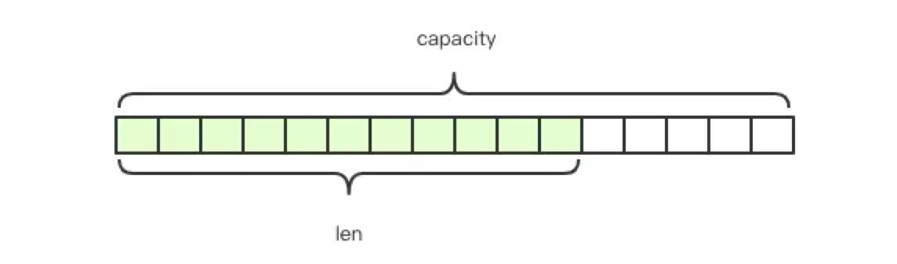

Redis的字符串是动态字符串，是可以修改的字符串，内部结构实现上类似于java的ArrayList，采用欲分配荣誉控件的方式来减少内存的频繁分配，如图中所示，内部为当前字符串实际分配的控件capacity一般要高于实际字符串长度len。当字符串长度小于1M时，扩容都是加倍现有的控件，如果超过1，扩容时一次只会多扩1M的控件。

##### 键值对

```assembly
> set name codehole
OK
> get name
"codehole"
> exists name
(integer) 1
> del name
(integer) 1
> get name
(nil)
```

##### 批量键值对

可以批量对多个字符串进行读写，节省网络耗时开销

```assembly
> set name1 codehole
OK
> set name2 holycoder
OK
> mget name1 name2 name3 # 返回一个列表
1) "codehole"
2) "holycoder"
3) (nil)
> mset name1 boy name2 girl name3 unknown
> mget name1 name2 name3
1) "boy"
2) "girl"
3) "unknown"...
```

##### 过期和set命令扩展

可以对keyi设置过期时间，到点自动删除，这个功能常用来控制缓存的失效时间。不过这个[]自动删除]的机制比较复杂。

```assembly
> set name codehole
> get name
"codehole"
> expire name 5  # 5s 后过期
...  # wait for 5s
> get name
(nil)

> setex name 5 codehole  # 5s 后过期，等价于 set+expire
> get name
"codehole"
... # wait for 5s
> get name
(nil)

> setnx name codehole  # 如果 name 不存在就执行 set 创建
(integer) 1
> get name
"codehole"
> setnx name holycoder
(integer) 0  # 因为 name 已经存在，所以 set 创建不成功
> get name
"codehole"  # 没有改变...
```

##### 计数

如果value值是一个整数，还可以对它进行自增操作。自增是有范围的，让的范围是signed long的最大值最小值，超过了这个值，Redis报错。

```assembly
> set age 30
OK
> incr age
(integer) 31
> incrby age 5
(integer) 36
> incrby age -5
(integer) 31
> set codehole 9223372036854775807  # Long.Max
OK
> incr codehole
(error) ERR increment or decrement would overflow
```

字符串是由多个字节组成，每个字节又是由8个bit组成，如此便可以将一个字符串看成很多bit的组合，这便是bitmap [位图] 数据结构，位图的具体使用会放到后面的章节来讲。

##### list (列表)

Redis的列表相当于 java 语言里面的 LinkedList，注意它是链表而不是数组，这意味着list的插入和删除操作非常亏，时间复杂度为O(1)，但是索引定位很慢，时间复杂度为O(n)，这点攘夷非常意外。

当列表弹出了最后一个元素之后，该数据结构自动被删除，内存被回收


Redis的列表结构常用来做异步队列使用。将需要延后处理的任务结构体序列化成字符串塞进Redis列表，另一个线程从这个列表中轮训数据进行处理。

##### 右边进左边出：队列

```assembly
> rpush books python java golang
(integer) 3
> llen books
(integer) 3
> lpop books
"python"
> lpop books
"java"
> lpop books
"golang"
> lpop books
(nil)
```

右边金右边出：栈

```assembly
> rpush books python java golang
(integer) 3
> rpop books
"golang"
> rpop books
"java"
> rpop books
"python"
> rpop books
(nil)
```

##### 满操作

lindex相当于java链表的get(int index)方法，它需要对链表进行遍历，性能随着参数index增大而变差

ltrim一个已存在的 list，这样 list 就会只包含指定范围的指定元素。start 和 stop 都是由0开始计数的， 这里的 0 是列表里的第一个元素（表头），1 是第二个元素，以此类推。

```assembly
> rpush books python java golang
(integer) 3
> lindex books 1  # O(n) 慎用
"java"
> lrange books 0 -1  # 获取所有元素，O(n) 慎用
1) "python"
2) "java"
3) "golang"
> ltrim books 1 -1 # O(n) 慎用
OK
> lrange books 0 -1
1) "java"
2) "golang"
> ltrim books 1 0 # 这其实是清空了整个列表，因为区间范围长度为负
OK
> llen books
(integer) 0
```

##### 快速列表

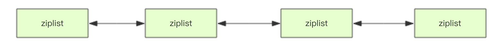

如果在深入一点，你会发现Redis底层存储的还不是一个简单的LinkedList，而是称之为快速链表quicklist的一个结构。

首先在列表元素较少的情况下会使用一块连续的内存存储，这个结构是ziplist，也即使压缩列表。他将所有的元素紧挨着一起存储，分配的是一块连续的内存。当数据量比较多的时候才会改成quicklist。因为普通的链表需要的附加指针空间太大，会比较浪费空间，而且会加重内存的碎片化。比如这个列表里存的只是int类型的数据，结构上还需要两个额外的指针prev和next。所以Redis将链表和ziplist结合起来组成了quicklist。也就是将多个ziplist使用双向指针串起来使用。这样既满足了快速的插入删除性能，又不会出现太大的空间冗余。

##### hash(字典)

Redis 的字典相当于 Java 语言里面的 HashMap，它是无序字典。内部实现结构上同 Java 的 HashMap 也是一致的，同样的数组 + 链表二维结构。第一维 hash 的数组位置碰撞时，就会将碰撞的元素使用链表串接起来。

 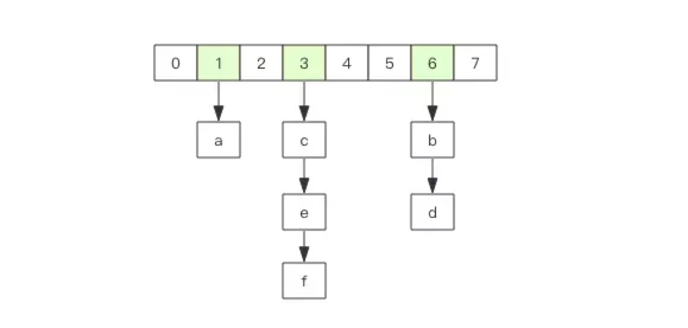

不同的是，Redis 的字典的值只能是字符串，另外它们 rehash 的方式不一样，因为 Java 的 HashMap 在字典很大时，rehash 是个耗时的操作，需要一次性全部 rehash。Redis 为了高性能，不能堵塞服务，所以采用了渐进式 rehash 策略

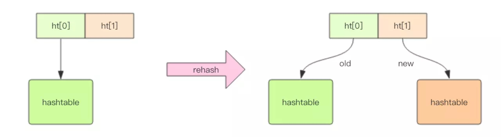

渐进式 rehash 会在 rehash 的同时，保留新旧两个 hash 结构，查询时会同时查询两个 hash 结构，然后在后续的定时任务中以及 hash 操作指令中，循序渐进地将旧 hash 的内容一点点迁移到新的 hash 结构中。当搬迁完成了，就会使用新的hash结构取而代之。 

当 hash 移除了最后一个元素之后，该数据结构自动被删除，内存被回收。


hash 结构也可以用来存储用户信息，不同于字符串一次性需要全部序列化整个对象，hash 可以对用户结构中的每个字段单独存储。这样当我们需要获取用户信息时可以进行部分获取。而以整个字符串的形式去保存用户信息的话就只能一次性全部读取，这样就会比较浪费网络流量。 hash 也有缺点，

hash 结构的存储消耗要高于单个字符串，到底该使用 hash 还是字符串，需要根据实际情况再三权衡。

```assembly
> hset books java "think in java"  # 命令行的字符串如果包含空格，要用引号括起来
(integer) 1
> hset books golang "concurrency in go"
(integer) 1
> hset books python "python cookbook"
(integer) 1
> hgetall books  # entries()，key 和 value 间隔出现
1) "java"
2) "think in java"
3) "golang"
4) "concurrency in go"
5) "python"
6) "python cookbook"
> hlen books
(integer) 3
> hget books java
"think in java"
> hset books golang "learning go programming"  # 因为是更新操作，所以返回 0
(integer) 0
> hget books golang
"learning go programming"
> hmset books java "effective java" python "learning python" golang "modern golang programming"  # 批量 set
OK
```

同字符串一样，hash 结构中的单个子 key 也可以进行计数，它对应的指令是 `hincrby`，和 `incr` 使用基本一样。

```assembly
# 老钱又老了一岁
> hincrby user-laoqian age 1
(integer) 30
```

##### set(集合)

Redis 的集合相当于 Java 语言里面的 HashSet，它内部的键值对是无序的唯一的。它的内部实现相当于一个特殊的字典，字典中所有的 value 都是一个值`NULL`。

当集合中最后一个元素移除之后，数据结构自动删除，内存被回收。


set 结构可以用来存储活动中奖的用户 ID，因为有去重功能，可以保证同一个用户不会中奖两次。

```assembly
> sadd books python
(integer) 1
> sadd books python  #  重复
(integer) 0
> sadd books java golang
(integer) 2
> smembers books  # 注意顺序，和插入的并不一致，因为 set 是无序的
1) "java"
2) "python"
3) "golang"
> sismember books java  # 查询某个 value 是否存在，相当于 contains(o)
(integer) 1
> sismember books rust
(integer) 0
> scard books  # 获取长度相当于 count()
(integer) 3
> spop books  # 弹出一个
"java"
```

##### zset(有序列表)

zset 可能是 Redis 提供的最为特色的数据结构，它也是在面试中面试官最爱问的数据结构。它类似于 Java 的 SortedSet 和 HashMap 的结合体，一方面它是一个 set，保证了内部 value 的唯一性，另一方面它可以给每个 value 赋予一个 score，代表这个 value 的排序权重。它的内部实现用的是一种叫做「跳跃列表」的数据结构。

zset 中最后一个 value 被移除后，数据结构自动删除，内存被回收。

 

zset 可以用来存粉丝列表，value 值是粉丝的用户 ID，score 是关注时间。我们可以对粉丝列表按关注时间进行排序。

zset 还可以用来存储学生的成绩，value 值是学生的 ID，score 是他的考试成绩。我们可以对成绩按分数进行排序就可以得到他的名次。

```assembly
> zadd books 9.0 "think in java"
(integer) 1
> zadd books 8.9 "java concurrency"
(integer) 1
> zadd books 8.6 "java cookbook"
(integer) 1
> zrange books 0 -1  # 按 score 排序列出，参数区间为排名范围
1) "java cookbook"
2) "java concurrency"
3) "think in java"
> zrevrange books 0 -1  # 按 score 逆序列出，参数区间为排名范围
1) "think in java"
2) "java concurrency"
3) "java cookbook"
> zcard books  # 相当于 count()
(integer) 3
> zscore books "java concurrency"  # 获取指定 value 的 score
"8.9000000000000004"  # 内部 score 使用 double 类型进行存储，所以存在小数点精度问题
> zrank books "java concurrency"  # 排名
(integer) 1
> zrangebyscore books 0 8.91  # 根据分值区间遍历 zset
1) "java cookbook"
2) "java concurrency"
> zrangebyscore books -inf 8.91 withscores # 根据分值区间 (-∞, 8.91] 遍历 zset，同时返回分值。inf 代表 infinite，无穷大的意思。
1) "java cookbook"
2) "8.5999999999999996"
3) "java concurrency"
4) "8.9000000000000004"
> zrem books "java concurrency"  # 删除 value
(integer) 1
> zrange books 0 -1
1) "java cookbook"
2) "think in java"
```

**跳跃列表**

zset 内部的排序功能是通过「跳跃列表」数据结构来实现的，它的结构非常特殊，也比较复杂。

因为 zset 要支持随机的插入和删除，所以它不好使用数组来表示。我们先看一个普通的链表结构。

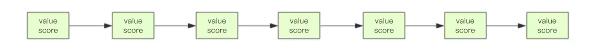

我们需要这个链表按照 score 值进行排序。这意味着当有新元素需要插入时，要定位到特定位置的插入点，这样才可以继续保证链表是有序的。通常我们会通过二分查找来找到插入点，但是二分查找的对象必须是数组，只有数组才可以支持快速位置定位，链表做不到，那该怎么办？ 

想想一个创业公司，刚开始只有几个人，团队成员之间人人平等，都是联合创始人。随着公司的成长，人数渐渐变多，团队沟通成本随之增加。这时候就会引入组长制，对团队进行划分。每个团队会有一个组长。开会的时候分团队进行，多个组长之间还会有自己的会议安排。公司规模进一步扩展，需要再增加一个层级 —— 部门，每个部门会从组长列表中推选出一个代表来作为部长。部长们之间还会有自己的高层会议安排。 

跳跃列表就是类似于这种层级制，最下面一层所有的元素都会串起来。然后每隔几个元素挑选出一个代表来，再将这几个代表使用另外一级指针串起来。然后在这些代表里再挑出二级代表，再串起来。最终就形成了金字塔结构。

 想想你老家在世界地图中的位置：亚洲-->中国->安徽省->安庆市->枞阳县->汤沟镇->田间村->xxxx号，也是这样一个类似的结构。

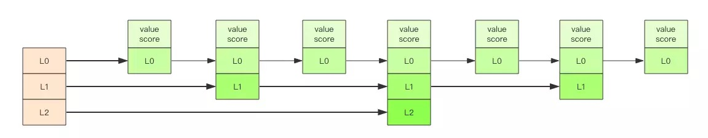

「跳跃列表」之所以「跳跃」，是因为内部的元素可能「身兼数职」，比如上图中间的这个元素，同时处于 L0、L1 和 L2 层，可以快速在不同层次之间进行「跳跃」。 

定位插入点时，先在顶层进行定位，然后下潜到下一级定位，一直下潜到最底层找到合适的位置，将新元素插进去。你也许会问，那新插入的元素如何才有机会「身兼数职」呢？ 

跳跃列表采取一个随机策略来决定新元素可以兼职到第几层。 

首先 L0 层肯定是 100% 了，L1 层只有 50% 的概率，L2 层只有 25% 的概率，L3 层只有 12.5% 的概率，一直随机到最顶层 L31 层。绝大多数元素都过不了几层，只有极少数元素可以深入到顶层。列表中的元素越多，能够深入的层次就越深，能进入到顶层的概率就会越大。 

## 容器型数据结构的通用规则

list/set/hash/zset 这四种数据结构是容器型数据结构，它们共享下面两条通用规则：

1、create if not exists 

如果容器不存在，那就创建一个，再进行操作。比如 rpush 操作刚开始是没有列表的，Redis 就会自动创建一个，然后再 rpush 进去新元素。 

2、drop if no elements 

如果容器里元素没有了，那么立即删除元素，释放内存。这意味着 lpop 操作到最后一个元素，列表就消失了。

## 过期时间

Redis 所有的数据结构都可以设置过期时间，时间到了，Redis 会自动删除相应的对象。需要注意的是过期是以对象为单位，比如一个 hash 结构的过期是整个 hash 对象的过期，而不是其中的某个子 key。

还有一个需要特别注意的地方是如果一个字符串已经设置了过期时间，然后你调用了 set 方法修改了它，它的过期时间会消失。

```assembly
127.0.0.1:6379> set codehole yoyo
OK
127.0.0.1:6379> expire codehole 600
(integer) 1
127.0.0.1:6379> ttl codehole
(integer) 597
127.0.0.1:6379> set codehole yoyo
OK
127.0.0.1:6379> ttl codehole
(integer) -1
```

# 三 应用1 分布式锁

分布式应用进行逻辑处理时经常会遇到并发问题。 

比如一个操作要修改用户的状态，修改状态需要先读出用户的状态，在内存里进行修改，改完了再存回去。如果这样的操作同时进行了，就会出现并发问题，因为读取和保存状态这两个操作不是原子的。（Wiki 解释：所谓原子操作是指不会被线程调度机制打断的操作；这种操作一旦开始，就一直运行到结束，中间不会有任何 context switch 线程切换。）

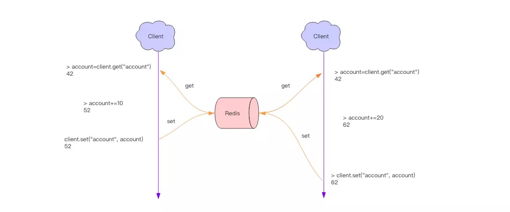

这个时候就要使用到分布式锁来限制程序的并发执行。Redis 分布式锁使用非常广泛，它是面试的重要考点之一，很多同学都知道这个知识，也大致知道分布式锁的原理，但是具体到细节的使用上往往并不完全正确。

**分布式锁**

分布式锁本质上要实现的目标就是在 Redis 里面占一个“茅坑”，当别的进程也要来占时，发现已经有人蹲在那里了，就只好放弃或者稍后再试。

占坑一般是使用 setnx(set if not exists) 指令，只允许被一个客户端占坑。先来先占， 用完了，再调用 del 指令释放茅坑。

```assembly
// 这里的冒号:就是一个普通的字符，没特别含义，它可以是任意其它字符，不要误解
> setnx lock:codehole true
OK
... do something critical ...
> del lock:codehole
(integer) 1
```

但是有个问题，如果逻辑执行到中间出现异常了，可能会导致 del 指令没有被调用，这样就会陷入死锁，锁永远得不到释放。

于是我们在拿到锁之后，再给锁加上一个过期时间，比如 5s，这样即使中间出现异常也可以保证 5 秒之后锁会自动释放。

```assembly
> setnx lock:codehole true
OK
> expire lock:codehole 5
... do something critical ...
> del lock:codehole
(integer) 1
```

但是以上逻辑还有问题。如果在 setnx 和 expire 之间服务器进程突然挂掉了，可能是因为机器掉电或者是被人为杀掉的，就会导致 expire 得不到执行，也会造成死锁。

这种问题的根源就在于 setnx 和 expire 是两条指令而不是原子指令。如果这两条指令可以一起执行就不会出现问题。也许你会想到用 Redis 事务来解决。但是这里不行，因为 expire 是依赖于 setnx 的执行结果的，如果 setnx 没抢到锁，expire 是不应该执行的。事务里没有 if-else 分支逻辑，事务的特点是一口气执行，要么全部执行要么一个都不执行。

为了解决这个疑难，Redis 开源社区涌现了一堆分布式锁的 library，专门用来解决这个问题。实现方法极为复杂，小白用户一般要费很大的精力才可以搞懂。如果你需要使用分布式锁，意味着你不能仅仅使用 Jedis 或者 redis-py 就行了，还得引入分布式锁的 library。


为了治理这个乱象，Redis 2.8 版本中作者加入了 set 指令的扩展参数，使得 setnx 和 expire 指令可以一起执行，彻底解决了分布式锁的乱象。从此以后所有的第三方分布式锁 library 可以休息了。

```assembly
> set lock:codehole true ex 5 nx
OK
... do something critical ...
> del lock:codehole
```

#### 超时问题

Redis 的分布式锁不能解决超时问题，如果在加锁和释放锁之间的逻辑执行的太长，以至于超出了锁的超时限制，就会出现问题。因为这时候锁过期了，第二个线程重新持有了这把锁，但是紧接着第一个线程执行完了业务逻辑，就把锁给释放了，第三个线程就会在第二个线程逻辑执行完之间拿到了锁。

为了避免这个问题，Redis 分布式锁不要用于较长时间的任务。如果真的偶尔出现了，数据出现的小波错乱可能需要人工介入解决。

```assembly
tag = random.nextint()  # 随机数
if redis.set(key, tag, nx=True, ex=5):
    do_something()
    redis.delifequals(key, tag)  # 假想的 delifequals 指令
```

有一个稍微安全一点的方案是为 set 指令的 value 参数设置为一个随机数，释放锁时先匹配随机数是否一致，然后再删除 key，这是为了确保当前线程占有的锁不会被其它线程释放，除非这个锁是过期了被服务器自动释放的。 但是匹配 value 和删除 key 不是一个原子操作，Redis 也没有提供类似于delifequals这样的指令，这就需要使用 Lua 脚本来处理了，因为 Lua 脚本可以保证连续多个指令的原子性执行。

```assembly
# delifequals
if redis.call("get",KEYS[1]) == ARGV[1] then
    return redis.call("del",KEYS[1])
else
    return 0
end
```

#### 可重入性

可重入性是指线程在持有锁的情况下再次请求加锁，如果一个锁支持同一个线程的多次加锁，那么这个锁就是可重入的。比如 Java 语言里有个 ReentrantLock 就是可重入锁。Redis 分布式锁如果要支持可重入，需要对客户端的 set 方法进行包装，使用线程的 Threadlocal 变量存储当前持有锁的计数。

```python
# -*- coding: utf-8
import redis
import threading


locks = threading.local()
locks.redis = {}

def key_for(user_id):
    return "account_{}".format(user_id)

def _lock(client, key):
    return bool(client.set(key, True, nx=True, ex=5))

def _unlock(client, key):
    client.delete(key)

def lock(client, user_id):
    key = key_for(user_id)
    if key in locks.redis:
        locks.redis[key] += 1
        return True
    ok = _lock(client, key)
    if not ok:
        return False
    locks.redis[key] = 1
    return True

def unlock(client, user_id):
    key = key_for(user_id)
    if key in locks.redis:
        locks.redis[key] -= 1
        if locks.redis[key] <= 0:
            del locks.redis[key]
        return True
    return False

client = redis.StrictRedis()
print "lock", lock(client, "codehole")
print "lock", lock(client, "codehole")
print "unlock", unlock(client, "codehole")
print "unlock", unlock(client, "codehole")
```

以上还不是可重入锁的全部，精确一点还需要考虑内存锁计数的过期时间，代码复杂度将会继续升高。老钱不推荐使用可重入锁，它加重了客户端的复杂性，在编写业务方法时注意在逻辑结构上进行调整完全可以不使用可重入锁。下面是 Java 版本的可重入锁。

```java
public class RedisWithReentrantLock {

  private ThreadLocal<Map<String, Integer>> lockers = new ThreadLocal<>();

  private Jedis jedis;

  public RedisWithReentrantLock(Jedis jedis) {
    this.jedis = jedis;
  }

  private boolean _lock(String key) {
    return jedis.set(key, "", "nx", "ex", 5L) != null;
  }

  private void _unlock(String key) {
    jedis.del(key);
  }

  private Map<String, Integer> currentLockers() {
    Map<String, Integer> refs = lockers.get();
    if (refs != null) {
      return refs;
    }
    lockers.set(new HashMap<>());
    return lockers.get();
  }

  public boolean lock(String key) {
    Map<String, Integer> refs = currentLockers();
    Integer refCnt = refs.get(key);
    if (refCnt != null) {
      refs.put(key, refCnt + 1);
      return true;
    }
    boolean ok = this._lock(key);
    if (!ok) {
      return false;
    }
    refs.put(key, 1);
    return true;
  }

  public boolean unlock(String key) {
    Map<String, Integer> refs = currentLockers();
    Integer refCnt = refs
        lockers.set(new HashMap<>());
    return lockers.get();
  }

  public boolean lock(String key) {
    Map<String, Integer> refs = currentLockers();
    Integer refCnt = refs.get(key);
    if (refCnt != null) {
      refs.put(key, refCnt + 1);
      return true;
    }
    boolean ok = this._lock(key);
    if (!ok) {
      return false;
    }
    refs.put(key, 1);
    return true;
  }

  public boolean unlock(String key) {
    Map<String, Integer> refs = currentLockers();
    Integer refCnt = refs.get(key);
    if (refCnt == null) {
      return false;
    }
    refCnt -= 1;
    if (refCnt > 0) {
      refs.put(key, refCnt);
    } else {
      refs.remove(key);
      this._unlock(key);
    }
    return true;
  }

  public static void main(String[] args) {
    Jedis jedis = new Jedis();
    RedisWithReentrantLock redis = new RedisWithReentrantLock(jedis);
    System.out.println(redis.lock("codehole"));
    System.out.println(redis.lock("codehole"));
    System.out.println(redis.unlock("codehole"));
    System.out.println(redis.unlock("codehole"));
  }

}
```

# 四 应用2 延时队列

我们平时习惯于使用 Rabbitmq 和 Kafka 作为消息队列中间件，来给应用程序之间增加异步消息传递功能。这两个中间件都是专业的消息队列中间件，特性之多超出了大多数人的理解能力。

使用过 Rabbitmq 的同学知道它使用起来有多复杂，发消息之前要创建 Exchange，再创建 Queue，还要将 Queue 和 Exchange 通过某种规则绑定起来，发消息的时候要指定 routing-key，还要控制头部信息。消费者在消费消息之前也要进行上面一系列的繁琐过程。但是绝大多数情况下，虽然我们的消息队列只有一组消费者，但还是需要经历上面这些繁琐的过程。

有了 Redis，它就可以让我们解脱出来，对于那些只有一组消费者的消息队列，使用 Redis 就可以非常轻松的搞定。Redis 的消息队列不是专业的消息队列，它没有非常多的高级特性，没有 ack 保证，如果对消息的可靠性有着极致的追求，那么它就不适合使用。

## 异步消息队列

Redis 的 list(列表) 数据结构常用来作为异步消息队列使用，使用`rpush/lpush`操作入队列，使用`lpop 和 rpop`来出队列。

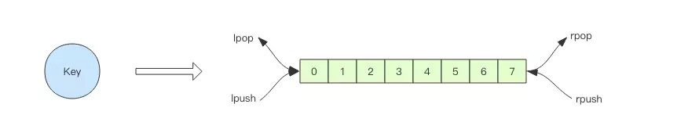

```assembly
> rpush notify-queue apple banana pear
(integer) 3
> llen notify-queue
(integer) 3
> lpop notify-queue
"apple"
> llen notify-queue
(integer) 2
> lpop notify-queue
"banana"
> llen notify-queue
(integer) 1
> lpop notify-queue
"pear"
> llen notify-queue
(integer) 0
> lpop notify-queue
(nil)
```

上面是 rpush 和 lpop 结合使用的例子。还可以使用 lpush 和 rpop 结合使用，效果是一样的。这里不再赘述。

## 队列空了怎么办？

客户端是通过队列的 pop 操作来获取消息，然后进行处理。处理完了再接着获取消息，再进行处理。如此循环往复，这便是作为队列消费者的客户端的生命周期。

可是如果队列空了，客户端就会陷入 pop 的死循环，不停地 pop，没有数据，接着再 pop，又没有数据。这就是浪费生命的空轮询。空轮询不但拉高了客户端的 CPU，redis 的 QPS 也会被拉高，如果这样空轮询的客户端有几十来个，Redis 的慢查询可能会显著增多。

通常我们使用 sleep 来解决这个问题，让线程睡一会，睡个 1s 钟就可以了。不但客户端的 CPU 能降下来，Redis 的 QPS 也降下来了。

```assembly
time.sleep(1)  # python 睡 1s
Thread.sleep(1000)  # java 睡 1s
```

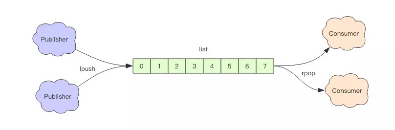

## 队列延迟

用上面睡眠的办法可以解决问题。但是有个小问题，那就是睡眠会导致消息的延迟增大。如果只有 1 个消费者，那么这个延迟就是 1s。如果有多个消费者，这个延迟会有所下降，因为每个消费者的睡觉时间是岔开来的。

有没有什么办法能显著降低延迟呢？你当然可以很快想到：那就把睡觉的时间缩短点。这种方式当然可以，不过有没有更好的解决方案呢？当然也有，那就是 blpop/brpop。

这两个指令的前缀字符b代表的是blocking，也就是阻塞读。

阻塞读在队列没有数据的时候，会立即进入休眠状态，一旦数据到来，则立刻醒过来。消息的延迟几乎为零。用blpop/brpop替代前面的lpop/rpop，就完美解决了上面的问题。

## 空闲连接自动断开

你以为上面的方案真的很完美么？先别急着开心，其实他还有个问题需要解决。

什么问题？—— 空闲连接的问题。

如果线程一直阻塞在哪里，Redis 的客户端连接就成了闲置连接，闲置过久，服务器一般会主动断开连接，减少闲置资源占用。这个时候blpop/brpop会抛出异常来。

所以编写客户端消费者的时候要小心，注意捕获异常，还要重试。

## 锁冲突处理

上节课我们讲了分布式锁的问题，但是没有提到客户端在处理请求时加锁没加成功怎么办。一般有 3 种策略来处理加锁失败：

1. 直接抛出异常，通知用户稍后重试；
2. sleep 一会再重试；
3. 将请求转移至延时队列，过一会再试；

**直接抛出特定类型的异常**

这种方式比较适合由用户直接发起的请求，用户看到错误对话框后，会先阅读对话框的内容，再点击重试，这样就可以起到人工延时的效果。如果考虑到用户体验，可以由前端的代码替代用户自己来进行延时重试控制。它本质上是对当前请求的放弃，由用户决定是否重新发起新的请求。

**sleep**

sleep 会阻塞当前的消息处理线程，会导致队列的后续消息处理出现延迟。如果碰撞的比较频繁或者队列里消息比较多，sleep 可能并不合适。如果因为个别死锁的 key 导致加锁不成功，线程会彻底堵死，导致后续消息永远得不到及时处理。

延时队列

这种方式比较适合异步消息处理，将当前冲突的请求扔到另一个队列延后处理以避开冲突。

## 延时队列的实现

延时队列可以通过 Redis 的 zset(有序列表) 来实现。我们将消息序列化成一个字符串作为 zset 的value，这个消息的到期处理时间作为score，然后用多个线程轮询 zset 获取到期的任务进行处理，多个线程是为了保障可用性，万一挂了一个线程还有其它线程可以继续处理。因为有多个线程，所以需要考虑并发争抢任务，确保任务不能被多次执行。

```python
def delay(msg):
    msg.id = str(uuid.uuid4())  # 保证 value 值唯一
    value = json.dumps(msg)
    retry_ts = time.time() + 5  # 5 秒后重试
    redis.zadd("delay-queue", retry_ts, value)


def loop():
    while True:
        # 最多取 1 条
        values = redis.zrangebyscore("delay-queue", 0, time.time(), start=0, num=1)
        if not values:
            time.sleep(1)  # 延时队列空的，休息 1s
            continue
        value = values[0]  # 拿第一条，也只有一条
        success = redis.zrem("delay-queue", value)  # 从消息队列中移除该消息
        if success:  # 因为有多进程并发的可能，最终只会有一个进程可以抢到消息
            msg = json.loads(value)
            handle_msg(msg)
```

Redis 的 zrem 方法是多线程多进程争抢任务的关键，它的返回值决定了当前实例有没有抢到任务，因为 loop 方法可能会被多个线程、多个进程调用，同一个任务可能会被多个进程线程抢到，通过 zrem 来决定唯一的属主。

同时，我们要注意一定要对 handle_msg 进行异常捕获，避免因为个别任务处理问题导致循环异常退出。以下是 Java 版本的延时队列实现，因为要使用到 Json 序列化，所以还需要 fastjson 库的支持。

```java
import java.lang.reflect.Type;
import java.util.Set;
import java.util.UUID;

import com.alibaba.fastjson.JSON;
import com.alibaba.fastjson.TypeReference;

import redis.clients.jedis.Jedis;

public class RedisDelayingQueue<T> {

  static class TaskItem<T> {
    public String id;
    public T msg;
  }

  // fastjson 序列化对象中存在 generic 类型时，需要使用 TypeReference
  private Type TaskType = new TypeReference<TaskItem<T>>() {
  }.getType();

  private Jedis jedis;
  private String queueKey;

  public RedisDelayingQueue(Jedis jedis, String queueKey) {
    this.jedis = jedis;
    this.queueKey = queueKey;
  }

  public void delay(T msg) {
    TaskItem<T> task = new TaskItem<T>();
    task.id = UUID.randomUUID().toString(); // 分配唯一的 uuid
    task.msg = msg;
    String s = JSON.toJSONString(task); // fastjson 序列化
    jedis.zadd(queueKey, System.currentTimeMillis() + 5000, s); // 塞入延时队列 ,5s 后再试
  }

  public void loop() {
   while (!Thread.interrupted()) {
      // 只取一条
      Set<String> values = jedis.zrangeByScore(queueKey, 0, System.currentTimeMillis(), 0, 1);
      if (values.isEmpty()) {
        try {
          Thread.sleep(500); // 歇会继续
        } catch (InterruptedException e) {
          break;
        }
        continue;
      }
      String s = values.iterator().next();
      if (jedis.zrem(queueKey, s) > 0) { // 抢到了
        TaskItem<T> task = JSON.parseObject(s, TaskType); // fastjson 反序列化
        this.handleMsg(task.msg);
      }
    }
  }

  public void handleMsg(T msg) {
    System.out.println(msg);
  }

  public static void main(String[] args) {
    Jedis jedis = new Jedis();
    RedisDelayingQueue<String> queue = new RedisDelayingQueue<>(jedis, "q-demo");
    Thread producer = new Thread() {

      public void run() {
        for (int i = 0; i < 10; i++) {
          queue.delay("codehole" + i);
        }
      }

    };
    Thread consumer = new Thread() {

      public void run() {
        queue.loop();
      }

 producer.start();
    consumer.start();
    try {
      producer.join();
      Thread.sleep(6000);
      consumer.interrupt();
      consumer.join();
    } catch (InterruptedException e) {
    }
  }
}
```

## 进一步优化

上面的算法中同一个任务可能会被多个进程取到之后再使用zrem进行争抢，那些没抢到的进程都是白取了一次任务，这是浪费。可以考虑使用lua scripting来优化一下这个逻辑，将zrangebyscore和zrem一同挪到服务器端进行原子化操作，这样多个进程之间争抢任务时就不会出现这种浪费了。

# 五 应用3 位图

在我们平时开发过程中，会有一些 bool 型数据需要存取，比如用户一年的签到记录，签了是 1，没签是 0，要记录 365 天。如果使用普通的 key/value，每个用户要记录 365 个，当用户上亿的时候，需要的存储空间是惊人的。

为了解决这个问题，Redis 提供了位图数据结构，这样每天的签到记录只占据一个位，365 天就是 365 个位，46 个字节 (一个稍长一点的字符串) 就可以完全容纳下，这就大大节约了存储空间。


位图不是特殊的数据结构，它的内容其实就是普通的字符串，也就是 byte 数组。我们可以使用普通的 get/set 直接获取和设置整个位图的内容，也可以使用位图操作 getbit/setbit 等将 byte 数组看成「位数组」来处理。

以老钱的经验，在面试中有 Redis 位图使用经验的同学很少，如果你对 Redis 的位图有所了解，它将会是你的面试加分项。

## 基本使用

Redis 的位数组是自动扩展，如果设置了某个偏移位置超出了现有的内容范围，就会自动将位数组进行零扩充。

接下来我们使用位操作将字符串设置为 hello (不是直接使用 set 指令)，首先我们需要得到 hello 的 ASCII 码，用 Python 命令行可以很方便地得到每个字符的 ASCII 码的二进制值。

```python
>>> bin(ord('h'))
'0b1101000'   # 高位 -> 低位
>>> bin(ord('e'))
'0b1100101'
>>> bin(ord('l'))
'0b1101100'
>>> bin(ord('l'))
'0b1101100'
>>> bin(ord('o'))
'0b1101111'
```


接下来我们使用 redis-cli 设置第一个字符，也就是位数组的前 8 位，我们只需要设置值为 1 的位，如上图所示，h 字符只有 1/2/4 位需要设置，e 字符只有 9/10/13/15 位需要设置。值得注意的是位数组的顺序和字符的位顺序是相反的。

```assembly
127.0.0.1:6379> setbit s 1 1
(integer) 0
127.0.0.1:6379> setbit s 2 1
(integer) 0
127.0.0.1:6379> setbit s 4 1
(integer) 0
127.0.0.1:6379> setbit s 9 1
(integer) 0
127.0.0.1:6379> setbit s 10 1
(integer) 0
127.0.0.1:6379> setbit s 13 1
(integer) 0
127.0.0.1:6379> setbit s 15 1
(integer) 0
127.0.0.1:6379> get s
"he"
```

上面这个例子可以理解为「零存整取」，同样我们还也可以「零存零取」，「整存零取」。「零存」就是使用 setbit 对位值进行逐个设置，「整存」就是使用字符串一次性填充所有位数组，覆盖掉旧值。

**零存零取**

```assembly
127.0.0.1:6379> setbit w 1 1
(integer) 0
127.0.0.1:6379> setbit w 2 1
(integer) 0
127.0.0.1:6379> setbit w 4 1
(integer) 0
127.0.0.1:6379> getbit w 1  # 获取某个具体位置的值 0/1
(integer) 1
127.0.0.1:6379> getbit w 2
(integer) 1
127.0.0.1:6379> getbit w 4
(integer) 1
127.0.0.1:6379> getbit w 5
(integer) 0
```

**整存零取**

```assembly
127.0.0.1:6379> set w h  # 整存
(integer) 0
127.0.0.1:6379> getbit w 1
(integer) 1
127.0.0.1:6379> getbit w 2
(integer) 1
127.0.0.1:6379> getbit w 4
(integer) 1
127.0.0.1:6379> getbit w 5
(integer) 0
```

如果对应位的字节是不可打印字符，redis-cli 会显示该字符的 16 进制形式。

```assembly
127.0.0.1:6379> setbit x 0 1
(integer) 0
127.0.0.1:6379> setbit x 1 1
(integer) 0
127.0.0.1:6379> get x
"\xc0"
```

## 统计和查找

Redis 提供了位图统计指令 bitcount 和位图查找指令 bitpos，bitcount 用来统计指定位置范围内 1 的个数，bitpos 用来查找指定范围内出现的第一个 0 或 1。

比如我们可以通过 bitcount 统计用户一共签到了多少天，通过 bitpos 指令查找用户从哪一天开始第一次签到。如果指定了范围参数[start, end]，就可以统计在某个时间范围内用户签到了多少天，用户自某天以后的哪天开始签到。

遗憾的是， start 和 end 参数是字节索引，也就是说指定的位范围必须是 8 的倍数，而不能任意指定。这很奇怪，我表示不是很能理解 Antirez 为什么要这样设计。因为这个设计，我们无法直接计算某个月内用户签到了多少天，而必须要将这个月所覆盖的字节内容全部取出来 (getrange 可以取出字符串的子串) 然后在内存里进行统计，这个非常繁琐。

接下来我们简单试用一下 bitcount 指令和 bitpos 指令:

```assembly
127.0.0.1:6379> set w hello
OK
127.0.0.1:6379> bitcount w
(integer) 21
127.0.0.1:6379> bitcount w 0 0  # 第一个字符中 1 的位数
(integer) 3
127.0.0.1:6379> bitcount w 0 1  # 前两个字符中 1 的位数
(integer) 7
127.0.0.1:6379> bitpos w 0  # 第一个 0 位
(integer) 0
127.0.0.1:6379> bitpos w 1  # 第一个 1 位
(integer) 1
127.0.0.1:6379> bitpos w 1 1 1  # 从第二个字符算起，第一个 1 位
(integer) 9
127.0.0.1:6379> bitpos w 1 2 2  # 从第三个字符算起，第一个 1 位
(integer) 17
```

## 魔术指令 bitfield

前文我们设置 (setbit) 和获取 (getbit) 指定位的值都是单个位的，如果要一次操作多个位，就必须使用管道来处理。

不过 Redis 的 3.2 版本以后新增了一个功能强大的指令，有了这条指令，不用管道也可以一次进行多个位的操作。

bitfield 有三个子指令，分别是 get/set/incrby，它们都可以对指定位片段进行读写，但是最多只能处理 64 个连续的位，如果超过 64 位，就得使用多个子指令，bitfield 可以一次执行多个子指令。

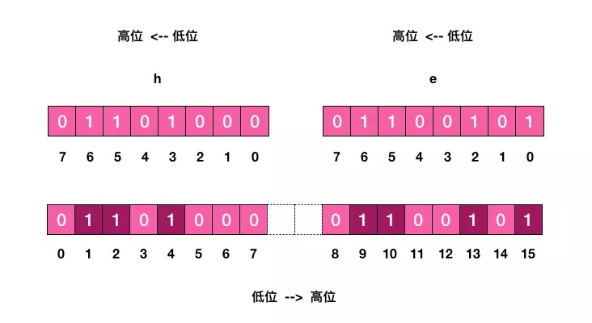

接下来我们对照着上面的图看个简单的例子:

```assembly
127.0.0.1:6379> set w hello
OK
127.0.0.1:6379> bitfield w get u4 0  # 从第一个位开始取 4 个位，结果是无符号数 (u)
(integer) 6
127.0.0.1:6379> bitfield w get u3 2  # 从第三个位开始取 3 个位，结果是无符号数 (u)
(integer) 5
127.0.0.1:6379> bitfield w get i4 0  # 从第一个位开始取 4 个位，结果是有符号数 (i)
1) (integer) 6
127.0.0.1:6379> bitfield w get i3 2  # 从第三个位开始取 3 个位，结果是有符号数 (i)
1) (integer) -3
```

所谓有符号数是指获取的位数组中第一个位是符号位，剩下的才是值。如果第一位是 1，那就是负数。无符号数表示非负数，没有符号位，获取的位数组全部都是值。有符号数最多可以获取 64 位，无符号数只能获取 63 位 (因为 Redis 协议中的 integer 是有符号数，最大 64 位，不能传递 64 位无符号值)。如果超出位数限制，Redis 就会告诉你参数错误。

```assembly
127.0.0.1:6379> bitfield w get u4 0 get u3 2 get i4 0 get i3 2
1) (integer) 6
2) (integer) 5
3) (integer) 6
4) (integer) -3
```

wow，很魔法有没有！

然后我们使用 set 子指令将第二个字符 e 改成 a，a 的 ASCII 码是 97。

```assembly
127.0.0.1:6379> bitfield w set u8 8 97  # 从第 8 个位开始，将接下来的 8 个位用无符号数 97 替换
1) (integer) 101
127.0.0.1:6379> get w
"hallo"
```

再看第三个子指令 incrby，它用来对指定范围的位进行自增操作。既然提到自增，就有可能出现溢出。如果增加了正数，会出现上溢，如果增加的是负数，就会出现下溢出。Redis 默认的处理是折返。如果出现了溢出，就将溢出的符号位丢掉。如果是 8 位无符号数 255，加 1 后就会溢出，会全部变零。如果是 8 位有符号数 127，加 1 后就会溢出变成 -128。

接下来我们实践一下这个子指令 incrby :

```assembly
127.0.0.1:6379> set w hello
OK
127.0.0.1:6379> bitfield w incrby u4 2 1  # 从第三个位开始，对接下来的 4 位无符号数 +1
1) (integer) 11
127.0.0.1:6379> bitfield w incrby u4 2 1
1) (integer) 12
127.0.0.1:6379> bitfield w incrby u4 2 1
1) (integer) 13
127.0.0.1:6379> bitfield w incrby u4 2 1
1) (integer) 14
127.0.0.1:6379> bitfield w incrby u4 2 1
1) (integer) 15
127.0.0.1:6379> bitfield w incrby u4 2 1  # 溢出折返了
1) (integer) 0
```

bitfield 指令提供了溢出策略子指令 overflow，用户可以选择溢出行为，默认是折返 (wrap)，还可以选择失败 (fail) 报错不执行，以及饱和截断 (sat)，超过了范围就停留在最大最小值。overflow 指令只影响接下来的第一条指令，这条指令执行完后溢出策略会变成默认值折返 (wrap)。

接下来我们分别试试这两个策略的行为

**饱和截断 SAT**

```assembly
127.0.0.1:6379> set w hello
OK
127.0.0.1:6379> bitfield w overflow sat incrby u4 2 1
1) (integer) 11
127.0.0.1:6379> bitfield w overflow sat incrby u4 2 1
1) (integer) 12
127.0.0.1:6379> bitfield w overflow sat incrby u4 2 1
1) (integer) 13
127.0.0.1:6379> bitfield w overflow sat incrby u4 2 1
1) (integer) 14
127.0.0.1:6379> bitfield w overflow sat incrby u4 2 1
1) (integer) 15
127.0.0.1:6379> bitfield w overflow sat incrby u4 2 1  # 保持最大值
1) (integer) 15
```

# 六 应用4 HyperLogLog

在开始这一节之前，我们先思考一个常见的业务问题：如果你负责开发维护一个大型的网站，有一天老板找产品经理要网站每个网页每天的 UV 数据，然后让你来开发这个统计模块，你会如何实现？


如果统计 PV 那非常好办，给每个网页一个独立的 Redis 计数器就可以了，这个计数器的 key 后缀加上当天的日期。这样来一个请求，incrby 一次，最终就可以统计出所有的 PV 数据。

但是 UV 不一样，它要去重，同一个用户一天之内的多次访问请求只能计数一次。这就要求每一个网页请求都需要带上用户的 ID，无论是登陆用户还是未登陆用户都需要一个唯一 ID 来标识。

你也许已经想到了一个简单的方案，那就是为每一个页面一个独立的 set 集合来存储所有当天访问过此页面的用户 ID。当一个请求过来时，我们使用 sadd 将用户 ID 塞进去就可以了。通过 scard 可以取出这个集合的大小，这个数字就是这个页面的 UV 数据。没错，这是一个非常简单的方案。

但是，如果你的页面访问量非常大，比如一个爆款页面几千万的 UV，你需要一个很大的 set 集合来统计，这就非常浪费空间。如果这样的页面很多，那所需要的存储空间是惊人的。为这样一个去重功能就耗费这样多的存储空间，值得么？其实老板需要的数据又不需要太精确，105w 和 106w 这两个数字对于老板们来说并没有多大区别，So，有没有更好的解决方案呢？

这就是本节要引入的一个解决方案，Redis 提供了 HyperLogLog 数据结构就是用来解决这种统计问题的。

HyperLogLog 提供不精确的去重计数方案，虽然不精确但是也不是非常不精确，标准误差是 0.81%，这样的精确度已经可以满足上面的 UV 统计需求了。

HyperLogLog 数据结构是 Redis 的高级数据结构，它非常有用，但是令人感到意外的是，使用过它的人非常少。

## 使用方法

HyperLogLog 提供了两个指令 pfadd 和 pfcount，根据字面意义很好理解，一个是增加计数，一个是获取计数。pfadd 用法和 set 集合的 sadd 是一样的，来一个用户 ID，就将用户 ID 塞进去就是。pfcount 和 scard 用法是一样的，直接获取计数值。

```assembly
127.0.0.1:6379> pfadd codehole user1
(integer) 1
127.0.0.1:6379> pfcount codehole
(integer) 1
127.0.0.1:6379> pfadd codehole user2
(integer) 1
127.0.0.1:6379> pfcount codehole
(integer) 2
127.0.0.1:6379> pfadd codehole user3
(integer) 1
127.0.0.1:6379> pfcount codehole
(integer) 3
127.0.0.1:6379> pfadd codehole user4
(integer) 1
127.0.0.1:6379> pfcount codehole
(integer) 4
127.0.0.1:6379> pfadd codehole user5
(integer) 1
127.0.0.1:6379> pfcount codehole
(integer) 5
127.0.0.1:6379> pfadd codehole user6
(integer) 1
127.0.0.1:6379> pfcount codehole
(integer) 6
127.0.0.1:6379> pfadd codehole user7 user8 user9 user10
(integer) 1
127.0.0.1:6379> pfcount codehole
(integer) 10
```

简单试了一下，发现还蛮精确的，一个没多也一个没少。接下来我们使用脚本，往里面灌更多的数据，看看它是否还可以继续精确下去，如果不能精确，差距有多大。人生苦短，我用 Python！Python 脚本走起来！😄

```python
# coding: utf-8

import redis

client = redis.StrictRedis()
for i in range(1000):
    client.pfadd("codehole", "user%d" % i)
    total = client.pfcount("codehole")
    if total != i+1:
        print total, i+1
        break
```

当然 Java 也不错，大同小异，下面是 Java 版本：

```java
ublic class PfTest {
  public static void main(String[] args) {
    Jedis jedis = new Jedis();
    for (int i = 0; i < 1000; i++) {
      jedis.pfadd("codehole", "user" + i);
      long total = jedis.pfcount("codehole");
      if (total != i + 1) {
        System.out.printf("%d %d\n", total, i + 1);
        break;
      }
    }
    jedis.close();
  }
}
```

当我们加入第 100 个元素时，结果开始出现了不一致。接下来我们将数据增加到 10w 个，看看总量差距有多大。

```python
# coding: utf-8

import redis

client = redis.StrictRedis()
for i in range(100000):
    client.pfadd("codehole", "user%d" % i)
print 100000, client.pfcount("codehole")
```

Java 版：

```java
public class JedisTest {
  public static void main(String[] args) {
    Jedis jedis = new Jedis();
    for (int i = 0; i < 100000; i++) {
      jedis.pfadd("codehole", "user" + i);
    }
    long total = jedis.pfcount("codehole");
    System.out.printf("%d %d\n", 100000, total);
    jedis.close();
  }
}
```

差了 277 个，按百分比是 0.277%，对于上面的 UV 统计需求来说，误差率也不算高。然后我们把上面的脚本再跑一边，也就相当于将数据重复加入一边，查看输出，可以发现，pfcount 的结果没有任何改变，还是 99723，说明它确实具备去重功能。

## pfadd 这个 pf 是什么意思？

它是 HyperLogLog 这个数据结构的发明人 Philippe Flajolet 的首字母缩写，老师觉得他发型很酷，看起来是个佛系教授。

## pfmerge 适合什么场合用？

HyperLogLog 除了上面的 pfadd 和 pfcount 之外，还提供了第三个指令 pfmerge，用于将多个 pf 计数值累加在一起形成一个新的 pf 值。

比如在网站中我们有两个内容差不多的页面，运营说需要这两个页面的数据进行合并。其中页面的 UV 访问量也需要合并，那这个时候 pfmerge 就可以派上用场了。

## 注意事项

HyperLogLog 这个数据结构不是免费的，不是说使用这个数据结构要花钱，它需要占据一定 12k 的存储空间，所以它不适合统计单个用户相关的数据。如果你的用户上亿，可以算算，这个空间成本是非常惊人的。但是相比 set 存储方案，HyperLogLog 所使用的空间那真是可以使用千斤对比四两来形容了。

不过你也不必过于当心，因为 Redis 对 HyperLogLog 的存储进行了优化，在计数比较小时，它的存储空间采用稀疏矩阵存储，空间占用很小，仅仅在计数慢慢变大，稀疏矩阵占用空间渐渐超过了阈值时才会一次性转变成稠密矩阵，才会占用 12k 的空间。

## HyperLogLog 实现原理

HyperLogLog 的使用非常简单，但是实现原理比较复杂，如果读者没有特别的兴趣，下面的内容暂时可以跳过不看。

为了方便理解 HyperLogLog 的内部实现原理，我画了下面这张图

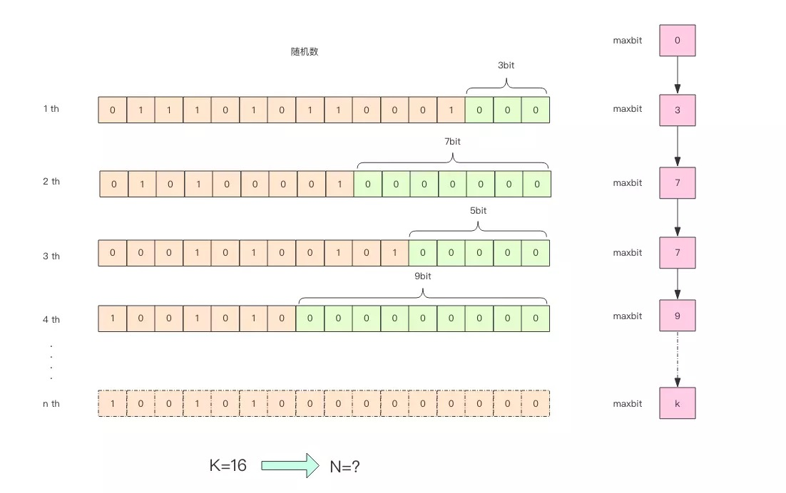

这张图的意思是，给定一系列的随机整数，我们记录下低位连续零位的最大长度 k，通过这个 k 值可以估算出随机数的数量。 首先不问为什么，我们编写代码做一个实验，观察一下随机整数的数量和 k 值的关系。

```python
import math
import random

# 算低位零的个数
def low_zeros(value):
    for i in xrange(1, 32):
        if value >> i << i != value:
            break
    return i - 1


# 通过随机数记录最大的低位零的个数
class BitKeeper(object):

    def __init__(self):
        self.maxbits = 0

    def random(self):
        value = random.randint(0, 2**32-1)
        bits = low_zeros(value)
        if bits > self.maxbits:
            self.maxbits = bits


class Experiment(object):

    def __init__(self, n):
        self.n = n
        self.keeper = BitKeeper()

    def do(self):
        for i in range(self.n):
            self.keeper.random()

    def debug(self):
        print self.n, '%.2f' % math.log(self.n, 2), self.keeper.maxbits


for i in range(1000, 100000, 100):
    exp = Experiment(i)
    exp.do()
    exp.debug()
```

Java 版：

```java
public class PfTest {

  static class BitKeeper {
    private int maxbits;

    public void random() {
      long value = ThreadLocalRandom.current().nextLong(2L << 32);
      int bits = lowZeros(value);
      if (bits > this.maxbits) {
        this.maxbits = bits;
      }
    }

    private int lowZeros(long value) {
      int i = 1;
      for (; i < 32; i++) {
        if (value >> i << i != value) {
          break;
        }
      }
      return i - 1;
    }
  }

  static class Experiment {
    private int n;
    private BitKeeper keeper;

    public Experiment(int n) {
      this.n = n;
      this.keeper = new BitKeeper();
    }

    public void work() {
      for (int i = 0; i < n; i++) {
        this.keeper.random();
      }
    }

    public void debug() {
      System.out.printf("%d %.2f %d\n", this.n, Math.log(this.n) / Math.log(2), this.keeper.maxbits);
    }
  }

  public static void main(String[] args) {
    for (int i = 1000; i < 100000; i += 100) {
      Experiment exp = new Experiment(i);
      exp.work();
      exp.debug();
    }
  }

}
```

通过这实验可以发现 K 和 N 的对数之间存在显著的线性相关性：

```assembly
N=2^K  # 约等于
```

如果 N 介于 2^K 和 2^(K+1) 之间，用这种方式估计的值都等于 2^K，这明显是不合理的。这里可以采用多个 BitKeeper，然后进行加权估计，就可以得到一个比较准确的值。

```python
import math
import random

def low_zeros(value):
    for i in xrange(1, 32):
        if value >> i << i != value:
            break
    return i - 1


class BitKeeper(object):

    def __init__(self):
        self.maxbits = 0

    def random(self, m):
        bits = low_zeros(m)
        if bits > self.maxbits:
            self.maxbits = bits


class Experiment(object):

    def __init__(self, n, k=1024):
        self.n = n
        self.k = k
        self.keepers = [BitKeeper() for i in range(k)]

    def do(self):
        for i in range(self.n):
            m = random.randint(0, 1<<32-1)
            # 确保同一个整数被分配到同一个桶里面，摘取高位后取模
            keeper = self.keepers[((m & 0xfff0000) >> 16) % len(self.keepers)]
            keeper.random(m)

    def estimate(self):
        sumbits_inverse = 0  # 零位数倒数
        for keeper in self.keepers:
            sumbits_inverse += 1.0/float(keeper.maxbits)
        avgbits = float(self.k)/sumbits_inverse  # 平均零位数
        return 2**avgbits * self.k  # 根据桶的数量对估计值进行放大


for i in range(100000, 1000000, 100000):
    exp = Experiment(i)
    exp.do()
    est = exp.estimate()
    print i, '%.2f' % est, '%.2f' % (abs(est-i) / i)
```

下面是 Java 版：

```java
public class PfTest {

  static class BitKeeper {
    private int maxbits;

    public void random(long value) {
      int bits = lowZeros(value);
      if (bits > this.maxbits) {
        this.maxbits = bits;
      }
    }

    private int lowZeros(long value) {
      int i = 1;
      for (; i < 32; i++) {
        if (value >> i << i != value) {
          break;
        }
      }
      return i - 1;
    }
  }

  static class Experiment {
    private int n;
    private int k;
    private BitKeeper[] keepers;

    public Experiment(int n) {
      this(n, 1024);
    }

    public Experiment(int n, int k) {
      this.n = n;
      this.k = k;
      this.keepers = new BitKeeper[k];
      for (int i = 0; i < k; i++) {
        this.keepers[i] = new BitKeeper();
      }
    }

    public void work() {
      for (int i = 0; i < this.n; i++) {
        long m = ThreadLocalRandom.current().nextLong(1L << 32);
        BitKeeper keeper = keepers[(int) (((m & 0xfff0000) >> 16) % keepers.length)];
        keeper.random(m);
      }
    }

    public double estimate() {
      double sumbitsInverse = 0.0;
      for (BitKeeper keeper : keepers) {
        sumbitsInverse += 1.0 / (float) keeper.maxbits;
      }
      double avgBits = (float) keepers.length / sumbitsInverse;
      return Math.pow(2, avgBits) * this.k;
    }
  }

  public static void main(String[] args) {
    for (int i = 100000; i < 1000000; i += 100000) {
      Experiment exp = new Experiment(i);
      exp.work();
      double est = exp.estimate();
      System.out.printf("%d %.2f %.2f\n", i, est, Math.abs(est - i) / i);
    }
  }

}
```

代码中分了 1024 个桶，计算平均数使用了调和平均 (倒数的平均)。普通的平均法可能因为个别离群值对平均结果产生较大的影响，调和平均可以有效平滑离群值的影响。 

真实的 HyperLogLog 要比上面的示例代码更加复杂一些，也更加精确一些。上面的这个算法在随机次数很少的情况下会出现除零错误，因为 maxbits=0 是不可以求倒数的。

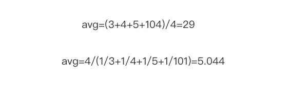

## pf 的内存占用为什么是 12k？

我们在上面的算法中使用了 1024 个桶进行独立计数，不过在 Redis 的 HyperLogLog 实现中用到的是 16384 个桶，也就是 2^14，每个桶的 maxbits 需要 6 个 bits 来存储，最大可以表示 maxbits=63，于是总共占用内存就是2^14 * 6 / 8 = 12k字节。

# 七 应用5 布隆过滤器

上一节我们学会了使用 HyperLogLog 数据结构来进行估数，它非常有价值，可以解决很多精确度不高的统计需求。

但是如果我们想知道某一个值是不是已经在 HyperLogLog 结构里面了，它就无能为力了，它只提供了 pfadd 和 pfcount 方法，没有提供 pfcontains 这种方法。

讲个使用场景，比如我们在使用新闻客户端看新闻时，它会给我们不停地推荐新的内容，它每次推荐时要去重，去掉那些已经看过的内容。问题来了，新闻客户端推荐系统如何实现推送去重的？

你会想到服务器记录了用户看过的所有历史记录，当推荐系统推荐新闻时会从每个用户的历史记录里进行筛选，过滤掉那些已经存在的记录。问题是当用户量很大，每个用户看过的新闻又很多的情况下，这种方式，推荐系统的去重工作在性能上跟的上么？