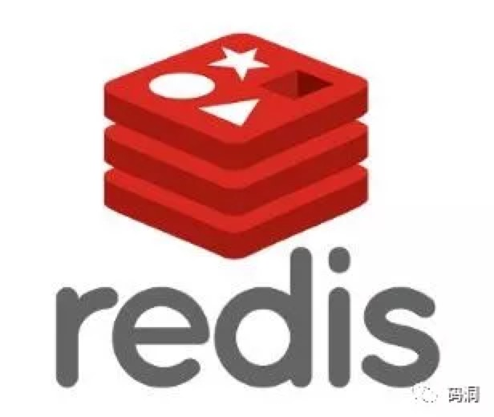

## 天下无难试之Redis面试刁难大全

**1、Redis 有哪些数据接口**

字符串String、字段Hash、列表List、集合Set、有序集合SortedSet。

如果你是Redis中高级用户，还需要机上下面几种数据结构HyperLogLog、Geo、Pub/Sub。

如果你说还玩过Redis Module，想BloomFilter，RedisSearch，Redis-ML，面试官得眼睛就开始发亮了。

**2、使用过Redis分布式锁么，它是怎么回事**

先拿setnx来争抢锁，抢到之后，再用expire给锁加一个国企时间防治锁忘记了释放。

**这时候对方会告诉你回答得不错，然后接着问如果在setnx之后执行expire之前进程意外crash或者要重启维护了，那会怎么样？**

这时候你要基于惊讶的反馈：唉，是喔，这个锁就永远得不到释放了。set指令有非常复杂的参数，这个应该是可以同时把setnx和expire合成一条指令来用的！

**3、加入Redis里面有1亿个key，其中有10w个key是以某个固定的已知的前缀开头的，如何将它们全部找出来？**

使用keys指令可以扫除指定模式的key列表

**如果这个redis正在给线上的业务提供服务，那使用keys指定会有什么问题。**

这个时候你就要回答redis关键的一个特性：redis的单线程的。keys指令会导致线程阻塞一段时间，线上服务会挺短，知道指令执行完毕，服务才能恢复。这个时候可以使用scan指令，scan指令可以无阻塞的提取出指定模式的key列表，但是会有一定的重复概率，在客户端做一次去重就可以了，但是整体锁话费的时间会比直接用keys指令长。

**4、使用过REdis做异步队列么，你是怎么用的。**

一般使用list结构作为队列，rpush生产消息，lpop消费消息。当lpop没有消息的时候，更适当sleep一会在重试。

**可不可以不用sleep呢？**list 还有个指令叫blpop，在没有消息的时候，它会阻塞住知道消息到来。

**能不能生产一次消费多次呢？**使用pub/sub主体订阅者模式，可以实现1：N的消息队列。

**pub/sub有什么缺点** 在消费者下线的情况下，生产的消息会丢失，得使用专业的消息队列如rabbitmq等。

**redis如何实现延时队列？** 使用sortedset，拿时间戳作为score，消息内容作为key调用zadd来生产消息，消费者用zrangebyscore指令获取N秒之前的数据轮询进行处理。

**5、如果有大量的key需要设置同一时间国企，一般需要注意什么？**

如果大量的key国企时间设置的过于集中，到国企的那个时间点，redis可能会出现短暂的卡顿现象。一般需要在时间上架一个随机值，使得国企时间分散一点。

**6、Redis如何做持久话的。**

bgsave做镜像圈梁持久化，aof做增量持久化。因为bgsave会耗费较长时间，不够实时，在停机的时候回导致大量丢失数据，所以需要aof来配合使用。在redis实例重启时，有限使用aof来回复内存的状态，如果没有aof日志，就会使用rdb文件来回复。

**aof文件过大恢复时间过长怎么办？**Redis会定期做aof重写，压缩aof文件日志大小。Redis4.0之后有了混合持久化的功能，将bgave的全量和aof的增量做了融合处理，这样既保证了恢复的效率又兼顾了数据的安全性。

如果突然记起掉电会怎么样？取决于aof日志sync属性的配置，如果不要求性能，在每条写指令时都sync一下磁盘，就不会丢失数据。但是在高性能的要求下每次都sync是不现实的，一般都使用定时sync，比如1s1次，这个时候最多就会丢失1s的数据。

**bgsave的原理是什么？**fork和cow。fork是指redis通过创建子进程来进行bgsave操作，cow指的是copy on write，子进程创建后，父子进程共享数据款，父进程继续提供读写服务，写脏的页面数据会组件和子进程分离开来。

**7、Pipeline 有什么好处，为什么要使用pipeline**

可以将多次 IO 往返时间缩减为一次，前提是pipeline执行的指令职之间没有因果相关性。使用redis-benchmark进行压测的时候可以发现影响redis的QPS峰值的一个重要因素是pipeline批次指令的数目。

**8、Redis的同步机制了解吗。**

Redis可以使用主从同步，从从同步。第一次同步时，主节点做一次bgsave，并同时将后续修改操作记录到内存buffer，待完成后将rdb文件全量同步到复制节点，负直接点接受完成后将rdb奖项加载到内存。加载完成后，再通知主节点将期间修改的操作记录同步到负直接点进行重放就完成了同步过程。

**9、是否使用过Redis集群，集群的原理是什么？**

Redis sentinal着眼于高可用，在master宕机时会将slave提升为master，继续提供服务。

Redis Cluster 着眼于扩展性，在单个redis内存不足时，使用Cluster进行分片存储。