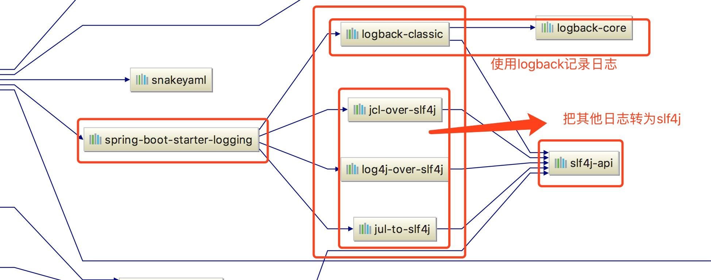
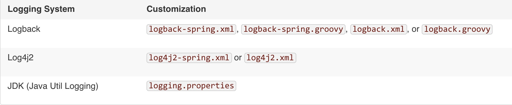
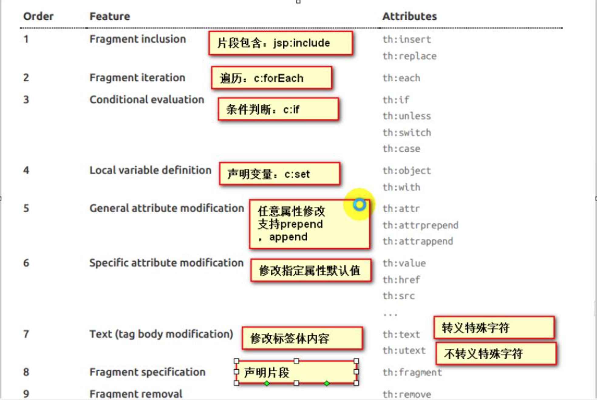

## 一、spring boot 入门

1、spring boot 简介
	简化 Spring 应用开发的一个框架；
	整个 spring 技术栈的一个大整合

2、自动配置原理
	1）、springboot启动的时候加载主配置类，开启了自动配置功能@EnableAutoConfiguration
	2）、@EnableAutoConfiguration作用：
		利用EnableAutoConfigurationImportSelector给容器中导入一些组件
		可以插件selectImports()方法的内容：
		List<String> configurations = getCandidateConfigurations(annotationMetadata, attrbuits); 获取候选的配置
			1、SpringFactoryesLoader.loadFactoryNames();
			2、扫描所有jar包类路径下 META-INF/spring.factories
			3、把扫描到的这些文件的内容包装成properties对象
			4、从properties中获取到EnableAutoConfiguration.class类（类名）对应的值，然后把他们添加到容器中
			5、将类路径下META-INF/spring.factories里面配置的所有EnableAutoConfiguration的值加入到了容器中
	3）、每一个自动配置类进行自动配置功能：
	4）、以HttpEncodingAutoConfiguration为例解释自动配置原理：

```java
@Configuration	//表示这是一个配置类，以前编写的配置文件一样， 也可以给容器中添加组件
@EnableConfigurationProperties(HttpEncodingProperties.class)	//启动指定类的ConfigurationProperties功能，将配置文件对应的值和HttpEncodingProperties绑定起来
@ConditionalOnWebApplication	//Spring底层@Conditional注解，根据不同的条件，如果满足指定的条件，整个配置类里面的配置就会生效； 判断当前应用是否是web应用，如果是，当前配置类生效
@conditionalOnClass(CharacterEncodingFilter.class)	//判断当前项目有没有这个类CharacterEncodingFilter；SpringMVC中进行乱码解决的过滤器
@ConditionalOnClass(prefix="spring.http.encoding", value="enabled", matchIfMissing=true)	//判断配置文件中是否存在某个配置。	spring.http.encoding.enabled;如果不存在，判断也是成立的。即使我们配置文件中不配置spring.http.encoding.enabled=true，也是默认生效
public class HttpEncodingAutoConfiguration {
    @Bean //给容器中天健一个组件
    @ConditionalOnMissingBean(CharacterEncodingFilter.class)
}
```

根据当前不同的条件判断，决定合格配置类是否生效

一旦这个配置类生效，这个配置类就会给容器中添加各种组件，这些组件的属性是从对应的properties类中获取，这些类里面的没一个属性又是和配置文件绑定

​	5）、所有在配置文件中配置的属性都是在xxxxProperties类中封装者；配置文件能配置扫描就可以参照某个功能对应的这个属性类

```java
@ConfigurationProperties(prefix="spring.http.encoding")	//从配置文件中获取指定的值和bean的属性进行绑定
public class HttpEncodingProperties {
    public static final Charset DEFAULT_CHARSET = Charset.forName("utf-8");
}
```

精髓：

​	1)、SpringBoot 启动会加载大量的自动配置类

​	2)、我们看我们需要的功能有没有SpringBoot默认写好的自动配置类；

​	3)、我们再来看这个自动配置类中到底配置了那些组件;（只要我们要用的组件有，我们就不需要再来配置了）

​	4)、给容器中自动配置类添加组件的时候，会从properties类中获取某些属性，我们就可以在配置文件中指定这些属性的值。

​	

自动配置类必须在一定条件下才能生效

市面上的日志框架：

JUL、JCL、Jboss-logging、logback、log4j、log4j2、slf4j...

| 日志门面（日志的抽象层）                                     | 日志实现                                             |
| ------------------------------------------------------------ | ---------------------------------------------------- |
| JCL（Jakarta Commons Logging） SLF4J(Simple Logging  Facade for java)       jboss-logging | Log4j    JUL(Java.util.logging)    Log4j2    Logback |

左边选一个门面（抽象层）、右边选一个实现。

### 遗留问题

（slf4j+logback）:Spring(commons-logging)、Hibernate（Jboss-logging）、MyBatis
		统一日志记录框架
**如何让系统中所有的日志都统一到slf4j:**

1、将系统中其他日志框架先排除出去；

2、用中间包来替换援用的日志框架

3、我们导入slf4j其他的实现。

SpringBoot使用它来做日志功能：


底层依赖关系：



总结：

​	1）、SpringBoot底层也是使用slf4j + logback的方式进行日志记录

​	2）、SpringBoot也把其他的日志都替换成了Slf4j;

​	3）、中间替换包

​	4）、如果我们要引入其他框架，一定要把这个框架的默认日志依赖移除掉。

​		Spring 框架用的是commons-loggong

```
<dependency>
   <groupId>org.springframework</groupId>
   <artifactId>spring-core</artifactId>
   <exclusions>
      <exclusion>
         <groupId>commons-logging</groupId>
         <artifactId>commons-logging</artifactId>
      </exclusion>
   </exclusions>
</dependency>
```

**SpringBoot能自动适配所有的日志，而且底层使用slf4j+logback的方式记录日志，引入其他框架的时候，值需要把这个框架依赖的日志框架排除掉。**

# 4、日志使用；

### 1、默认配置

SpringBoot默认帮我们配置好了日志：

```
Logger logger = LoggerFactory.getLogger(getClass());
@Test
    public void contextLoads() {

        //日志的级别：
        //由低到高      trance < debug < info < warn < error
        //可以调整输出的日志级别；日志就智慧在这个界别以后的高级别生效
        logger.trace("这是trance日志");
        logger.debug("这是debug日志");
        //SpringBoot默认给我们使用的是info级别的，没有指定级别的就用SpringBoot默认规定的级别：root级别
        logger.info("这是info日志");
        logger.warn("这是ware日志");
        logger.error("这是error日志");
    }
```

```
logging.file			logging.path		Example			Description
(none)					(none)								只在控制台输入
指定文件名				(none)				my.log			 输入日志到my.log文件
(none)					指定目录			/var/log		  输出到指定目录的spring.log文件中
```

日志输出格式：

```
#logging.path=
#不指定路径在当前项目下生成springboot.log日志
#可以指定完整的路径；
#logging.file = G:/springboot.log
#在当前磁盘的跟路径下创建spring文件夹和里面的log文件夹；使用 spring.log 作为默认文件
logging.path=/spring/log

# 在控制台输入的日志的格式
logging.pattern.console=%d{yyyy-MM-dd HH:mm:ss.SSS} [%thread] %-5level %logger{50} - %msg%n
#指定文件中日志输出的格式
logging.pattern.file=%d{yyyy-MM-dd HH:mm:ss.SSS} [%thread] %-5level %logger{50} - %msg%n
```

2、指定配置

给类路径下放上每个日志框架自己的配置文件即可；SpringBoot就不使用它默认配置的了



logback.xml：直接就被日志框架识别了；

logback-spring.xml：日志框架就不直接加载日志的配置项，由SpringBoot解析日志配置，可以使用SpringBoot的高级 Profile 功能

```tex
<springProfile name="staging">
	<!-- configuration to be enabed when the "staging" profile is active -->
	可以指定某段配置只在某个环境下生效
</springProfile>
```

否则

```xml
no applicable action for [springProfile]
```

```xml
<appender name="stdout" class="ch.qos.loback.core.ConsoleAppender">
	<!--
 	日志输出格式：
		%d表示日期时间；
		%thread表示线程名
		%-5level：级别从左显示5个字符宽度
		%logger{50}：表示logger名字最长50个字符，否则按照句点分割。
		%msg：日志消息
		%n是换行符
	-->
    <layout class="ch.qos.logback.classic.PatternLayout">
    	<springProfile name="dev">
        	<pattern>%d{yyyy-MM-dd HH:mm:ss.SSS} -----> [%thread] %-5level %logger{50} - %msg%n</pattern>
        </springProfile>
        <springProfile name="!dev">
        	<pattern>%d{yyyy-MM-dd HH:mm:ss.SSS} =====> [%thread] %-5level %logger{50} - %msg%n</pattern>
        </springProfile>
    </layout>
</appender>
```

3、切换日志框架

可以按照slf4j的日志适配图，进行相关的切换:

slf4j + log4j的方式

# 四、Web开发

## 1、使用SpringBoot：

1）、创建SpringBoot应用，选中我们需要的模块；

2）、SpringBoot已经默认将这些场景配置好了，只需要在配置文件中指定少量配置就可以运行起来

3）、自己编写业务代码；

#### 自动配置原理

这个场景SpringBoot帮我们配置了啥么？能不能修改？能修改哪些配置？能不能扩展？... ...

```java
1	xxxxAutoConfiguration: 帮我们给容器中自动配置组件；
2	xxxxProperties: 配置类来封装配置文件的内容

```

2、SpringBoot对静态资源的映射规则；

```java
		public void addResourceHandlers(ResourceHandlerRegistry registry) {
            if(!this.resourceProperties.isAddMappings()) {
                logger.debug("Default resource handling disabled");
            } else {
                Integer cachePeriod = this.resourceProperties.getCachePeriod();
                if(!registry.hasMappingForPattern("/webjars/**")) {
                    this.customizeResourceHandlerRegistration(registry.addResourceHandler(new String[]{"/webjars/**"}).addResourceLocations(new String[]{"classpath:/META-INF/resources/webjars/"}).setCachePeriod(cachePeriod));
                }

                String staticPathPattern = this.mvcProperties.getStaticPathPattern();
                if(!registry.hasMappingForPattern(staticPathPattern)) {
                    this.customizeResourceHandlerRegistration(registry.addResourceHandler(new String[]{staticPathPattern}).addResourceLocations(this.resourceProperties.getStaticLocations()).setCachePeriod(cachePeriod));
                }

            }
        }

		//配置欢迎页面
		@Bean
        public WebMvcAutoConfiguration.WelcomePageHandlerMapping welcomePageHandlerMapping(ResourceProperties resourceProperties) {
            return new WebMvcAutoConfiguration.WelcomePageHandlerMapping(resourceProperties.getWelcomePage(), this.mvcProperties.getStaticPathPattern());
        }

		//配置喜欢的图标
		@Configuration
        @ConditionalOnProperty(
            value = {"spring.mvc.favicon.enabled"},
            matchIfMissing = true
        )
		public static class FaviconConfiguration {
            private final ResourceProperties resourceProperties;

            public FaviconConfiguration(ResourceProperties resourceProperties) {
                this.resourceProperties = resourceProperties;
            }

            @Bean
            public SimpleUrlHandlerMapping faviconHandlerMapping() {
                SimpleUrlHandlerMapping mapping = new SimpleUrlHandlerMapping();
                mapping.setOrder(-2147483647);
                mapping.setUrlMap(Collections.singletonMap("**/favicon.ico", this.faviconRequestHandler()));
                return mapping;
            }

            @Bean
            public ResourceHttpRequestHandler faviconRequestHandler() {
                ResourceHttpRequestHandler requestHandler = new ResourceHttpRequestHandler();
                requestHandler.setLocations(this.resourceProperties.getFaviconLocations());
                return requestHandler;
            }
        }
```

1）、所有/webjars/**，都去classpath:/META-INF/resources/webjars/ 找资源；

​	webjars: 以jar包的方式引入静态资源；

http://www.webjars.org/


localhost:8080/webjars/jquery/3.3.1/jquery.js

```xml
<dependency>
    <groupId>org.webjars</groupId>
    <artifactId>jquery</artifactId>
    <version>3.3.1</version>
</dependency>
```


2)、"/**"访问当前项目的任何资源，（静态资源的文件夹）

```xml
"classpath:/META-INF/resources/",
"classpath:/resources/",
"classpath:/static/",
"classpath:/public/",
"/": 当前项目的根路径
```

localhost：8080/abc === 去静态资源文件夹里面找abc

3）、欢迎页：静态资源文件夹下的所有index.html："/**"映射：

​	localhost:8080/	找index 页面

4）、所有的**/favicon.ico都是在静态资源文件下找


## 3、模板引擎

jsp、velocity、freemarker、 thymeleaf

SpringBoot推荐的thymeleaf：语法更简单，功能更强大；

1）、引入thymeleaf；

```xml
<dependency>
    <groupId>org.springframework.boot</groupId>
    <artifactId>spring-boot-starter-thymeleaf</artifactId>
</dependency>

<properties>
    <thymeleaf.version>3.0.9.RELEASE</thymeleaf.version>
    <!-- 布局功能的支持程序  thymeleaf3主程序    layout2以上版本 -->
    <thymeleaf-layout-dialect.version>2.2.2</thymeleaf-layout-dialect.version>
</properties>
```

2）、thymeleaf使用&语法

```java
@configurationProperties(prefix = "spring.thymeleaf")
public class ThymeleafProperties {
    
    private static final Charset DEFAULT_ENCODING = Charset.forName("UTF-8");
    
    private static final MimeType DEFAULT_CONTENT_TYPE = MimeType.valueOf("text/html");
    
    public static final String DEFAULT_PREFIX = "classpath:/templates";
    
    public static final String DEFAULT_SUFFIX = ".html";
}
```

只有我们把HTML页面放在classpath:/templates, thymeleaf就能自动渲染。

#### 使用

1、导入thymelaf的名称控件

```html
<html lang="en" xmlns:th="http://www.thymeleaf.org">
    
</html>
```

2、使用thymeleaf

```html
<!DOCTYPE html>
<html lang="en" xmlns:th="http://www.thymeleaf.org">
<head>
    <meta charset="UTF-8">
    <title>Title</title>
</head>
<body>
    <h1>成功！</h1>
    <!--  th:text 将div里面的文本内容设置  -->
    <div th:text="${hello}">这是现实欢迎信息</div>
</body>
</html>
```

3、语法规则

1）、th:text：改编当前元素里面的文本内容

​	th：任意htm 属性，来替换原生属性的值



2）、表达式

```properties
Simple expressions:(表达式语法)
    Variable Expressions: ${...}: 获取变量值：OGNL
    	1）、获取对象的属性、调用方法
    	2）、使用内置的基本对象
    		#ctx : the context object.
            #vars: the context variables.
            #locale : the context locale.
            #request : (only in Web Contexts) the HttpServletRequest object. 
            #response : (only in Web Contexts) the HttpServletResponse object. 
            #session : (only in Web Contexts) the HttpSession object. 
            	$(session.foo)
            #servletContext : (only in Web Contexts) the ServletContext object.
         3)、内置的一些工具对象
            #execInfo : information about the template being processed.
            #messages : methods for obtaining externalized messages inside variables expressions, in the same way as they would be obtained using #{...} syntax.
                     Established locale country: <span th:text="${#locale.country}">US</span>.
            #uris : methods for escaping parts of URLs/URIs
            #conversions : methods for executing the configured conversion service (if any).
            #dates : methods for java.util.Date objects: formatting, component extraction, etc.
            #calendars : analogous to #dates , but for java.util.Calendar objects.
            #numbers : methods for formatting numeric objects.
            #strings : methods for String objects: contains, startsWith, prepending/appending, etc.
            #objects : methods for objects in general.
            #bools : methods for boolean evaluation.
            #arrays : methods for arrays.
            #lists : methods for lists.
            #sets : methods for sets.
            #maps : methods for maps.
            #aggregates : methods for creating aggregates on arrays or collections.
            #ids : methods for dealing with id attributes that might be repeated (for example, as a result of an iteration).
    Selection Variable Expressions: *{...}: 选择表达式：和${}在功能上市一样
    	补充：配合 th:object=“session.user”:
    	<div th:object="${session.user}">
        	<p>Name: <span th:text="*{firstName}">Sebastian</span>.
        	</p> <p>Surname: <span th:text="*{lastName}">Pepper</span>.
        	</p> <p>Nationality: <span th:text="*{nationality}">Saturn</span>.</p>
        </div>
    Message Expressionss: #{...}: 获取国际化名
    Link URL Expressions: @{...}: 定义URL链接
    	@{/order/process(execId=${execId},execType='FAST')}
    Fragment Expressions: ~{...}: 片段引用表达式
    	<div th:insert="~{commons::min}">...</div>
Literals:(字面量)
	Text literals: 'one text' , 'Another one!' ,... 
	Number literals: 0 , 34 , 3.0 , 12.3 ,... Boolean literals: true , false
    Nullliteral: null
    Literal tokens: one , sometext , main ,...
Text operations:(文本操作)
    Stringconcatenation: +
    Literal substitutions: |The name is ${name}|
Arithmetic operations: (数学运算)
    Binaryoperators: +, -, *, /, %
    Minussign(unaryoperator): -
Boolean operations:(布尔运算)
    Binary operators: and , or
    Boolean negation (unary operator): ! , not
Comparisons and equality:(比较运算)
    Comparators: >, <, >=, <= (gt, lt, ge, le)
    Equality operators: == , != ( eq , ne )
Conditional operators:(条件运算)三元运算符
    If-then: (if) ? (then)
    If-then-else: (if) ? (then) : (else) 
    Default: (value) ?: (defaultvalue)
Special tokens:
	No-Operation: _
```

## 4、SpringMVC 自动配置

​	27.1.1 Spring MVC Auto-configuration

Spring Boot provides auto-configuration for Spring MVC that works well with most applications.

The auto-configuration adds the following features on top of Spring’s defaults:

- Inclusion of `ContentNegotiatingViewResolver` and `BeanNameViewResolver` beans.

  - 自动配置了ViewResolver（视图解析器：根据方法的方绘制得到视图对象（view），视图对象决定如何渲染（转发？重定向？））
  - `ContentNegotiatingViewResolver`组合所有的视图解析器
  - <u>如何定制：我们可以自己给容器中添加一个视图解析器；自动的将其组合起来。</u>

- Support for serving static resources, including support for WebJars (covered [later in this document](https://docs.spring.io/spring-boot/docs/2.1.0.M1/reference/htmlsingle/#boot-features-spring-mvc-static-content))). 静态资源文件夹路径webjars

- Static `index.html` support. 静态首页访问

- Custom `Favicon` support (covered [later in this document](https://docs.spring.io/spring-boot/docs/2.1.0.M1/reference/htmlsingle/#boot-features-spring-mvc-favicon)). favicon.ico

- Automatic registration of `Converter`, `GenericConverter`, and `Formatter` beans.

  - Converter：转换器；public String hello()

  - `Formatter`：格式化器： 2017.13.17 ==== Date;

  - ```java
    @Bean
    @ConditionalOnProperty(prefix="spring.mvc", name="data-formate") //在文件中配置日期格式化的规则
    public Formatter<Date> dateFormatter() {
        return new DateFormatter(this.mvcProperties.getDateFormate());//日期格式化组件
    }
    ```

  - <u>自己添加的格式化器转换器，我们只需要放在容器中即可</u>

- Support for `HttpMessageConverters` (covered [later in this document](https://docs.spring.io/spring-boot/docs/2.1.0.M1/reference/htmlsingle/#boot-features-spring-mvc-message-converters)).

  - HttpMessageConverter: SpringMVC用来转换Http请求和相应的相应: User--json;
  - HttpMessageConverterse: 是从容器中确定；
  - <u>获取所有的HttpMessageConverter; 自己给容器中添加HTTPMessageConverter， 只需要将自己的组件注册容器中（@Bean, @Component）</u>

- Automatic registration of `MessageCodesResolver` (covered [later in this document](https://docs.spring.io/spring-boot/docs/2.1.0.M1/reference/htmlsingle/#boot-features-spring-message-codes)). 定义错误代码生成规则

- Automatic use of a `ConfigurableWebBindingInitializer` bean (covered [later in this document](https://docs.spring.io/spring-boot/docs/2.1.0.M1/reference/htmlsingle/#boot-features-spring-mvc-web-binding-initializer)).

  - 我们可以配置一个configurableWebBindingInitializer来替换默认的：（添加到容器中）

  - ```
    初始化WebDataBinder
    请求数据 ===== javaBean
    ```

  <u>org.springframework.boot.autoconfigure.web: web的所有自动场景</u>

If you want to keep Spring Boot MVC features and you want to add additional [MVC configuration](https://docs.spring.io/spring/docs/5.1.0.RC1/spring-framework-reference/web.html#mvc) (interceptors, formatters, view controllers, and other features), you can add your own `@Configuration` class of type `WebMvcConfigurer` but **without** `@EnableWebMvc`. If you wish to provide custom instances of `RequestMappingHandlerMapping`, `RequestMappingHandlerAdapter`, or `ExceptionHandlerExceptionResolver`, you can declare a `WebMvcRegistrationsAdapter` instance to provide such components.

## 5、如何修改SpringBoot配置